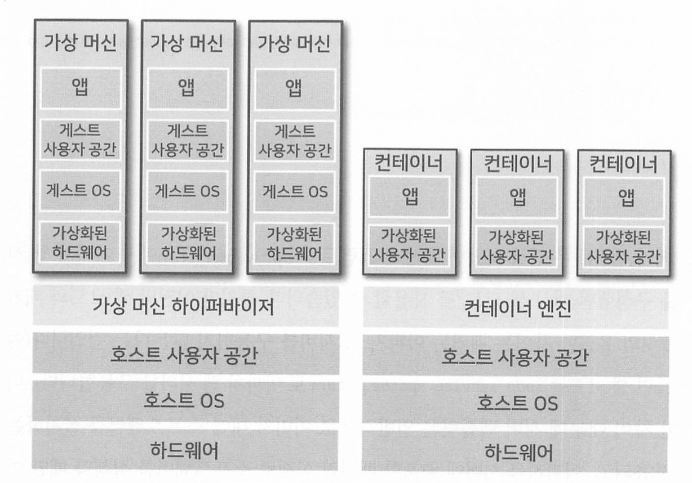
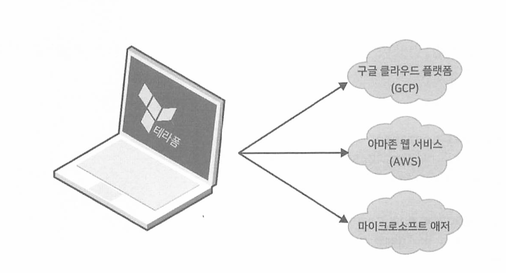
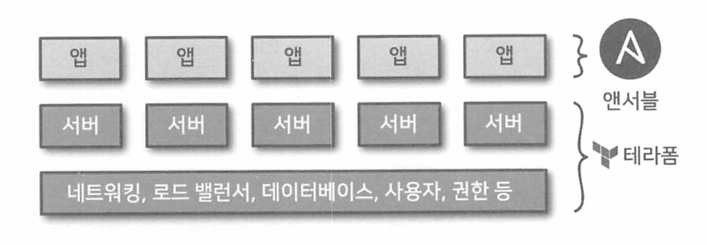
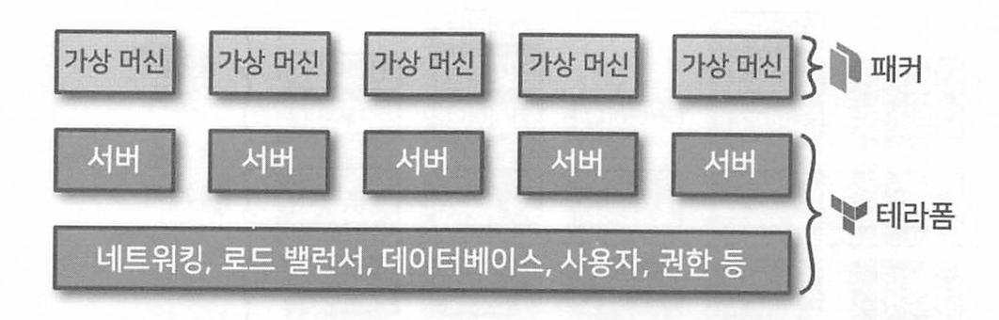
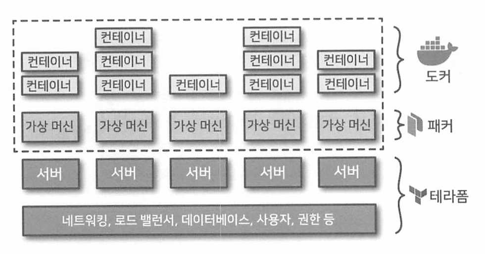

# Terraform Up & Running 

## ch1. 왜 테라폼인가?
</br>

### 01. 데브옵스의 등장
#### 데브옵스의 등장
- 과거
    1. 운영팀(하드웨어 관리하는 팀)과 개발팀(소프트웨어를 관리하는 팀)의 분리
    2. 운영팀 - 배포 및 운영 작업 **수동**으로 처리함으로써 구성 드리프트(configuration drift) 발생
- 현재
    1. 클라우드 서비스 사용
    2. 운영팀 - 하드웨어보다 소프트웨어 작업에 많은 시간 투자 
-> 결과적으로 개발팀과 운영팀이 모두 소프트웨어 작업에 대부분의 시간을 소비하며 두팀의 구분이 모호해짐.

#### 데브옵스 정의
* 데브옵스는 소프트웨어를 효율적으로 전달하는 프로세스이다.

#### 데브옵스 핵심 가치 (CAMS)
- 문화(culture)
- 자동화(Automatic)
- 측정(Measurement)
- 공유(Sharing)

---

### 02. 코드형 인프라란?
- 코드형 인프라(Infrastructure as Code, IaC) : 코드를 작성 및 실행하여 인프라를 생성, 배포, 수정, 정리하는 것

</br>

### 1. 애드혹 스크립트
- 수행할 작업을 단계별로 나누고 배시, 루비, 파이썬 등 선호하는 언어를 사용하여 각 단계를 코드로 정의하고 작성된 스크립트를 서버에서 수동으로 실행하는 것
  ```
  # apt-get 캐시를 업데이트
  apt-get update

  # PHP와 아파치 설치
  apt-get install -y php apache 2

  # 깃 리포지터리에서 코드를 다운로드
  git clone github.com/foo/bar/var/www/html/app

  # 아파치 웹 서버 시작
  service apache2 start 
  ```
#### 특징
1. 소규모 일회성 작업에 적합
2. 개발자가 매번 코드를 수동으로 작업해야함.
    - 코드형 인프라용으로 설계된 도구를 사용하면 코드에 정해진 구조가 적용되지만, </br>
      범용 프로그래밍 언어를 사용할 때는 각 개발자가 자신만의 고유한 스타일로 작업함.

</br>

### 2. 구성 관리 도구
- 셰프, 퍼핏, 앤서블, 솔트스택 등 구성 관리 도구로써 대상 서버에 소프트웨어 설치하고, 관리하도록 설계되어 있음.
  ```
  # ansible 예제 코드
  - name: Update the apt-get cache
    apt:
      update_cache: yes

  - name: Install PHP
    apt:
      name: php

  - name: Install Apache
    apt: 
      nameL apache2

  - name: Copy the code from the repository
    git: repo=git clone github.com/foo/bar/var/www/html/app

  - name: Start Apache
    service: name=apache2 state=started enable=yes
  ```

#### 특징
1. 코딩 규칙
- 앤서블은 문서화, 파일 레이아웃, 명확하게 이름 붙여진 매개 변수, 시크릿 관리 등을 포함하는 일관되고 예측 가능한 구조 제공
- 구성 관리 도구에는 **코딩 규칙**이 포함되어 있어 코드 쉽게 탐색 가능

2. 멱등성
- `멱등성을 가진 코드` : 실행 횟수에 관계없이 올바르게 동작하는 코드
- 앤서블이 제공하는 대부분의 기능은 기본적으로 멱등성을 가짐.
    - 배시 셸 스크립트를 멱등성을 가진 코드로 작성하려면 많은 조건문이 포함된 복잡한 구조의 코드를 작성해야함.
    - 앤서블 롤은 설정 파일을 사용하여 아파치가 설치되지 않았을 경우에만 설치하고 아파치 웹 서버가 동작하지 않는 경우에만 동작하도록 함.

3. 분산형 구조
- 원격의 수많은 서버를 관리할 수 있음.
- 앤서블은 `serial`이라는 매개 변수를 설정하여 롤링 배포를 수행함으로써 서버를 일괄 업데이트할 수 있음.
  - `serial`을 2로 지정하면, 5대의 서버 업데이트가 모두 완료될 때까지 한 번에 2대씩 업데이트할 수도 있음.
      
</br>                   

### 3. 서버 템플릿 도구
- 구성 관리 도구의 대안으로 도커(Docker), 패커(Packer), 베이그런트(Vagrant)와 같은 서버 탬플릿 도구 인가가 높아지고 있음.
- 서버 템플릿 도구는 운영 체제, 소프트웨어, 파일 및 기타 필요한 모든 내용을 포함하고 있는 `스냅숏(snapshot)`으로 이미지를 생성함.
- 이미지를 생성한 후, 앤서블과 같은 코드형 인프라 도구를 사용하여 모든 서버에 이미지를 설치할 수 있음.

</br>

### 이미지 작업을 위한 도구
- 가상 머신
  ```
  1. 하드웨어를 포함한 전체 컴퓨터 시스템을 애뮬레이트한다.
  2. VM웨어, 버추얼박스와 같은 하이퍼바이저를 사용하여 CPU, 메모리, 하드 드라이브, 네트워크를 가상화한다.
  3. 하이퍼바이저에서 실행되는 모든 VM 이미지는 가상화된 하드웨어만 볼 수 있다.
  4. (단점) 모든 하드웨어를 가상화하고 다른 VM과도 완전히 분리했기 때문에 VM마다 별도의 CPU, 메모리, 리소스가 할당되는 오버헤드가 발생한다.
  4. (tool) Packer, Vagrant
  ```
- 컨테이너
  ```
  1. OS의 사용자 공간을 애뮬레이트한다.
  2. 컨테이너 엔진을 실행하여 격리된 프로세스, 메모리, 마운트 지점, 네트워킹을 만든다.
  3. 컨테이너 엔진에서 실행되는 컨테이너는 그 자체의 사용자 공간만 볼 수 있다.
  4. (단점) 단일 서버에서 실행되는 모든 컨테이너가 해당 서버의 OS 커널과 하드웨어를 공유하므로 VM을 사용하는 것만큼의 격리 및 보안 수준을 달성하지 못한다.
  5. (장점) 커널과 하드웨어가 공유되므로 밀리세컨드 단위로 부팅할 수 있으며, CPU 또는 메모리에 대한 오버헤드가 거의 없다.
  6. (tool) Docker, Core OS, rkt
  ```



</br>

### 패커 예제
- AWS에서 실행할 수 있는 VM 이미지인 아마존 머신 이미지(Amazon Machine Image, AMI)를 생성하는 템플릿
- 서버 탬플릿은 일반적으로 이미지 내에 소프트웨어를 설치하는데 사용되고, 이미지를 서버에 배포할 때처럼 실제로 소프트웨어를 실행할 때만 아파치 웹 서버가 동작한다.
```
{
    "builders" : [{
        "ami_name" : "packer-example",
        "instance_type" : "t2.micro",
        "region" : "us-east-2",
        "type" : "amazon-ebs",
        "source_ami" : "ami-0c55b159cbfafe1d0",
        "ssh_username" : "ubuntu"
    }],
    "provisioners" : [{
        "type" : "shell",,
        "inline" : [
            "sudo apt-get update",
            "sudo apt-get install -y php apache2",
            "sudo git clone https://github.com/.../ /var/www/html/app"
        ]
    }],
    "environment_vars" [
        "DEBIAN_FRONTEND=noninteractive"
    ]
}
```

</br>

### 서버 템플릿 도구들의 목적
| 도구 이름 | 목적 |
| --- | --- |
| 패커(Packer) | 프로덕션 서버에서 직접 실행하는 이미지 생성 |
| 베이그런트(Vagrant) | 랩톱에서 실행되는 버추얼박스 이미지와 같이 개발 컴퓨터에서 실행하는 이미지 생성 |
| 도커(Docker) | 개별 응용 프로그램의 이미지 생성 |

</br>

### 4. 오케스트레이션 도구
- 쿠버네티스, 마라톤/메소스, 아마존 엘라스틱 컨테이너 서비스, 도커 스웜
- 아래의 작업들을 처리하기 위해 오케스트레이션 도구가 필요하다.
  ```
  - VM과 컨테이너를 하드웨어에 효율적으로 배포하기
  - 롤링 배포, 블로-그린 배포, 카나리 배포 전략을 사용하여 기본의 VM이나 컨테이너를 효율적으로 업데이트하거나 롤백하기
  - VM과 컨테이너의 상태를 모니터링하고 비정상적인 부분을 자동으로 대체하기 (자동 복구)
  - 발생하는 트래픽에 따라 VM과 컨테이너의 수를 늘리거나 줄이기 (자동 확장)
  - VM과 컨테이너의 트래픽을 분산하기 (로드 밸런싱)
  - 서로 다른 네트워크가 있더라도 VM과 컨테이너가 서로 식별하고 통신할 수 있게 하기 (서비스 검색)
  ```
- Kubernetes 예제 코드
  ```
  apiVersion: apps/v1
  kind: Deployment
  metadata:
    name: example-app
  spec:
    selector:
      matchLabels:
        app: example-app
    replicas: 3
    strategy:
        rollingUpate:
        maxSurge: 3
        maxUnavailable: 0
        type: RollingUpdate
    template:
        metadata:
        labels:
            app: example-app
        spec:
        containers:
            - name: example-app
            image: httd:2.4.39
            ports:
            - containerPort:80
  ```
### 5. 프로비전 도구
- 구성 관리, 서버 템플릿 및 오케스트레이션 도구가 각 서버에서 실행되는 코드를 정의한다면, 
  테라폼과 같은 프로비전 도구는 서버 자체를 생성한다.
- 테라폼 예제 코드
  ``` 
  resource "aws_instance" "app" {
    instance_type = "t2.micro"
    available_zone = "us-east-2a"
    ami = "ami-0c55b159cbfafef0"

    user_data = <<--EOF
                #!/bin/bash
                sudo service apache2 start
                EOF
  }
  ```

---

### 03. 코드형 인프라의 장점
- 인프라가 코드로 정의되면 다음과 같은 배포 프로세스를 극적으로 개선할 수 있음.
    ```   
    1. 자급식 배포 : 개발자가 필요할 때마다 자체적으로 배포 진행 가능
    2. 속도와 안정성 : 빠르게 컴퓨터 배포 진행 / 수동 배포보다 안전
    3. 문서화 : 누구나 읽을 수 있는 소스 파일로 인프라 상태 기록
    4. 버전 관리  : 버전 관리 용이
    5. 유효성 검증 : 코드를 변경할 때마다 검증을 수행하고 일련의 자동화된 테스트 진행 가능
    6. 재사용성 : 인프라를 재사용 가능한 모듈로 패키징 가능
    7. 행복 
    ```

---

### 04. 테라폼의 작동 방식
- `테라폼` : 해시코프사가 Go언어로 개발한 오픈 소스 도구
    - Go코드는 하나의 바이너리 파일로 컴파일되며 terraform이라는 명령어로 실행 가능
    - terraform 바이너리가 AWS, Azure, GCP 등의 API를 호출하여 리소스 생성
    - 생성하려는 인프라 정보가 담겨있는 테라폼 구성 파일을 생성하여 API 호출 </br>


  ```
  📌 참고 : 클라우드 공급자 간 투명한 이식성 
  테라폼은 여러 클라우드 공급자를 지원하기 때문에 업체 간 투명한 이식성을 제공하는지 궁금할 것이다.
  실제로 클라우드 공급자는 동일한 유형의 인프라를 제공하지 않기 때문에 '정확히 동일한 인프라'를 배포할 수는 없다.
  이러한 이유로 인프라를 '투명하게' 이식할 수 있는 쉬운 방법은 존재하지 않는다.
  한 클라우드 공급자는 기능이 다른 클라우드에는 전혀 존재하지 않을 수도 있다.
  ```

---

### 05. 테라폼과 다른 코드형 인프라 도구 비교

1. 구성 관리 VS 프로비저닝
2. 가변 인프라 VS 불변 인프라
   - `가변 인프라` : 각 서버는 고유한 변경 기록을 작성 
   - `불변 인프라` : '변경'은 완전히 '새로운 서버'를 배포하는 것 
3. 절차적 언어 VS 선언적 언어
   - `절차적 언어` 
     - 셰프, 앤서블
     - 최종 상태를 달성하는 방법을 단계별로 지정
     ```
     📌 절차적 방식의 주요한 문제
     1. 절차적 코드는 인프라의 마지막 상태 정보를 기록하고 있지 않는다.
     2. 절차적 코드는 재사용 가능성을 제한한다.
     ```
   - `선언적 언어`
     - 테라폼, 솔트스택, 퍼핏, 오픈스택 등
     - 최종 상태를 지정
4. 마스터 서버 유무
5. 에이전트 유무
6. 커뮤니티 규모와 활성화
7. 성숙한 기술 VS 최첨단 기술
8. 여러 도구를 함께 사용
    1. 프로비저닝과 구성 관리
      - 테라폼 : 네트워크 토폴로지와 데이터 저장소, 로드 밸런서, 서버 등을 포함한 모든 기본 인프라 배포 
      - 앤서블 : 서버에 앱을 배포 </br>
       </br>
    2. 프로비저닝과 서버 템플릿
      - 패커 : 앱을 VM 이미지로 패키징
      - 테라폼 : VM 이미지 배포 & 네트워크 토폴로지와 데이터 저장소, 로드 밸런서, 서버 등을 포함한 모든 기본 인프라 배포 </br>
       </br>
    3. 프로비저닝과 서버 탬플릿 그리고 오케스트레이션 도구 🌈 
      - 패커 : 도커 및 쿠버네티스가 설치된 VM 이미지 생성
      - 테라폼 : VM 이미지를 실행하는 서버, 나머지 인프라 배포
      - 쿠버네티스 : 컨테이너로 된 애플리케이션을 오케스트레이션 도구에서 실행 </br>
      