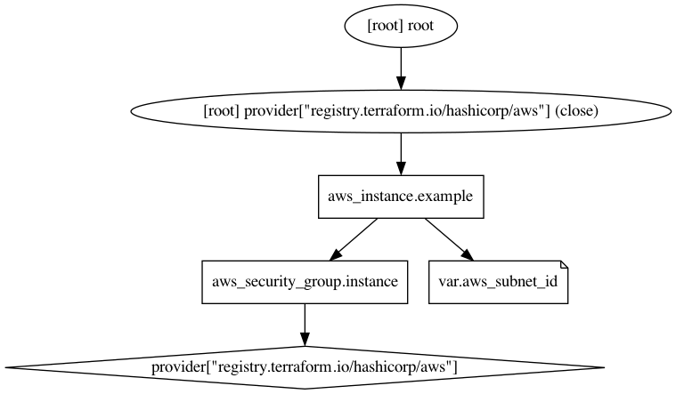
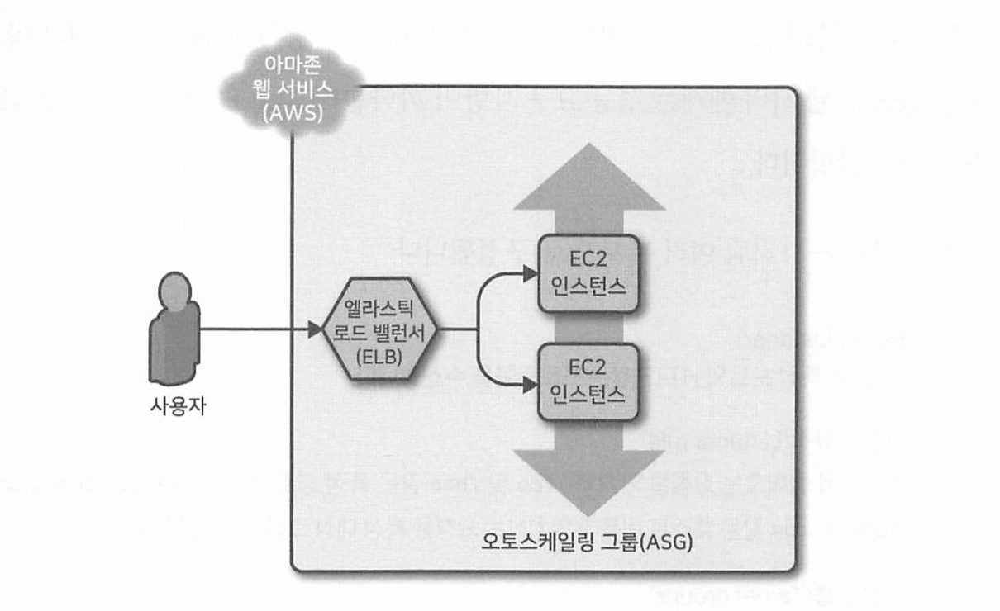
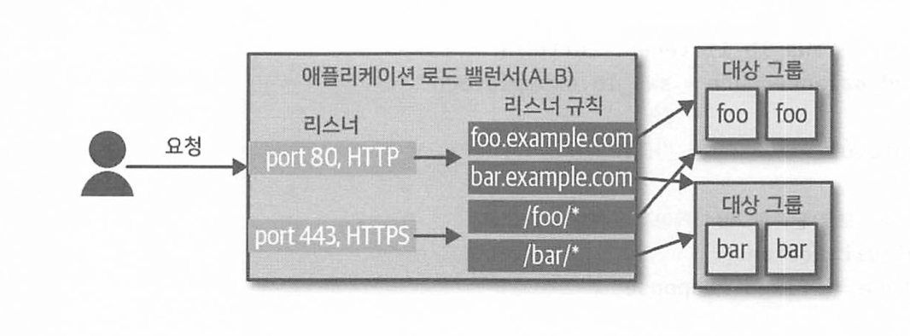

# Terraform Up & Running 

## ch2. 왜 테라폼인가?

</br>

### 1. AWS 계정 설정
IAM을 사용하여 제한된 권한을 가진 사용자 계정 생성
```
1. 새 IAM 사용자 추가하기
2. 새 IAM 사용자에게 기존 관리 정책 적용하기
3. AWS 자격 증명 확인
```

---

### 2. 테라폼 설치
테라폼 명령어 설치

---

### 3. 단일 서버 배포
- 테라폼 코드는 확장자가 .tf인 해시코프 구성 언어로 작성된다.
- 해시코드 구성 언어는 `선언적 언어`이다. (= 인프라를 설명하기 위해 코드 작성)

1. 공급자 구성하기
    ```
        provider "aws" {
            region = "us-east-2"
        }
    ```

2. 리소스 생성하기
    ```
        resource "<PROVIDER>_<TYPE>" "<NAME>" {
            [CONFIG ... ]
        }
    ```
    ```
        resource "aws_instance" "example" {
            ami = "ami-0e38c97339cddf4bd" # EC2 인스턴스를 생성하는 아마존 머신 이미지
            instance_type = "t2.micro"
        }
    ```

3. `terraform init`
   - 테라폼이 코드 스캔, 공급자 확인, 필요한 코드 다운로드한다.
   - 공급자 코드는 `.terraform`폴더에 다운로드된다.

4. `terraform plan`
   - 테라폼이 수행할 작업 확인한다.

5. `terraform apply`
   - 테라폼 코드로 인스턴스를 생성한다.

---

### 4. 단일 웹 서버 배포
- HTTP 요청에 응답할 수 있는 단일 웹 서버 배포하기
1. 테라폼의 히어닥(heredoc) 구문을 이용해 다음의 셸 스크립트 입력하기
    ```
    #!/bin/bash
    echo "Hello, World" > index.html
    nohup busybox httpd -f -p 8080 &
    ```
    ```
    📌 참고
    이 예제가 기분 HTTP 포트인 80포트가 아닌 8080을 사용하는 이유는 1024보다 숫자가 작은 포트레서 청취하려면 루트 사용자 권한이 필요하기 때문이다.
    80포트로 수신한 트래픽을 높은 번호의 포트로 라우팅하도록 로드 밸런서를 구성할 수 있다.
    ```

2. 보안 그룹 생성하기
    ```
    resource "aws_security_group" "instance" {
        name = "terraform-example-instance"

        ingress = [ {
        cidr_blocks = [ "0.0.0.0/0" ]
        from_port = 8080
        to_port = 8080
        protocol = "tcp"
        } ]
    }
    ```
    ```
    📌 참고
    하나의 리소스에 다른 리소스로 참조를 추가하면 내재된 종속성이 작성된다.
    terraform graph 명령어를 이용해 종속성 그래프를 확인할 수 있다.
    그래프비즈라는 앱을 사용해 이미지로 변환할 수 있다.
    ```
    

3. `terraform apply`
   - aws_instance 리소스의 인수 중 대다수는 변경 시 대체를 강제 실행하므로, </br>
     원래 EC2 인스턴스가 종료되고 완전히 새로운 인스턴스가 생성된다.
   - 웹 서버를 교체할 때 해당 웹 서버의 모든 사용자는 서비스 중단을 경험할 수 있다. (-> 5장에서 무중단 배포 방법을 다룬다.)
  
---

### 5. 구성 가능한 웹 서버 배포
- `DRY(Don't Repeat Yourself)`원칙
- 테라폼은 `입력 변수`를 정의하게 하므로 코드가 중복되지 않고 구성을 관리하기도 쉽다.
  ```
  variable "NAME"{
    [CONFIG ...]
  }
  ```
  - 변수 선언의 매개 변수
    ```
    - description : 변수 사용 방법을 문서화하기 위한 설명.
    - default : 변수에 값이 전달되지 않으면 기본 값 전달.
    - type : 유형 제약 조건으로 사용자가 전달하는 변수의 유형 지정. 지정하지 않으면 any로 간주.
    ```
  - 예시
    - number
      ```
      # number
      variable "number_example" {
          description = "An example of a number variable in Terraform"
          type = number
          default = 42
      }
      ```
    - list
      ```
      # list
      variable "list_example" {
          description = "An example of a list in Terraform"
          type = list
          default = ["a", "b", "c"]
      }
      ```
    - map 
      ```
      variable "map_example" {
          description = "An example of a map in Terraform"
          type = map(string)
          default = {
              key1 = "value1"
              key2 = "value2"
              key3 = "value3"
          }
      }
      ```
    - object
      ```
      variable "object_example" {
          description = "An example of a structural type in Terraform"
          type = object({
              name    = string
              age     = number
              tags    = list(string)
              enabled = bool
          })
      }
      ```
- 테라폼은 `출력 변수`도 정의할 수 있다.
  ```
  output "<NAME>"{
    value = <VALUE>
    [CONFIG ...]
  }
  ```
  - 변수 선언의 매개 변수
    ```
    - description : 변수 사용 방법을 문서화하기 위한 설명.
    - sensitive : terraform apply 실행이 끝날 때 출력을 기록하지 않고록 테라폼에 지시.
    ```
  - `terraform output` 명령어 지원
  
---

### 6. 웹 서버 클러스터 배포
- 단일 서버가 아니라 서버 클러스터를 구성해서 트래픽을 분산시키고, 트래픽의 양에 따라 클러스터의 크기를 늘리거나 줄여야 한다.
- `ASG(Auto Scaling Group)` 사용하기 - (`/code/2.web-server-cluster`참고)
  1. 시작 구성 만들기 (`aws_launch_configuration`)
  2. ASG 만들기 (`aws_autoscaling_group`)
  3. 수명 주기 설정하기
       - `시작 구성`의 매개 변수 변경 -> 테라폼 이전 리소스 삭제 및 대체 리소스 생성 </br>
         but, `ASG`에 이전 리소스에 대한 참조가 있기 때문에 리소스 삭제 불가
       - `create_before_destroy = true` : 교체 리소스 먼저 생성 -> 참조 업데이트 -> 기존 리소스 삭제
  4. 서브넷 목록 가져오기
       - 데이터 소스를 사용하여 AWS 계정에서 서브넷 목록을 얻어온다.
       - 데이터 소스는 테라폼을 실행할 때마다 공급자에서 가져온 읽기 전용 정보를 나타낸다.
         ```
         data "<PROVIDER>_<TYPE> "<NAME> {
           [CONFIG ...]
         }
         ```

---

### 7. 로드 밸런서 배포
- 각각 고유한 IP주소를 가진 서버가 여러 개 있지만 사용자에게는 `하나의 IP주소`를 제공해야 한다.
- `로드 밸런서`를 배포해 서버 전체에 트래픽을 분산시키고 모든 사용자에게 로드 밸런서 IP(실제로는 DNS 이름)을 제공한다. </br>
  
  1. 로드 밸런서 생성하기 - (`/code/2.web-server-cluster`참고)
  2. 리스너 정의하기
  3. 새 보안 그룹 생성하기
  4. ASG의 대상 그룹 생성하기
  5. 리스너 규칙 생성하기
  - 📌 참고 [AWS-ALB 쉽게 이해하기](https://aws-hyoh.tistory.com/entry/AWS-Application-Load-Balancer-%EC%89%BD%EA%B2%8C-%EC%9D%B4%ED%95%B4%ED%95%98%EA%B8%B0-2)

</br>

#### AWS 로드 밸런서
- 종류
  - `애플리케이션 로드 밸런서` (Application Load Balancer, ALB)
    - HTTP 및 HTTPS 트래픽 처리에 적합한 로드 밸런서이다.
    - OSI 모델의 응용 계층(7계층)에서 동작한다.
  - `네트워크 로드 밸런서` (Network Load Balancer, NLB)
    - TCP, UDP 및 TLS 트래픽 처리에 적합한 로드 밸런서이다.
    - OSI 모델의 전송 계층(4계층)에서 작동한다.
  - `클래식 로드 밸런서` (Classic Load Balancer, CLB)
    -  '레거시' 로드 밸런서이다.
    -  OSI 모델의 용용 계층(7계층)및 전송 계층(4계층)에서 모두 작동한다.
- ALB 구성
  ```
  Listener      : 특정 포트와 HTTP 같은 프로토콜 수신
  Listener rule : 리스너에 들어오는 요청을 가져와 특정 경로나 호스트 이름과 일치하는 요청을 특정 대상 그룹에 보냄
  Target groups : 로드 밸런서에서 요청을 받는 하나 이상의 서버
  ```
  

---

### 8. 정리
- `terraform destroy`
