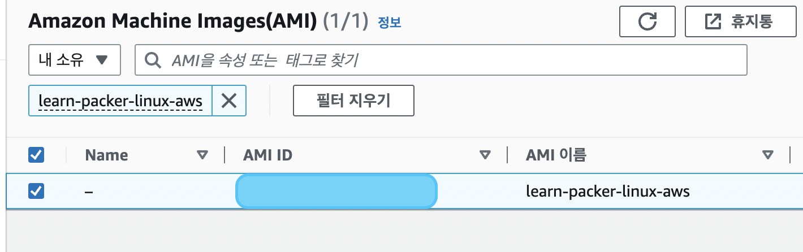
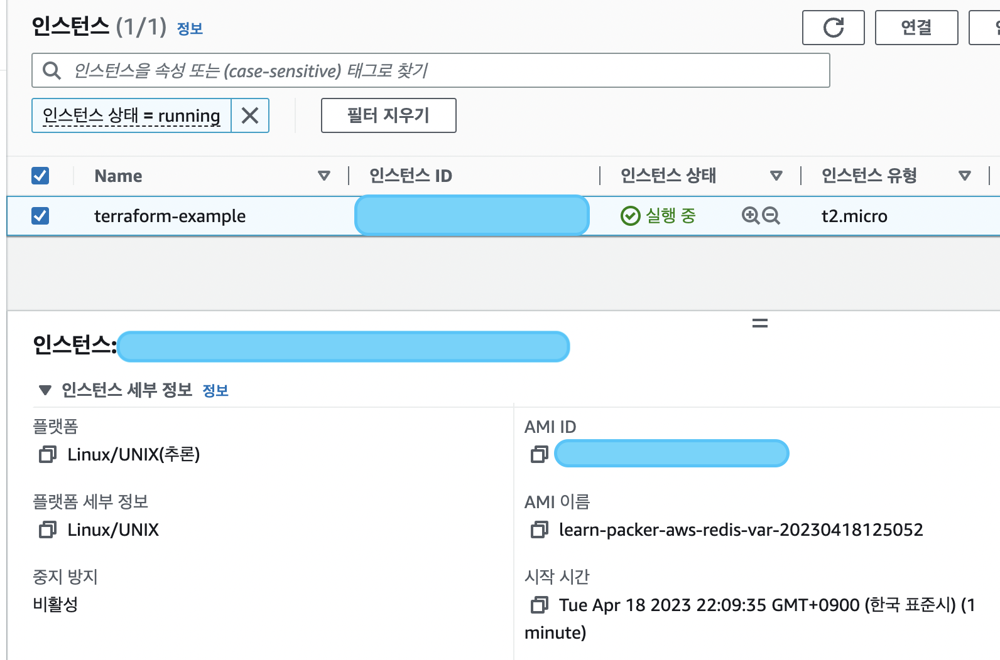

## packer tutorial
---
### packer CLI

1. `packer init .`
2. `packer fmt .`
3. `packer validate .`
4. `packer build aws_ubuntu.pkr.hcl`

</br>

### 🔥 AMI 생성 완료 🔥


</br>

### variable 지정하기
```
variable "ami_prefix" {
  type    = string
  default = "learn-packer-linux-aws-redis"
}
```

</br>

### variable file 생성하기
- `example.pkrvars.hcl` 생성
- ```
  ami_prefix = "learn-packer-aws-redis-var"
  ```
- `packer build --var-file=example.pkrvars.hcl aws-ubuntu.pkr.hcl`

</br>

### parallel build
- source 생성하기
    ```
    source "amazon-ebs" "ubuntu-focal" {
    ami_name      = "${var.ami_prefix}-focal-${local.timestamp}"
    instance_type = "t2.micro"
    region        = "us-west-2"
    source_ami_filter {
        filters = {
        name                = "ubuntu/images/*ubuntu-focal-20.04-amd64-server-*"
        root-device-type    = "ebs"
        virtualization-type = "hvm"
        }
        most_recent = true
        owners      = ["099720109477"]
    }
    ssh_username = "ubuntu"
    }
    ```
- build에 추가하기
  ```
  build {
    name = "learn-packer"
    sources = [
        "source.amazon-ebs.ubuntu"
        "source.amazon-ebs.ubuntu-focal"
    ]
  }
  ```

</br>

### 🔥 인스턴스 생성 완료 🔥 


