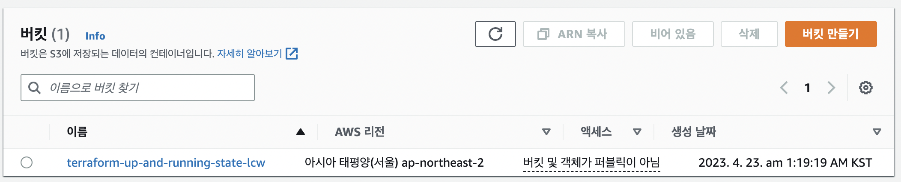
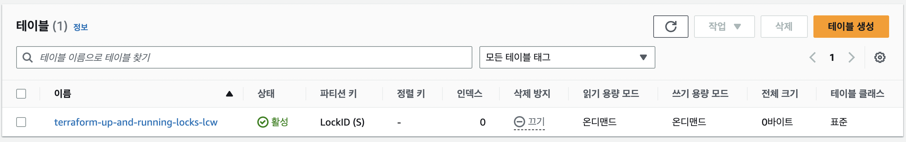
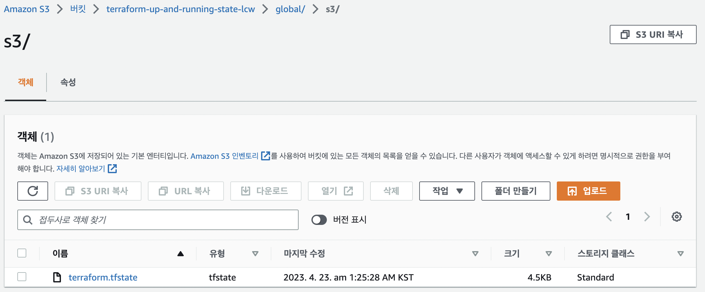
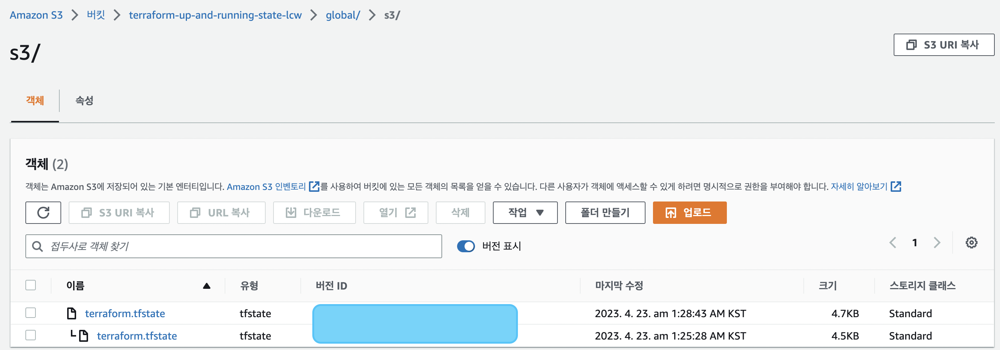
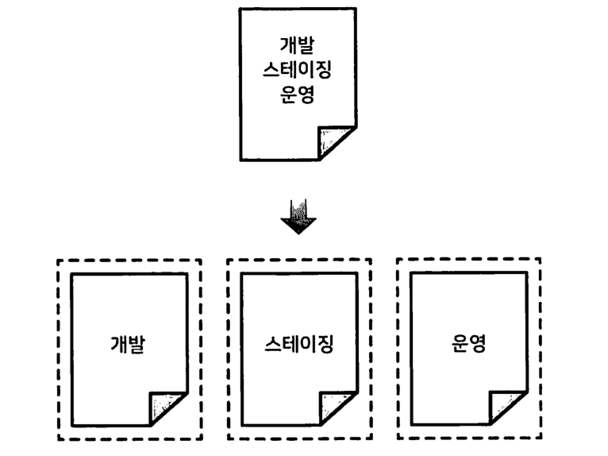
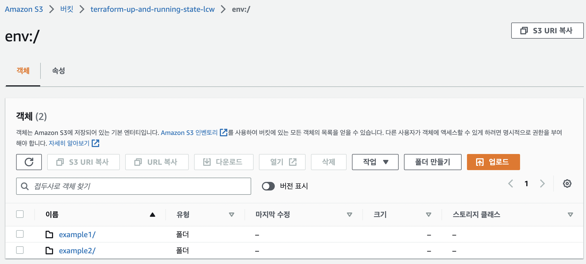
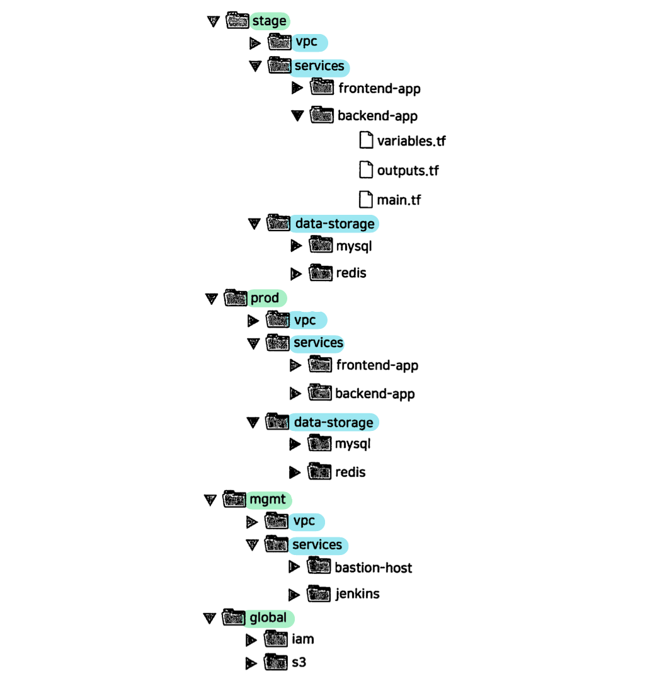
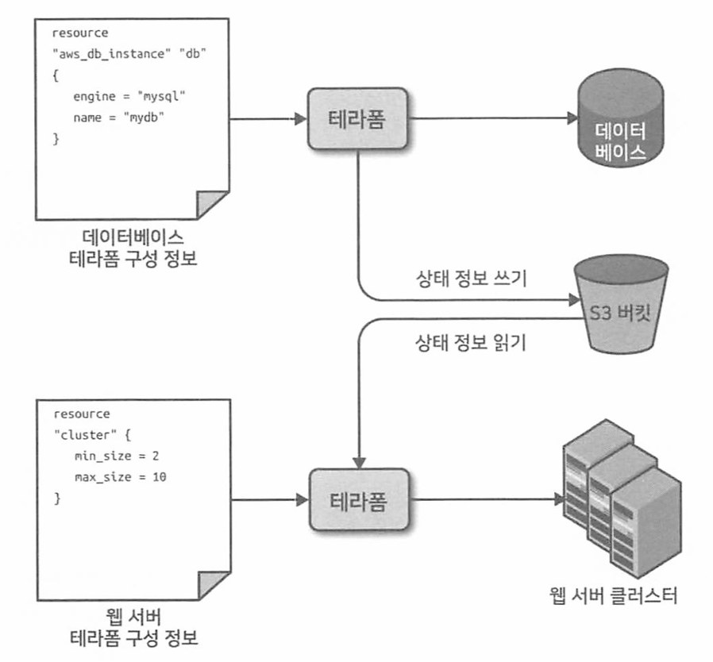

# 3. 테라폼 상태 관리하기

## 01. 테라폼 상태란?
테라폼을 실행할 때마다 테라폼은 생성한 인프라에 대한 정보를 테라폼 상태 파일(`terraform.tfstate`)에 기록한다.
이 파일에는 구성 파일(.tf)의 테라폼 리소스가 실제 리소스의 표현으로 매핑되는 내용을 기록하는 사용자 정의 `JSON`형식이 포함되어 있다.

</br>

### 상태 관리 방법
1. `terraform apply`
2. `terraform.tfstate` 파일 생성된다.
3. 테라폼을 실행할 때마다 AWS에서 리소스의 최신 상태를 가져와 테라폼의 구성과 비교한다.
   - `plan` 명령의 출력은 상태 파일의 ID를 통해 발견된 컴퓨터의 코드와 실제 세계에 배포된 인프라 간의 차이이다.

</br>

```
📌 참고 : 상태 파일은 프라이빗 API이다.
상태 파일은 배포할 때마다 변경되는 프라이빗 API로, 오직 테라폼 내부에서 사용하기 위한 것이다.
테라폼 상태 파일을 직접 편집하거나 직접 읽는 코드를 작성해서는 안된다.
상태 파일을 조작해야 하는 경우 terraform import 또는 terraform state 명령을 사용해야 한다.
```

</br>

### 팀 단위로 상태 관리하기
테라폼을 실제 운영 환경에서 팀 단위로 사용하고자 할 때는 다음과 같은 문제가 발생한다.
1. 상태 파일을 저장하는 공유 스토리지
   - 테라폼을 사용하여 인프라를 업데이트하려면 각 팀원이 동일한 테라폼 상태 파일에 엑세스해야한다. 즉, 상태 파일을 공유 위치에 저장해야 한다.
2. 상태 파일 잠금
   - 상태 데이터가 공유되자마자 `잠금(locking)`이라는 새로운 문제가 발생한다.
   - 잠금 기능 없이 두 팀원이 동시에 테라폼을 실행하는 경우 `경쟁 상태(race condition)`에 처해 데이터가 손실되거나 상태 파일이 손상될 수 있다.
3. 상태 파일 격리
   - 인프라를 변경할 때는 다른 환경을 격리하는 것이 가장 좋다.
   - 테스트 또는 스테이징 환경을 변경할 때 실수로 프로덕션 환경이 중단되는 경우는 없는지 확인해야 한다.

</br>

---

## 02. 상태 파일 공유

### 👎 버전 관리 도구를 이용한 관리
여러 명의 팀원이 파일에 공통으로 엑세스할 수 있게 하는 가장 일반적인 방법은 파일을 깃과 같은 버전 관리 시스템에 두는 것이다.
그러나 테라폼 상태 파일을 버전 관리 시스템에 저장하는 것은 다음과 같은 이유 때문에 `부적합`하다.
1. 수동 오류
   - 테라폼을 실행하기 전에 최신 변경 사항을 가져오거나 실행하고 나서 푸시하는 것을 잊기 쉽다.
2. 잠금
   - 대부분의 버전 관리 시스템은 여러 명의 구성원이 동시에 하나의 상태 파일에 terraform apply 명령을 실행하지 못하게 하는 잠금 기능을 제공하지 않는다.
3. 시크릿
   - 테라폼 상태 파일의 모든 데이터는 평문으로 저장되는데 특정 테라폼 리소스에 중요한 데이터를 저장해야 할 때 문제가 발생한다.

</br>

### 👍 테라폼 백엔드를 이용한 관리
가장 좋은 방법은 테라폼에 내장된 원격 백엔드 기능을 사용하는 것이다.
`테라폼 백엔드`는 테라폼이 상태를 로드하고 저장하는 방법을 결정한다.

</br>

- `로컬 백엔드(기본 백엔드)` - 로컬 디스크에 상태 파일 저장
- `원격 백엔드` - 원격 공유 저장소에 상태 파일 저장.
  - 아마존 S3, 애저 스토리지, 구글 클라우드 스토리지, 해시코프의 테라폼 클라우드, 테라폼 프로, 테라폼 엔터프라이즈 등
  - 다음의 세 가지 문제 해결
    1. 수동 오류
       - 원격 백엔드를 구성하면 테라폼은 plan이나 apply 명령을 실행할 때마다 해당 백엔드에서 상태 파일을 자동으로 로드한다. 
    2. 잠금
       - 대부분의 원격 백엔드는 기본적으로 잠금 기능을 지원한다.
       - `terraform apply` 명령어를 실행하면 테라폼은 자동으로 잠금을 활성화한다.
       - `-lock-timeout=<TIME>` 매개 변수를 사용하면 apply 명령을 실행할 때 잠금이 해제되기까지 테라폼이 얼마 동안 대기하도록 할지 설정할 수 있다.
    3. 시크릿
       - 대부분의 원격 백엔드는 기본적으로 데이터를 보내거나 상태 파일을 저장할 때 암호화하는 기능을 지원한다.
  - 테라폼을 AWS와 함께 사용하는 경우 아마존이 관리하는 파일 저장소인 아마존 `S3(Simple Storage Service)`가 가장 적합하다.
    ```
    👍 장점
    - 관리형 서비스이므로 추가 인프라를 배포하고 관리할 필요가 없다.
    - 99.9999999999%의 내구성과 99.99%의 가용성을 제공하도록 설계되었으므로 데이터 손실 또는 서비스 중단을 걱정할 필요가 없다.
    - 암호화를 지원하므로 상태 파일에 민감한 데이터를 저장할 때 안정성을 높인다.
    - 아마존 다이나모DB를 통한 잠금 기능을 지원한다.
    - 버전 관리를 지원하므로 상태 파일의 수정 사항이 모두 저장된다. 롤백이 가능하다.
    ```

</br>

### 원격 저장소 S3 bucket 생성
1. 4가지 인수를 설정한다.
   ```
   1. bucket
   2. lifecycle
   3. versioning
   4. server_side_encryption_configuration
   ```
    ```
    resource "aws_s3_bucket" "terraform_state" {
        bucket = "terraform-up-and-running-state"

        # 실수로 버킷을 삭제하는 것을 방지한다.
        lifecycle {
            prevent_destroy = true
        }

        # 코드 이력을 관리하기 위해 상태 파일의 버전 관리를 활성화한다.
        versioning {
            enabled = true
        }

        # 서버 측 암호화를 활성화 한다.
        server_side_encryption_configuration {
        rule {
            apply_server_side_encryption_by_default {
            sse_algorithm = "AES256"
            }
        }
        }
    }
    ```
    ```
    🔑 서버 측 암호화란? 
    --> S3 버킷에 기록된 모든 데이터에 <<서버 측 암호화>>를 설정한다.

    웹 사이트의 경우 외부에 공개하는 정보가 아닌 이상 S3에 저장하는 데이터는 기본적으로 암호화할 필요가 있다.
    대개 S3 데이터를 암호화하는 방식은 크게 두가지 방식이 있다.
    1. 데이터를 저장할 때 암호화 KEY를 이용해 암호화/복호화를 관리한다.
    2. Amazon의 암호화된 API 엔드포인트를 이용해 S3에서 다른 서비스 또는 리소스로 전송되는 데이터를 암호화한다.

    📌 S3 Key로 암호화 하기
    키를 이용해 S3 데이터를 암호화할 때 어느 주체 기준으로 암호화하는지에 따라, 서버측과 클라이언트로 나뉘게 된다.
    - 서버측 암호화
    - 서버 측 암호화는 데이터를 받는 애플리케이션 또는 서비스에 의해 데이터를 암호화하는 것이다.
    - 서버측 암호화는 S3 플랫폼 내에서 진행되며, 디스크에 저장될 때 데이터 객체를 암호화하고, 적절한 권한 증빙을 통해 데이터 인출을 요청할 때 복호화해 전송한다.
    - 서버측에서 S3에서 암호화를 하는 방법은 총 3가지가 있는데 그 중 SSE-S3를 살펴본다.

    📌 SSE-S3
    - 아마존 S3에서 관리하는 키를 사용하여 암호화하는 방법이다.
    S3 mamaged data key는 S3에 의해 완전히 소유되고 관리 된다.
    - AES-256 알고리즘을 이용해 암호화 한다.
    - 서버에서 암호화 하도록 만들기 위해서는 헤더에 아래 내용을 보내야 한다.
    - "x-amz-server-side-encryption": "AES256" (amz는 amazon의 약자이다)

    아래의 과정을 거쳐 암호화 된다.
    1. 암호화되지 않음 객체를 S3로 업로드하여 SSE-S3 암호화를 할 것이다.
    2. S3 로 객체를 전송할 때 HTTP/HTTPS 프로토콜로 헤더에 "x-amz-server-side-encryption":"AES256" 을 설정해 전송한다.
    3. 그러면 Amazon S3 는 이 헤더를 통해 S3 Managed Data Key 로 전송받은 Object 를 암호화 하고 저장한다.
    4. 즉, S3 에서 암호화 하는 데이터 키를 소유하고 관리하고 있는 방식이다.
    ```
    참고 사이트 : [[AWS] 📚 S3 객체 암호화 기능 종류 및 사용하기](https://inpa.tistory.com/entry/AWS-%F0%9F%93%9A-S3-%EA%B0%9D%EC%B2%B4-%EC%95%94%ED%98%B8%ED%99%94-%EA%B8%B0%EB%8A%A5-%EC%A2%85%EB%A5%98-%EB%B0%8F-%EC%82%AC%EC%9A%A9%ED%95%98%EA%B8%B0)

2. DynamoDB 테이블 생성하기
- 아마존의 분산형 키-값 저장소
- 분산 잠금 시스템에 필요한 강력한 읽기 일관성 및 조건부 쓰기를 지원한다.
  1. `LockID`라는 기본 키가 있는 Dynamo table 생성하기 (aws_dynamodb_table)
     ```
      resource "aws_dynamodb_table" "terraform_locks" {
         name         = "terraform-up-and-running-locks"
         billing_mode = "PAY_FOR_REQUEST"
         hash_key     = "LockID"

         attribute {
            name = "LockID"
            type = "S"
         }
      }
     ```

3. backend 만들기
   S3 버킷에 상태를 저장(암호화 및 잠금을 사용)하도록 테라폼을 구성하려면 테라폼 코드 내에 backend 구성을 설정해야 한다.
   ```
   terraform {
      backend "<BACKEND_NAME>" { # 사용하려는 백엔드의 이름
         [CONFIG...]
      }
   }
   ```
   ```
   📌 Config 값
   bucket         : 사용할 S3 버킷의 이름
   key            : 테라폼 상태 파일을 저장할 S3 버킷 내의 파일 경로
   region         : S3 버킷이 있는 AWS의 리전
   dynamodb_table : 잠금에 사용할 dynamoDB 테이블
   encypt         : true로 설정시 테라폼 상태가 S3 디스크에 저장될 때 암호화됨.
   ```

</br>

### 결과
테라폼은 S3에 상태 데이터를 자동으로 푸시하거나 가져오고 S3가 상태 파일의 모든 변경 사항을 저장한다.
1. bucket 생성 완료 </br>
   
2. dynamoDB 생성 완료 </br>
   
3. terraform.tfstate 파일 업로드 완료 </br>
   
4. 버저닝 정상 동작 확인 </br>
   

</br>

---

## 03. 테라폼 백엔드의 단점
테라폼을 사용하여 테라폼 상태를 저장할 S3 버킷을 만드는 것은 닭이 먼저인지 달걀이 먼저인지 묻는 것과 같다.
1. 테라폼 모드를 작성하여 S3 버킷과 DynamoDB 테이블을 생성하고 해당 코드를 로컬 백엔드와 함께 배포한다.
2. 테라폼 코드로 돌아가서 원격 backend 구성을 추가한다. 새로 생성된 S3 버킷과 DynamonDB 테이블을 사용하고, terraform init 명령을 실행하여 로컬 상태를 S3에 복사한다.

</br>

S3 버킷과 DynamoDB table을 삭제하려면 이 단계를 반대로 수행해야 한다.
1. 테라폼 코드로 이동하여 backend 구성을 제거한 다음 terraform init 명령을 재실행하여 테라폼 상태를 로컬 디스크에 다시 복사한다.
2. terraform destroy 명령을 실행하여 S3 버킷 및 DynamoDB table을 삭제한다.

</br>

테라폼의 backend 블록에서는 변수나 참조를 사용할 수 없다. </br>
즉, S3 버킷 이름, 리전, DynamoDb 테이블 이름 등을 모두 테라폼 모듈에 수동으로 복사해서 붙여넣어야 한다. </br>
배포하는 모든 테라폼 모듈마다 고유한 key를 확보해서 실수로 다른 모듈의 상태를 덮어쓰지 않도록 해야한다. 
```
# 백엔드 구성에 변수는 허용되지 않으므로 이 코드는 실행되지 않는다.
terraform {
   backend "s3" {
      bucket = var.bucket 
      ...
   }
}
```

수동 변경 작업을 자주하면 에러가 발생하기 쉽다. 이를 해결하기 위해 </br>
`부분 구성(partial configuration)`을 이용해 terraform init을 호출할 때 `-backend-config` 인수를 통해 매개 변수를 전달한다.
```
📌 반복되는 백엔드 인수를 backend.hcl이라는 별도의 파일로 추출한다.
# backend.hcl
bucket         = "terraform-up-and-running-state"
region         = "us-east-3"
dynamodb_table = "terraform-up-and-running-locks"
encrypt        = true

📌 모듈마다 서로 다른 key 값에 대해서만 테라폼 코드에 작성한다.
terraform {
   backend "s3" {
      key = "example/terraform.tfstate
   }
}

📌 -backend-config 인수와 함께 terraform init 명령을 실행한다.
$ terraform init -backend-config=backend.hcl
```

---

## 04. 상태 파일 격리
모든 인프라를 단 하나의 테라폼 파일로 관리하면 실수로 전체를 날려버릴 수 있다. </br>
분리된 환경을 갖춘다는 것은 하나의 환경을 다른 환경으로부터 격리한다는 것이다. </br>
따라서 단 하나의 테라폼 구성 안에서 모든 환경을 관리하고 있다면 이 `격리 상태`를 깨뜨리는 것이다. </br>

다음과 같이 각 환경을 별도의 구성 세트로 정의하려 한다. 상태 파일을 격리하는 2가지 방법이 있다. </br>
    
1. 작업 공간을 통한 격리 - 동일한 구성에서 빠르고 격리된 테스트 환경에 유용하다.
2. 파일 레이아웃을 이용한 격리 - 보다 강력하게 분리해야 하는 운영 환경에 적합하다.

</br>

### 1. 작업 공간을 통한 격리
- 테라폼은 작업 공간(terraform workspace)을 통해 테라폼 상태를 별도의 이름을 가진 여러 개의 작업 공간에 저장할 수 있다.
- 테라폼은 'default'라는 기본 작업 공간에서 시작하며 작업 공간을 따로 지정하지 않으면 기본 작업 공간을 사용한다.
- 새 작업 공간을 생성하거나 작업 공간을 전환하려면 `terraform workspace` 명령을 사용한다.

</br>

```
💻 Terraform Workspace 명령어
$ terraform workspace show        # 작업 공간 확인 하기
$ terraform workspace new example # 새 작업 공간 만들기
$ terraform workspace select      # 작업 공간 선택하기
```

</br>

1. [workspace - default] backend.tf 
    ```
    terraform {
    backend "s3" {
        # 이전에 생성한 버킷 이름으로 변경
        bucket = "terraform-up-and-running-state-lcw"
        key    = "workspace-example/s3/terraform.tfstate"
        region = "ap-northeast-2"

        # 이전에 생성한 BynamoDB Table 이름으로 변경
        dynamodb_table = "terraform-up-and-running-locks-lcw"
        encrypt        = true
    }
    }  
    ```
2. [workspace - default ] `terraform plan`
   ```
   Plan: 1 to add, 0 to change, 0 to destroy.
   ```
3. [workspace - default ] `terraform apply`
   ```
   Apply complete! Resources: 1 added, 0 changed, 0 destroyed.
   ```
4. [workspace - example1] `terraform plan`
   - example1 workspace는 아직 리소스가 생성되지 않은 상태이다.
   ```
   Plan: 1 to add, 0 to change, 0 to destroy.
   ```
5. [workspace - example1] `terraform apply`
   ```
   Apply complete! Resources: 1 added, 0 changed, 0 destroyed.
   ```
6. `terraform workspace list`
   ```
   default
   example1
   * example2
   ```

</br>

### S3 버킷 디렉터리 구조 확인하기
- 각 작업 공간 내에서 테라폼은 backend 구성에서 지정한 key를 사용한다.
- 작업 공간 마다 별도의 상태 파일이 있어 다른 작업 공간으로 전환하는 것은 `상태 파일이 저장된 경로를 변경하는 것`과 같다. </br>


</br>

### 각 작업 공간에 다른 설정 값 적용하기
- 테스트 비용을 점감하기 위해서 기본 작업 공간에서 인스턴스 유형을 `t2.medium`으로 설정하고 그 외의 작업 공간은 `t2.micro`로 설정한다.
- 3항 연산자를 사용한다.
   ```
   resource "aws_instance" "example" {
      ami = "ami-0e38c97339cddf4bd"
      instance-type = terraform.workspace == "default" ? "t2.medium" : "t2.micro"
   }
   ```

</br>

### 테라폼 작업 공간의 단점
1. 모든 작업 공간의 상태 파일은 동일한 백엔드(예를 들어, 동일한 S3 버킷)에 저장된다. 즉, 모든 작업 공간이 같은 인증 메커니즘을 사용한다.
2. terraform workspace 명령을 실행하지 않으면 코드나 터미널에 작업 공간에 대한 정보가 표시 되지 않는다. </br>
   코드를 탐색할 때, 한 작업 공간에 배치된 모듈은 다른 모든 작업 공간에 배치된 모듈과 정확히 동일하다.
3. 어떤 작업 공간에 있는지 보이지 않기 때문에 현재 사용 중인 작업 공간이 어느 것인지 잊어버리기 쉽다.

</br>

---
### 2. 파일 레아아웃을 이용한 격리
환경을 완전히 격리하려면 다음 작업을 수행해야 한다.
- 각 테라폼 구성 파일을 분리된 폴더에 넣는다.
- 서로 다른 인증 메커니즘과 엑세스 제어를 사용해 각 환경에 서로 다른 백엔드를 구성한다.
  - 각 환경은 각각 분리된 S3 버킷을 백엔드로 사용하는 별도의 AWS 계정에 있을 수 있다.

</br>

### 구성 요소(component)별 테라폼 폴더 관리하기
- `구성 요소`  : 일반적으로 함께 배포되는 일관된 리소스 집합
- 권장되는 파일 레이아웃 </br>
   </br>
  ```
  📌 환경
   - stage  : 테스트 환경과 같은 사전 프로덕션 워크로드 환경
   - prod   : 사용자용 맵 같은 프로덕션 워크로드 환경
   - mgmt   : Bastion Host, Jenkins와 같은 데브옵스 도구 환경
   - global : S3, IAM과 같이 모든 환경에서 사용되는 리소스를 배치할 수 있는 장소
  
  📌 구성 요소
   - vpc          : 해당 환경을 위한 네트워크 토폴로지
   - services     : 해당 환경에서 서비스되는 애플리케이션 또는 마이크로서비스. 
   - data-storage : MYSQL 또는 레디스와 같은 해당 환경에서 실행할 데이터 저장소.
  ```
```
📌 참고 : 코드 중복 피하기
파일 레이아웃에는 많은 복제본이 발생한다.
4장에서 테라폼 모듈을 사용하며 코드를 중복하지 않고 유지하는 방법을 설명한다.
```

</br>

### 👎 단점
1. 한 번의 명령으로 전체 인프라를 만들지 못한다. 
   - [terragrant](https://terragrunt.gruntwork.io/)를 사용하는 경우 apply-all 명령을 사용하여 이 프로세스를 자동화할 수 있다.
2. 리소스 종속성을 사용하기 어렵다.
   - 테라폼은 `terraform_remote_state` 데이터 소스 솔루션을 제공한다.

</br>

---

## 05. terraform_remote_state 데이터 소스
`terraform_remote_state` 데이터 소스를 사용하면 다른 테라폼 구성 세트에 완전한 읽기 전용 방식으로 저장된 테라폼 상태 파일을 가져올 수 있다.

### [예제] 웹 서버 클러스터 <-> MySQl 데이터 베이스 통신
 </br>
- 웹 서버 클러스터는 MySQL 데이터베이스보다 훨씬 자주 배포할 것이다. </br>
  이 과정에서 실수로 데이터베이스를 손상시키고 싶지 않다면 웹 서버 클러스터와 MySQL 데이터 베이스 설정 디렉터리를 분리해야 한다.  </br>
  ```
   ├── global
   │   └── s3
   │       ├── main.tf
   │       ├── outputs.tf
   │       ├── providers.tf
   │       └── variables.tf
   └── stage
      ├── data-stores
      │   └── mysql
      │       ├── main.tf
      │       ├── outputs.tf
      |       ├── providers.tf
      │       └── variables.tf
      └── services
         └── webserver-cluster
               ├── data.tf
               ├── main.tf
               ├── outputs.tf
               └── variables.tf  
  ```

- stage/data-stores/mysql/main.tf
  - 패스워드와 같은 정보는 절대 평문으로 입력해서는 안된다.
  - 다음의 두 가지 방법으로 패스워드를 입력할 수 있다.
  1. `AWS Secrets Manager`에 저장하기
      ```
      resource "aws_db_instance" "example" {
         identifier_prefix  = "terraform-up-and-running"
         engine             = "mysql"
         allocation_storage = 10 # 10G
         instance_class     = "db.t2.micro"
         name               = "example_database"
         username           = "admin"
         password           = data.aws_secretsmanager_secret_version.db_password.secret_string
      }

      data "aws_secretsmanager_secret_version" "db_password" {
         secret_id = "mysql-master-password-stage"
      }
      ``` 
  2. 테라폼 외부에서 관리하고 환경 변수를 통해 값을 테라폼에 전달하기
     - variables.tf
      ```
      variable "db_password" {
         description = "The password for the database"
         type        = string
      }       
      ``` 
      ```
      📌 참고 : 시크릿 값은 항상 테라폼 상태에 저장된다.
      시크릿 값을 어떤 방법으로 읽든 간에 테라폼 리소승에 시크릿 값을 인수로 전달하면 해당 시크릿 값은 테라폼 상태 파일에 평문으로 저장된다.
      항상 암호화를 사용하는 등 상태 파일을 저장할 때 특히 주의해야 한다.
      IAM 권한을 사용해 S3 버킷에 대한 엑세스를 제한하는 등 상태 파일에 엑세스할 수 있는 사용자를 세심하게 파악하고 관리해야 한다.
      ```
- stage/services/webserver-cluster/main.tf
  - `terraform_remote_state` 데이터 소스 추가해 웹 서버 클러스터 코드가 DB 상태 파일에서 데이터를 읽도록 한다.
      ```
         data "terraform_remote_state" "db" {
         backend = "s3" 

         config = {
            bucket = "terraform-up-and-running-state-lcw"
            key = "stage/data-stores/mysql/terraform.tfstate"
            }
         } 
      ```
       </br>
  - 모든 데이터베이스의 출력 변수는 상태 파일에 저장되며 다음과 같은 참조를 이용해 `terraform_remote_state` 데이터 소스에서 읽을 수 있다.
    ```
    data.terraform_remote_state.<NAME>.outputs.<ATTRIBUTE>
    ```

- 테라폼 내장 함수를 이용해 배시 스크립트 외부화하기
  - `template_file`을 이용해 aws_laucnch_configuration.example.user_data를 설정했다.
   ```
   📌 테라폼의 내장 함수
   테라폼에는 표현식을 사용하여 실행할 수 있는 여러 내장 함수가 있다.
   terraform console 명령을 실행해 대화형 콘솔 사용해서 내장 함수 테스트할 수 있다.

   1. format(<FMT>, <ARGS>, ...)
   > format("%.3f", 3.14159265359)
   "3.142"

   1. file(<PATH>)
   PATH에서 파일 읽고 그 내용을 문자열로 반환한다.
   예를 들어 사용자 데이터 스크립트를 stage/services/webserver-cluster/user-data.sh에 넣고
   file("user-data.sh")로 문자열로 내용을 읽을 수 있다.


   3. template_file
   data "template_file" "user_data" {
      template = file("user-data.sh) # 랜더링할 문자열

      vars = { # 랜더링 중에 사용할 변수의 맵
         server_port = var.server_port
         db_address  = data.terraform_remote_state.db.outputs.address
         db_port     = data.terraform_remote_state.db.outputs.port
      }
   }
   ```
   ```
   📌 참고 : 외부화된 파일
   사용자 데이터 스크립트를 별도의 자체 파일로 추출하면 자동화된 단위 테스트 코드를 작성할 수 있다는 이점이 있다.
   환경 변수를 찾는 배시 구문은 테라폼의 보간 구문과 동일하기 때문에 테스트 코드는 환경 변수를 사용하여 보간된 변수를 채울 수도 있다.
   [예시 코드]
   export db_address=12.24.XX.XX
   export db_port=5555
   export server_port=8888

   ./user-data.sh

   output=$(curl "http://localhost:$server_port")

   if [[ $output == *"Hello, World"* ]], then
      echo "Success!"
   else
      echo "Error"
   fi
   ```

</br>

---

## 06. 결론
격리, 잠금 및 상태에 대해 많은 고민을 해야 하는 이유는 코드형 인프라가 일반 코딩과 다른 트레이드 오프를 갖기 때문이다. </br>
인프라를 제어하는 코드를 작성할 때 버그는 모든 앱, 모든 데이터 저장소 및 전체 네트워크 토폴로지, 기타모든 요소를 손상시킬 수 있다. </br>
따라서 코드형 인프라 작업을 할 때는 일반적인 코드보다 더 많은 '안전 메커니즘'을 포함하는 것이 좋다. </br>
