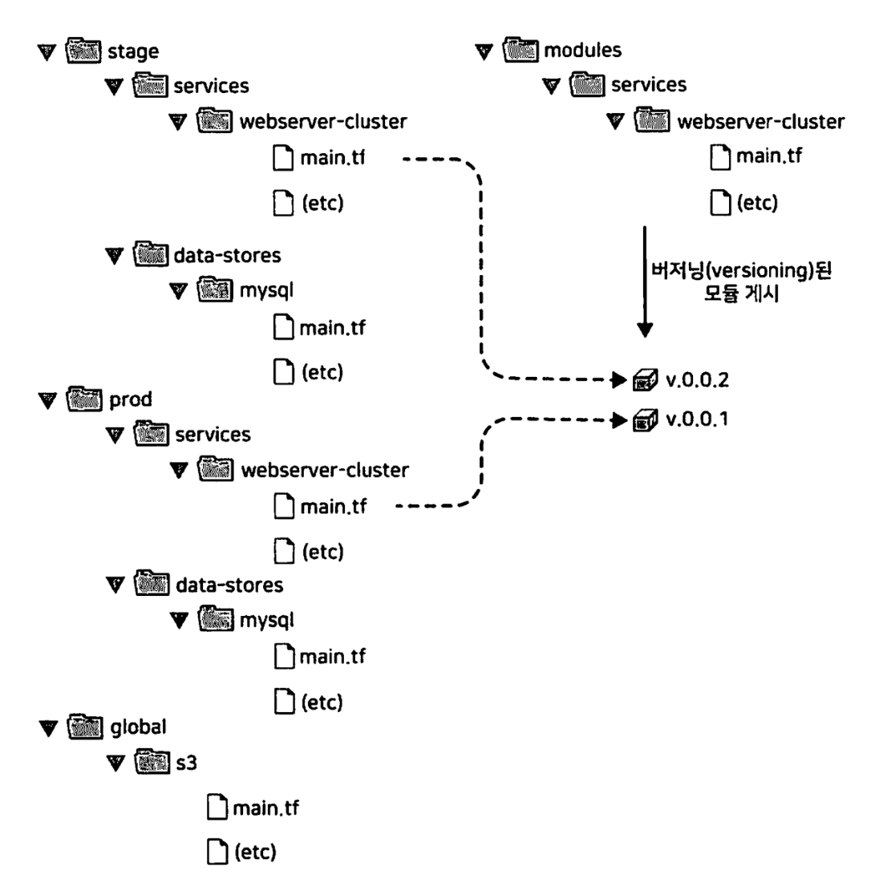
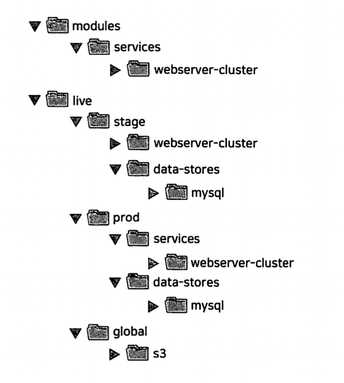

# 4. 테라폼 모듈로 재사용 가능한 인프라 생성하기

우리는 일반적으로 둘 이상의 환경이 필요하다. </br>
하나는 팀의 내부 테스트(staging)을 위한 환경이고 다른 하나는 실제 사용자가 엑세스(production)하기 위한 환경이다. </br>

테라폼을 사용하면 코드를 `테라폼 모듈`에 넣고 전체 코드의 여러 위치에서 해당 모듈을 `재사용`할 수 있다.

---

## 1. 모듈의 기본
```
디렉터리 구조

├── global
│   └── s3
│       ├── main.tf
│       ├── outputs.tf
│       ├── providers.tf
│       └── variables.tf
├── modules
│   └── services
│       └── webserver-cluster
└── stage
    ├── data-stores
    │   └── mysql
    │       ├── backend.tf
    │       ├── data.tf
    │       ├── main.tf
    │       ├── outputs.tf
    │       ├── providers.tf
    │       ├── terraform.tfvars
    │       └── variables.tf
    └── services
        └── webserver-cluster
            ├── data.tf
            ├── main.tf
            ├── outputs.tf
            ├── terraform.tfstate
            ├── terraform.tfvars
            ├── user-data.sh
            └── variables.tf
```

모듈을 사용하기 위한 구문은 다음과 같다.
```
module "<NAME>" {
    source = "<SOURCE>"

    [CONFIG ...]
}
```
```
📌 Description
NAME : 모듈을 참조하기 위해 사용할 수 있는 식별자
SOURCE : 모듈 코드를 찾을 수 있는 경로
```

---

## 2. 모듈 입력
- 테라폼에서는 모듈에도 입력 매개 변수를 만들 수 있다.
- 입력 매개 변수를 정의하기 위해 `입력 변수(input variables)`를 사용한다.

</br>

### 1. 변수 정의하기 (`modules/services/webserver-cluster/variables.tf`)
```
variable "cluster_name" {
  description = "The name to use for all the cluster resources"
  type        = string
}

variable "db_remote_state_bucket" {
  description = "The name of the s3 bucket for the database's remote state"
  type        = string
}

variable "db_remote_state_key" {
  description = "The path for the database's remote state in S3"
  type        = string
}
```

### 2. 리소스에 입력 변수 값 설정하기 (`stage/services/webserver-cluster/main.tf`)
```
resource "aws_security_group" "alb" {
  name   = "${var.cluster_name}-alb"
  vpc_id = data.aws_vpc.default.id

  # 인바운드 HTTP 트래픽 허용
  ingress {
    from_port   = 80
    to_port     = 80
    protocol    = "tcp"
    cidr_blocks = ["0.0.0.0/0"]
  }

  # 모든 아웃바운드 트래픽 허용
  egress {
    from_port   = 0
    to_port     = 0
    protocol    = "-1"
    cidr_blocks = ["0.0.0.0/0"]
  }
}
```

### 3. 모듈에 입력 변수 값 설정하기 (`stage/services/webserver-cluster/main.tf`)
```
module "webserver_cluster" {
  source                 = "../../../modules/services/webserver-cluster"
  cluster_name           = "webservers-stage"
  db_remote_state_bucket = var.db_remote_state_bucket
  db_remote_state_key    = var.db_remote_state_key
}
```

</br>

### 📌 예제
- `staging` 환경에서는 비용을 절약하기 위해 적은 수의 웹 서버 클러스터를 실행하고 `production` 환경에서는 많은 트래픽을 처리하기 위해 더 큰 클러스터를 실행한다.
1. 변수 정의하기 (`modules/services/webserver-cluster/variables.tf`)
   ```
    variable "instance_type" {
        description = "The type of EC2 Instances to run (e.g. t2.micro)"
        type        = string
    }

    variable "min_size" {
        description = "The minimum number of EC2 Instances in the ASG"
        type        = string
    }

    variable "max_size" {
        description = "The maximum number of EC2 Instances in the ASG"
        type        = string
    }
   ```
2. 리소스에 입력 변수 값 설정하기 (`stage/services/webserver-cluster/main.tf`)
```
resource "aws_launch_configuration" "example" {
  image_id        = "ami-0e38c97339cddf4bd"
  instance_type   = var.instance_type
  security_groups = [data.aws_security_group.instance.id]

  user_data = data.template_file.user_data.rendered

  lifecycle {
    create_before_destroy = true
  }
}

resource "aws_autoscaling_group" "example" {
  launch_configuration = aws_launch_configuration.example.name
  vpc_zone_identifier  = data.aws_subnet_ids.default.ids

  target_group_arns = [aws_lb_target_group.asg.arn]
  health_check_type = "ELB"

  min_size = var.min_size
  max_size = var.max_size

  tag {
    key                 = "Name"
    value               = var.cluster_name
    propagate_at_launch = true
  }

  lifecycle {
    create_before_destroy = true
  }
}
```
3. 모듈에 입력 변수 값 설정하기 (`stage/services/webserver-cluster/main.tf`)
- `staging`
    ```
    module "webserver_cluster" {
    source                 = "../../../modules/services/webserver-cluster"
    cluster_name           = "webservers-stage"
    db_remote_state_bucket = var.db_remote_state_bucket
    db_remote_state_key    = var.db_remote_state_key
    instance_type          = "t2.micro"
    min_size               = 2
    max_size               = 2
    }
    ```
- `production`
  ```
    module "webserver_cluster" {
    source                 = "../../../modules/services/webserver-cluster"
    cluster_name           = "webservers-prod"
    db_remote_state_bucket = var.db_remote_state_bucket
    db_remote_state_key    = var.db_remote_state_key
    instance_type          = "m4.large"
    min_size               = 2
    max_size               = 10
  ```

---

## 3. 모듈과 지역 변수
입력 변수를 사용하여 모듈의 입력을 정의하는 것도 좋지만 중간에 계산을 수행하거나 코드가 중복되지 않게끔 모듈에서 변수를 정의하는 방법이 필요하다. </br>
현재는 아래와 같이 포트 번호가 여러 곳에 하드 코딩되어있다. </br>
```
resource "aws_security_group" "alb" {
name   = "${var.cluster_name}-alb"
vpc_id = data.aws_vpc.default.id

# 인바운드 HTTP 트래픽 허용
ingress {
    from_port   = 80
    to_port     = 80
    protocol    = "tcp"
    cidr_blocks = ["0.0.0.0/0"]
}

# 모든 아웃바운드 트래픽 허용
egress {
    from_port   = 0
    to_port     = 0
    protocol    = "-1"
    cidr_blocks = ["0.0.0.0/0"]
}
}
```
🚨 이러한 값이 여러 곳에 하드 코딩하여 적용되면 코드를 읽고 유지하기 어려워진다. </br>
   입력 변수로 값을 추출할 수도 있지만 이 경우 모듈 사용자가 작성자가 의도하지 않은 값을 실수로 재정의할 수 있다. </br>
🌈 입력 변수를 사용하는 대신 이러한 값을 `locals` 블록에서 로컬 값으로 정의한다.
  ```
  locals {
    http_port    = 80
    any_port     = 0
    any_protocol = "-1"
    tcp_protocol = "tcp"
    all_ips      = ["0.0.0.0/0"]
  }
  ```
- 로컬 값을 사용하면 모든 테라폼 표현식에 이름을 할당하고 모듈 전체에서 해당 이름을 사용할 수 있다.
- 해당 이름은 모듈 내에서만 표시되므로 다른 모듈에는 영향을 미치지 않으며, 모듈 외부에서 이 값을 재정의할 수 없다.
- 로컬 값을 읽으려면 다음 구문으로 된 로컬 참조를 사용해야 한다.
  `local.<NAME>`
로드 밸런서의 보안 그룹을 포함해 모듈의 모든 보안 그룹에 적용한다.
```
resource "aws_security_group" "alb" {
  name   = "${var.cluster_name}-alb"
  vpc_id = data.aws_vpc.default.id

  # 인바운드 HTTP 트래픽 허용
  ingress {
    from_port   = local.http_port
    to_port     = local.http_port
    protocol    = local.tcp_protocol
    cidr_blocks = local.all_ips
  }

  # 모든 아웃바운드 트래픽 허용
  egress {
    from_port   = local.any_port
    to_port     = local.any_port
    protocol    = local.any_protocol
    cidr_blocks = local.all_ips
  }
}
```

---

## 4. 모듈 출력
로드에 응답하여 실행 중인 서버 수를 늘리거나 줄일 수 있는 것은 ASG의 강력한 기능이다. </br>
하루 중 예약된 시간에 클러스터 크기를 변경하는 예약된 작업으로 이 기능을 사용할 수 있다. </br>
다음의 코드는 </br>
1. 매일 오전 9시 서버 수를 10으로 늘린다.
2. 매일 오후 5시 서버 수를 2로 줄인다.
동작을 수행한다.
```
# prod/services/webserver-cluster/main.tf
resource "aws_autoscaling_schedule" "scale_out_during_business_hours" {
  scheduled_action_name = "scale-out-during-business-hours"
  min_size              = 2
  max_size              = 10
  desired_capacity      = 10
  recurrence            = "0 9 * * *"
}

resource "aws_autoscaling_schedule" "scale_in_at_night" {
  scheduled_action_name = "scale_in_at_night"
  min_size              = 2
  max_size              = 10
  desired_capacity      = 2
  recurrence            = "0 17 * * *"
}
```
🚨 이 두 번의 `aws_autoscaling_schedule`리소스에는 ASG의 이름을 지정하는 `autoscaling_group_name`이라는 필수 매개 변수가 누락되어 있다. </br>
🌈 테라폼에서는 출력 변수를 이용해 모듈 역시 값을 반환할 수 있다.
```
# prod/services/webserver-cluster/outputs.tf
output "asg_name" {
  value       = aws_autoscaling_group.example.Name
  description = "The name of the Auto Scaling Group"
}
```
- 다음의 구문을 사용하여 모듈 출력 변수에 엑세스할 수 있다.
  `module.<MODULE_NAME>.<OUTPUT_NAME>`

### 📌 예제
클러스터가 배포될 때 테스트할 URL을 알 수 있도록 `webserver-cluster` 모듈에 다른 출력인 ALB의 DNS이름을 노출할 수 있다.
1. 모듈에 출력 변수 추가하기 (`modules/services/webserver-cluster/outputs.tf`)
   ```
    output "alb_dns_name" {
    value       = aws_lb.example.dns_name
    description = "The domain name of the load balancer"
    }
   ```
2. 환경 코드에 출력 변수 추가하기 (`prod/services/webserver-cluster/outputs.tf`)
   - 
   ```
    output "alb_dns_name" {
    value       = module.webserver_cluster.alb_dns_name
    description = "The domain name of the load balancer"
    }
   ```

---

## 5. 모듈 주의 사항
모듈을 만들 때는 다음과 같은 사항을 주의해야 한다.
- 파일 경로
- 인라인 블록

### 1. 파일 경로
- 기본적으로 테라폼은 현재 작업 중인 디렉터리를 기준으로 경로를 해석한다.
  - 내장 함수 `file`을 사용하여 디스크에서 파일을 읽을 때 파일 경로가 `상대 경로`여만 한다. 

</br>

🚨 루트 모듈에서 `file` 함수를 사용하는 것은 가능하지만 별도의 폴더에 정의된 모듈에서 `file`함수를 사용할 수는 없다. </br>
🌈 `path.<TYPE>`형태의 경로 참조 표현식을 사용해 해결할 수 있다. </br>
테라폼은 다음 유형의 경로 참조를 지원한다.
```
- path.module
  표현식이 정의된 모듈의 파일 시스템 경로를 반환한다.
- path.root
  루트 모듈의 파일 시스템 경로를 반환한다.
- path.cwd
  현재 작업 중인 디렉터리의 파일 시스템 경로를 반환한다.
```
```
# modules/services/webserver-cluster/data.tf
data "template_file" "user_data" {
  template = file("${path.module}/user-data.sh")

  vars = {
    server_port = var.server_port
    db_address  = data.terraform_remote_state.db.outputs.address
    db_port     = data.terraform_remote_state.db.outputs.port
  }
}
```

### 2. 인라인 블록
일부 테라폼 리소스의 구성은 인라인 블록 또는 별도의 리소스로 정의할 수 있다. </br>
모듈을 만들 때는 항상 별도의 리소스를 사용하는 것이 좋다. </br>
`aws_security_group` 리소스를 사용하면 다음과 같이 인라인 블록을 통해 수신 및 송신 규측을 정의할 수 있다.
```
# create a new security group for the load balancer
resource "aws_security_group" "alb" {
  name   = "${var.cluster_name}-alb"
  vpc_id = data.aws_vpc.default.id

  # 인바운드 HTTP 트래픽 허용
  ingress {
    from_port   = local.http_port
    to_port     = local.http_port
    protocol    = local.tcp_protocol
    cidr_blocks = local.all_ips
  }

  # 모든 아웃바운드 트래픽 허용
  egress {
    from_port   = local.any_port
    to_port     = local.any_port
    protocol    = local.any_protocol
    cidr_blocks = local.all_ips
  }
}
```
별도의 `aws_security_group_rule`리소스를 사용하여 정확히 수신 및 송신 규칙을 정의하도록 이 모듈을 변경해야 한다. </br>
모듈의 두 보안 그룹 모두에 이 작업을 수행해야 한다. </br>
```
resource "aws_security_group" "alb" {
  name = "${var.cluster_name}-alb"
}

resource "aws_security_group_rule" "allow_http_inbound" {
  type              = "ingress"
  security_group_id = aws_security_group.alb.id

  from_port   = local.http_port
  to_port     = local.http_port
  protocol    = local.tcp_protocol
  cidr_blocks = local.all_ips
}

resource "aws_security_group_rule" "allow_http_outbound" {
  type              = "egress"
  security_group_id = aws_security_group.alb.id

  from_port   = local.any_port
  to_port     = local.any_port
  protocol    = local.any_protocol
  cidr_blocks = local.all_ips
}
```
인라인 규칙과 별도의 리소스를 혼합하여 사용하려 하면 라우팅 규칙이 충돌하여 서로 덮어쓰는 오류가 발생한다. 따라서 둘 중 하나만 사용해야 한다. </br>
이 제한 사항으로 인해 모듈을 작성할 때 항상 인라인 블록 대신 별도의 리소스를 사용해야 한다. 그렇지 않으면 `유연성`이 떨어진다.

---

## 6. 모듈 버전 관리
`staging`환경과 `production`환경이 동일한 모듈 폴더를 가리키는 경우 해당 폴더를 변경하면 바로 다음 배포 시 두 환경 모두 영향을 미친다. </br>
이러한 종류의 결합은 프로덕션에 영향을 미치지 않고 스테이징 변화를 테스트하기 어렵게 만든다. </br>
다음의 그림과 같이 0.0.2 버전을 스테이징 환경에서 사용하고 0.0.1 버전을 프로덕션 환경에서 사용할 수 있도록 버전이 저장된 모듈을 만드는 것이 더 적절한 접근 방식이다. </br>



🌈 버전이 지정된 모듈을 만드는 가장 쉬운 방법은 모듈의 코드를 별도의 깃 리포지터리에 넣고 source 매개 변수를 해당 리포지터리의 URL로 설정하는 것이다. </br>
다시 말해 테라폼 코드를 적어도 2개 리포지터리에 분산하는 것이다.
```
- 모듈(modules)
  이 리포지터리는 재사용이 가능한 모듈을 정의합니다. 각 모듈을 인프라의 특정 부분을 정의하는 '청사진'으로 생각하세요.

- 라이브(live)
  이 리포지터리는 스테이징, 프로덕션, 관리 등 각 환경에서 실행 중인 인프라를 정의한다. 이것을 리포지터리의 청사진에서 구축한 '집'이라고 생각하세요.
```
테라폼 코드의 업데이트된 폴더 구조는 다음과 같다. </br>


</br>

### 특정 modules 버전 깃에 업로드하기
```
$ cd modules
$ git init
$ git add .
$ git commit -m "Initial commit of modules repo"
$ git remote add origin "(URL OF REMOTE GIT REPOSITORY)"
$ git push origin master

# tagging
$ git tag -a "v0.0.1" -m "First release of webserver-cluster module"
$ git push --follow-tags
```

```
📌 개인 깃 리포지터리
테라폼 모듈이 개인 깃 리포지터리에 있는 경우 해당 리포지터리를 모듈의 source에 사용하려면 테라폼에 해당 깃 리포지터리를 인증할 수 있는 방법을 제공해야 한다.
SSH 인증을 사용하는 방법이 있다. SSH 인증을 사용하면 각 개발자는 SSH 키를 생성하여 이를 깃 사용자와 연관시키고 ssh-agent에 추가할 수 있으며 SSH Source URL을 사용하는 경우 테라폼은 인증을 위해 해당 키를 자동으로 사용한다.

source URL은 다음과 같은 형식이어야 한다.
git@github.com:<OWNER>/<REPO>.git//<PATH>?ref=<VERSION>
```

</br>

### 스테이징 환경과 프로덕션 환경 다른 버전 적용시키기
- 스테이징에 0.0.2 버전 적용
```
module "webserver_cluster" {
  source                 = "git@github.com:foo/modules.git//webserver-cluster?ref=v0.0.2"
  cluster_name           = "webservers-stage"
  db_remote_state_bucket = var.db_remote_state_bucket
  db_remote_state_key    = var.db_remote_state_key
  instance_type          = "t2.micro"
  min_size               = 2
  max_size               = 2
}
```
- 프로덕션에 0.0.1 버전 적용
```
module "webserver_cluster" {
  source                 = "git@github.com:foo/modules.git//webserver-cluster?ref=v0.0.1"
  cluster_name           = "webservers-prod"
  db_remote_state_bucket = var.db_remote_state_bucket
  db_remote_state_key    = var.db_remote_state_key
  instance_type          = "m4.large"
  min_size               = 2
  max_size               = 10
}
```
- 철저하게 테스트하고 스테이징에 검증한 후에 프로덕션도 업데이트할 수 있다.

---

## 7. 결론
모듈에서 코드형 인프라를 정의하면 다음과 같은 이점이 있다. </br>
첫째. 다양한 소프트웨어 엔지니어링 모범 사례를 인프라에 적용할 수 있다. </br>
둘째. 코드 리뷰 및 자동화된 테스트를 통해 모듈의 각 변경 사항을 확인할 수 있다. </br>
셋째. 각 모듈에 버전을 지정하여 배포할 수 있다. </br>
넷째. 다른 환경에서 다른 버전의 모듈을 안전하게 사용해보고 문제가 발생하면 이전 버전으로 롤백할 수 있다. </br>
개발자들이 검증과 테스트를 거쳐 문서화된 인프라 전체를 재사용할 수 있기 때문에 인프라를 빠르고 안정적으로 구축할 수 있다.