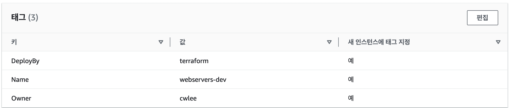
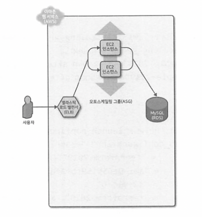
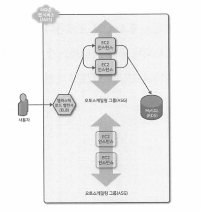
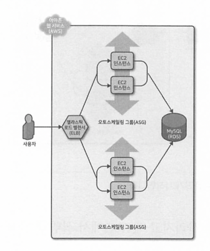
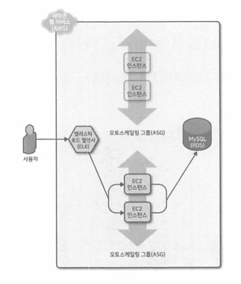
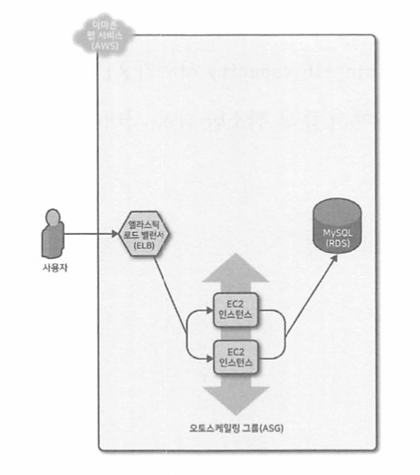

# 05. 테라폼의 팁과 요령: 반복문, if문, 배포 및 주의 사항

테라폼은 특정 유형을 반복하거나 if문을 사용하거나 무중단 배포를 할 수 있도록 count 메타 변수, for_each와 for 표현식, create_before_destroy 같은 생명 주기 블록, 3항 연산자, 그리고 다양한 함수 등을 제공한다.

## 1. 반복문
테라폼은 각각 조금씩 다른 상황에서 사용하도록 고안된 몇 가지 반복문 구성을 제공한다.
- count 매개 변수 : 리소스를 반복
- for_each 표현식 : 리소스 내에서 리소스 및 인라인 블록을 반복
- for 표현식 : 리소스의 맵을 반복
- for 문자열 지시어 : 문자열 내에서 리스트와 맵을 반복

---

### 1. count 매개 변수를 이용한 반복

</br>

### IAM 사용자를 생성하고 관리하기
- count를 이용해 3명의 사용자를 생성하기
  - 각 사용자의 이름이 유일해야 하는데 이 코드에서는 3명의 IAM 사용자가 모두 같은 이름을 가지므로 오류가 발생한다.
    ```
    resource "aws_iam_user" "example" {
        count = 3
        name  = "neo"
    }
    ```
  - 테라폼에서 `count.index`를 사용하여 반복문 안에 있는 각각의 `반복(iteration)`을 가리키는 인덱스를 얻을 수 있다.
    ```
    resource "aws_iam_user" "example" {
        count = 3
        name  = "neo.${count.index}"
    }
    ```
    - `terraform plan` </br>
      각각 다른 이름을 가진 3명의 IAM 사용자 `neo0`, `neo1`, `neo2`를 생성하려는 것을 알 수 있다. </br>
      `neo1`과 같은 사용자 이름은 특별한 의미를 부여하여 사용할 수는 없다. </br>
      ```
        aws_iam_user.example[2]: Refreshing state... [id=neo]

        Terraform used the selected providers to generate the following execution plan. Resource actions are indicated with the following symbols:
        + create
        ~ update in-place

        Terraform will perform the following actions:

        # aws_iam_user.example[0] will be created
        + resource "aws_iam_user" "example" {
            + arn           = (known after apply)
            + force_destroy = false
            + id            = (known after apply)
            + name          = "neo.0"
            + path          = "/"
            + tags_all      = (known after apply)
            + unique_id     = (known after apply)
            }

        # aws_iam_user.example[1] will be created
        + resource "aws_iam_user" "example" {
            + arn           = (known after apply)
            + force_destroy = false
            + id            = (known after apply)
            + name          = "neo.1"
            + path          = "/"
            + tags_all      = (known after apply)
            + unique_id     = (known after apply)
            }

        # aws_iam_user.example[2] will be updated in-place
        ~ resource "aws_iam_user" "example" {
                id            = "neo"
            ~ name          = "neo" -> "neo.2"
                tags          = {}
                # (5 unchanged attributes hidden)
            }

        Plan: 2 to add, 1 to change, 0 to destroy.      
      ```
    - `variables.tf`의 입력 변수에 원하는 모든 IAM 사용자 이름을 정의할 수 있다. </br>
      ```
      variable "user_names" {
        description = "Create IAM users with these names"
        type        = list(string)
        default     = ["neo", "trinity", "morpheus"]
      }      
      ```
      - 테라폼에서는 `count`와 함께 배열 조회 구문과 `length` 함수를 사용해 앞과 동일한 작업을 수행할 수 있다.
        - 배열 조회 구문
          `ARRAY[<INDEX>]`
        - `length 함수` : ARRAY의 항목 수를 반환하는 함수이다. 문자열 및 맵을 대상으로도 동작한다.
          `length(<ARRAY>)`
      - 종합하면 다음과 같은 결과를 얻을 수 있다.
        ```
        resource "aws_iam_user" "example" {
          count = length(var.user_names)
          name  = var.user_names[count.index]
        }
        ``` 
</br>

### 배열 조회 구문 사용하기
- `<PROVIDER>_<TYPE>.<NAME>[INDEX].ATTRIBUTE`
- IAM 사용자 중 하나의 ARN을 출력 변수로 제공하기
  ```
  output "neo_arn" {
    value = aws_iam_user.example[0].arn
    description = "The ARN for user Neo"
  }
  ```
- IAM 사용자 전체의 ARN을 출력 변수로 제공하기 (`splat 연산자 사용하기`)
  ```
  output "all_arns" {
    value - aws_iam_user.example[*].arn
    description = "The ARNs for all users"
  }
  ```
  ```
  Changes to Outputs:
  + all_arns = [
      + "arn:aws:iam::258267424961:user/neo",
      + "arn:aws:iam::258267424961:user/trinity",
      + "arn:aws:iam::258267424961:user/morpheus",
    ]
  + neo_arn  = "arn:aws:iam::258267424961:user/neo"
  ```

### count의 제약점
1. count를 사용하여 전체 리소스를 반복할 수 있지만 리소스 내에서 인라인 블록을 반복할 수는 없다.
2. 테라폼은 해당 배열의 위치로 배열 내의 각 리소스를 식별한다. </br>
   count를 사용하여 리소스 목록을 만들 때마다 목록 중간에서 항목을 제거하면 테라폼은 해당 항목 뒤에 있는 모든 리소스를 삭제한 다음 해당 리소스를 처음부터 다시 만든다.
   ```
    Terraform will perform the following actions:

      # aws_iam_user.example[1] will be updated in-place
      ~ resource "aws_iam_user" "example" {
            id            = "trinity"
          ~ name          = "trinity" -> "morpheus"
            tags          = {}
            # (5 unchanged attributes hidden)
        }

      # aws_iam_user.example[2] will be destroyed
      # (because index [2] is out of range for count)
      - resource "aws_iam_user" "example" {
          - arn           = "arn:aws:iam::258267424961:user/morpheus" -> null
          - force_destroy = false -> null
          - id            = "morpheus" -> null
          - name          = "morpheus" -> null
          - path          = "/" -> null
          - tags          = {} -> null
          - tags_all      = {} -> null
          - unique_id     = "AIDATYIPQFDAUFAO3GU2E" -> null
        }

    Plan: 0 to add, 1 to change, 1 to destroy.

    Changes to Outputs:
      ~ all_arns = [
            # (1 unchanged element hidden)
            "arn:aws:iam::258267424961:user/trinity",
          - "arn:aws:iam::258267424961:user/morpheus",
        ]
   ```

---


### 2. for_each 표현식을 사용한 반복문 처리

</br>

for_each 표현식을 사용하면 리스트, 집합, 맵을 사용하여 전체 리소스의 여러 복사본 또는 리소스 내 인라인 블록의 여러 복사본을 생성할 수 있다. </br>
- COLLECTION : 루프를 처리할 집합 또는 맵 (리스트 지원 안함.)
- CONFIG내에서 `each.key`, `each.value`를 사용하여 COLLECTION에서 현재 항목의 키와 값에 접근
```
resource "<PROVIDER>_<TYPE>" "<NAME>" {
  for_each = <COLLECTION>

  [CONFIG ...]
}
```
```
resource "aws_iam_user" "example" {
  for_each = toset(var.user_names) # 리스트를 집합으로 변환
  name     = each.value
}
```
for_each를 사용한 후에는 하나의 리소스는 또는 count를 사용한 것과 같은 리소스 배열이 되는 것이 아니라 리소스 맵이 된다. </br>
```
output "all_users" {
    value = aws_iam_user.example
}
```
```
+ all_users = {
    + morpheus = {
        + force_destroy        = false
        + name                 = "morpheus"
        + path                 = "/"
        + permissions_boundary = null
        + tags                 = null
      }
    + neo      = {
        + force_destroy        = false
        + name                 = "neo"
        + path                 = "/"
        + permissions_boundary = null
        + tags                 = null
      }
    + trinity  = {
        + force_destroy        = false
        + name                 = "trinity"
        + path                 = "/"
        + permissions_boundary = null
        + tags                 = null
      }
  }
```
all_arns 출력 변수를 다시 가져오려면 맵에서 값만 반환하는 내장 함수 `values`를 이용해 ARN을 추출하고 스플랫 표현식을 사용하는 약간의 추가 작업을 수행해야 한다. </br>
```
output "all_arns" {
  value = values(aws_iam_user.example)[*].arn
}
```

### for_each의 장점 (vs count)
for_each를 사용해 리소스를 맵으로 처리하면 컬렉션 중간의 항목도 안전하게 제거할 수 있어 count를 사용해 리소스를 처리하는 것보다 이점이 크다. </br>
주변의 모든 리소스를 옮기지 않고 정확히 목표한 리소스만 삭제한다. </br>
```
Terraform will perform the following actions:

  # aws_iam_user.example["trinity"] will be destroyed
  # (because key ["trinity"] is not in for_each map)
  - resource "aws_iam_user" "example" {
      - arn           = "arn:aws:iam::258267424961:user/trinity" -> null
      - force_destroy = false -> null
      - id            = "trinity" -> null
      - name          = "trinity" -> null
      - path          = "/" -> null
      - tags          = {} -> null
      - tags_all      = {} -> null
      - unique_id     = "AIDATYIPQFDAW7EM6QHIL" -> null
    }

Plan: 0 to add, 0 to change, 1 to destroy.
```

리소스 내에서 여러 개의 인라인 블록을 만들 수 있다.
- `1.for_if_example/modules/services/webserver-cluster/variables.tf`
  ```
  variable "custom_tags" {
    description = "Custom tags to set on the Instances in the ASG"
    type        = map(string)
    default     = {}
  }
  ```
- `1.for_if_example/live/stage/services/webserver-cluster/main.tf`
  ```
  custom_tags = {
    Owner    = "cwlee" 
    DeployBy = "terraform"
  }  
  ```
- `for_each`문을 사용해 인라인 블록을 동적으로 생성하는 구문
  ```
  dynamic "<VAR_NAME>" {
    for_each = <COLLECTION>

    content {
      [CONFIG ...]
    }
  }
  ```
  ```
  📌 
  <VAR_NAME>    : 각 '반복'의 값을 저장할 변수에 사용할 이름
  <COLLECTION>  : 반복되는 리스트 또는 맵
  content block : 각 반복에서 생성되는 항목
  ```
  ```
  📌  예제 (1.for_if_example/modules/services/webserver-cluster/main.tf)
  dynamic "tag" {
    for_each = var.custom_tags

    content {
      key                 = tag.key
      value               = tag.value
      propagate_at_launch = true
    }
  }
  ```
  - `terraform plan`
    ```
    Terraform will perform the following actions:

      # module.webserver_cluster.aws_autoscaling_group.example will be updated in-place
      ~ resource "aws_autoscaling_group" "example" {
            id                        = "terraform-202305021******"
            name                      = "terraform-202305021******"
            # (25 unchanged attributes hidden)

          + tag {
              + key                 = "DeployBy"
              + propagate_at_launch = true
              + value               = "terraform"
            }
          + tag {
              + key                 = "Owner"
              + propagate_at_launch = true
              + value               = "cwlee"
            }

            # (1 unchanged block hidden)
        }

    Plan: 0 to add, 1 to change, 0 to destroy.
    ```
  - 태그 생성 완료 🎉  </br>
    

---

### 3. for 표현식을 이용한 반복문
단일 값을 생성하기 위해 반복이 필요한 경우에는 for 표현식을 이용할 수 있다.
`[ for <ITEM> in <LIST> : <OUTPUT> ]`
```
📌
<LIST>   : 반복할 리스트
<ITEM>   : LIST의 각 항목에 할당할 로컬 변수의 이름
<OUTPUT> : ITEM을 어떤 식으로든 변환하는 표현식
```
```
📌  예제 (1.for_if_example/live/global/iam/existing-iam-user/outputs.tf)

# 1
output "upper_names" {
  value = [for name in var.user_names : upper(name)]
}

$ terraform plan
aws_iam_user.example["morpheus"]: Refreshing state... [id=morpheus]
aws_iam_user.example["neo"]: Refreshing state... [id=neo]

Changes to Outputs:
  + upper_names = [
      + "NEO",
      + "MORPHEUS",
    ]


# 2
output "upper_names" {
  value = [for name in var.user_names : upper(name) for length(name) < 5]
}

$ terraform plan
aws_iam_user.example["neo"]: Refreshing state... [id=neo]
aws_iam_user.example["morpheus"]: Refreshing state... [id=morpheus]

Changes to Outputs:
  ~ upper_names = [
        "NEO",
      - "MORPHEUS",
    ]


# 3
output "bios" {
  value = [for name, role in var.hero_thousand_faces : "${name} is the ${role}"]
}

$ terraform plan
Changes to Outputs:
  + bios        = [
      + "morpheus is the mentor",
      + "neo is the hero",
      + "trinity is the love interest",
    ]
```

for 표현식을 리스트가 아닌 맵을 출력하기 위해 사용하기 </br>
```
# 리스트를 반복하고 맵을 출력
[for <ITEM> in <LIST> : <OUTPUT_KEY> => <OUTPUT_VALUE>]

# 맵을 반복하고 리스트를 출력
{for <KEY>, <VALUE> in <MAP> : <OUTPUT_KEY> => <OUTPUT_VALUE>}
```
```
variable "hero_thousand_faces" {
  description = "map"
  type        = map(string)
  default = {
    neo      = "hero"
    trinity  = "love interest"
    morpheus = "mentor"
  }
}

output "upper_roles" {
  value = {for name, role in var.hero_thousand_faces : upper(name) => upper(role)}
}

# 결과
upper_roles = {
  "MORPHEUS" = "MENTOR"
  "NEO" = "HERO"
  "TRINITY" = "LOVE INTEREST"
}
```

---

### 4. 문자열 지시자를 사용하는 반복문
문자열 지시자를 사용하면 문자열 보간과 유사한 구문으로 문자열 내에서 for 반복문, if문과 같은 제어문을 사용할 수 있다. </br>
테라폼은 두 가지 유형의 문자열 지시자, for 반복문과 조건문을 지원한다. </br>
for 문자열 지시자는 다음 구문을 사용한다. </br>
`%{ for <ITEM> in <COLLECTION> }<BODY>%{ endfor }`
```
for_directive = <<EOT
  
    neo
  
    morpheus
  

EOT
```
스페이스나 줄 바꿈 같은 공백을 없애기 위해 문자열 지시자의 앞이나 뒤에 물결표를 사용할 수 있다. </br>
```
output "for_directive" {
  value = <<EOF
%{~for name in var.user_names}
  ${name}
%{~endfor}
EOF
}
```
```
for_directive = <<EOT

  neo
  morpheus

EOT
```

---

## 2. 조건문
테라폼은 반복을 수행하는 여러 가지 방법을 제공하는 것과 마찬가지로 조건을 설정하는 여러 가지 방법을 제공한다.
```
- count 매개 변수
  조건부 리소스에서 사용
- for_each와 for 표현식
  리소스 내의 조건부 리소스 및 인라인 블록에 사용
- If 문자열 지시자
  문자열 내의 조건문에 사용
```

### 1. count 매개 변수를 사용한 조건문
- count 매개 변수를 사용한 if문
  📌 예제 </br>
  1. 모듈의 오토스케일링 여부를 지정하는 불리언 입력 변수 작성
     ```
      variable "enable_autoscaling" {
        description = "If set to true, enable auto scaling"
        type        = bool
      }
     ```
  2. `<CONDITION> ? <TRUE_VAL> : <FALSE_VAL>` 조건 표현식을 이용해 분기 처리
     ```
      resource "aws_autoscaling_schedule" "scale_out_during_business_hours" {
        count = var.enable_autoscaling ? 1 : 0

        scheduled_action_name = "${var.cluster_name}-scale-out-during-business-hours"
        min_size              = 2
        max_size              = 10
        desired_capacity      = 10
        recurrence            = "0 9 * * *"

        autoscaling_group_name = aws_autoscaling_group.example.name
      }
     ```
  📌 예제 </br>
  `var.instance_type`의 문자 't'로 시작하는 경우에만 알람 생성하기 </br>
  ```
  resource "aws_cloudwatch_metric_alarm" "low_cpu_credit_balance" {
    count       = format("%.1s", var.instance_type) == "t" ? 1 : 0
    alarm_name  = "${var.cluster_name}-low-cpu-credit-balance"
    namespace   = "AWS/EC2"
    metric_name = "CPUCreditBalance"

    dimensions = {
      AutoScalingGroupName = aws_autoscaling_group.example.name
    }

    comparison_operator = "LessThanThreshold"
    evaluation_periods  = 1
    period              = 300
    statistic           = "Minimum"
    threshold           = 10
    unit                = "Count"
  }
  ```

</br>

- count 매개 변수를 사용한 if-else문
  📌 예제 </br>
  IAM 사용자 중 `neo`에 클라우드워치에 대한 엑세스 권한 부여하기 </br>
  테라폼 구성을 적용하는 사람이 `neo`에게 읽기 권한만 부여할 것인지 아니면 읽기와 쓰기 권한을 모두 부여할 것인지 결정한다. </br>
  1. 선택지 만들기 (`1.for_if_example/live/global/iam/policy/data.tf`)
  ```
  data "aws_iam_policy_document" "cloudwatch_read_only" {
    statement {
      effect = "Allow"
      actions = [
        "cloudwatch:Describe*",
        "cloudwatch:Get*",
        "cloudwatch:List*"
      ]
      resources = ["*"]
    }
  }

  data "aws_iam_policy_document" "cloudwatch_full_access" {
    statement {
      effect    = "Allow"
      actions   = ["cloudwatch:*"]
      resources = ["*"]
    }
  }
  ```
  2. 불리언 변수 생성하기 (`1.for_if_example/live/global/iam/policy/variable.tf`)
  ```
  variable "give_neo_cloudwatch_full_access" {
    description = "If true, neo gets full access to CloudWatch"
    type        = bool
  }
  ```
  3. 리소스 생성하기 (if-else 문 적용) (`1.for_if_example/live/global/iam/policy/main.tf`)
  ```
  resource "aws_iam_policy" "cloudwatch_read_only" {
    count = var.give_neo_cloudwatch_full_access ? 1 : 0
    name   = "cloudwatch-read-only"
    policy = data.aws_iam_policy_document.cloudwatch_read_only.json
  }

  resource "aws_iam_policy" "cloudwatch_full_access" {
      count = var.give_neo_cloudwatch_full_access ? 1 : 0
    name   = "cloudwatch-full-access"
    policy = data.aws_iam_policy_document.cloudwatch_full_access.json
  }
  ```
  📌 예제 </br>
  1. 선택지 만들기 (if-else 문 적용) (`1.for_if_example/modules/services/webserver-cluster/data.tf`)
  2. 불리언 변수 생성하기 (`1.for_if_example/modules/services/webserver-cluster/variables.tf`)
  3. 리소스 생성하기 (if-else 문 적용) (`1.for_if_example/modules/services/webserver-cluster/main.tf`)
     배열의 길이를 확인해 user_data에 지정할 파일을 결정한다. </br>
     ```
      user_data = (
        length(data.template_file.user_data[*]) > 0
        ? data.template_file.user_data[0].rendered
        : data.template_file.user_data_new[0].rendered
      )
     ```
count와 내장 함수를 사용하여 if-else 구문을 시뮬레이션하는 것은 약간의 꼼수같지만 상당히 잘 작동한다. </br>
복잡성을 숨겨서 사용자들이 깔끔하고 단순한 API로 작업할 수 있게 해준다. </br>

</br>

### 2. for_each와 for 표현식을 사용한 조건문
for_each 표현식으로 조건 논리를 수행할 수 있다. for_each 표현식을 빈 컬렉션으로 전달하면 0개의 리소스 또는 0개의 인라인 블록을 생성한다. </br>
비어 있지 않은 컬랙션을 전달하면 하나 이상의 리소스 또는 인라인 블록을 만든다. </br>
컬렉션이 비어 있는지 여부를 조건부로 어떻게 결정할 수 있을까? </br>
📌 예제 (`1.for_if_example/modules/services/webserver-cluster/main.tf`) </br> 
다음의 코드에서 `var.custom_tags`가 비어 이쓰여면 for_each 표현식에는 반복할 항목이 없으므로 태그가 설정되지 않는다. </br>
```
  dynamic "tag" {
    for_each = var.custom_tags

    content {
      key                 = tag.key
      value               = tag.value
      propagate_at_launch = true
    }
```
for_each 표현식을 for 표현식과 결합하여 더 발전시킬 수 있다. </br>
중첩된 for 표현식은 일관성을 위해 `var.custom_tags`를 반복하며 각 값을 대문자로 변환하고 모듈이 이미 자체 Name 태그를 설정했으므로 for 표현식의 조건을 사용하여 Key 집합을 Name으로 필터링한다.
```
  dynamic "tag" {
    for_each = {
      for key, value in var.custom_tags:
      key => upper(value)
      if key != "Name"
    }

    content {
      key                 = tag.key
      value               = tag.value
      propagate_at_launch = true
    }
```
```
리소스 복사본을 여러 개 만들 때는 count 보다 for_each를 사용하는 것이 더 낫지만
조건 논리의 경우 비어 있지 않은 컬랙션에 for_each를 설정하는 것보다 count를 0 또는 1로 설정하는 것이 간단하다.
🎉 즉, 리소스를 조건부로 생성한 때는 count를 사용할 수 있지만 그 외 모든 유형의 반복문 및 조건문에는 for_each를 사용한다.
```

</br>

### 3. if 문자열 지시자가 있는 조건문
`%{ if <CONDITION> }<TRUEVAL>%{ endif }` </br>
`%{ if <CONDITION> }<TRUEVAL>%{ else }<FALSEVAL%{ endif }`

</br>

📌 예제
```
variable "name" {
  description = "A name to render"
  type = string
}

output "if_else_directive" {
  value = "Hello, %{ if var.name != "" }${var.name}%{ else }{unnamed}%{ endif }"
}
```
```
$ terraform plan -var name="cwlee"
Changes to Outputs:
  + if_else_directive = "Hello, cwlee"

$ terraform plan -var name=""
Changes to Outputs:
  + if_else_directive = "Hello, {unnamed}"
```

---

## 3. 무중단 배포
실제 운영 환경을 안정적으로 배포하기 위해 여러 가지 배포 방법을 사용할 수 있다. </br>
그 중 대표적인 것이 `블루-그린(blue-green)`, `롤링 업데이트(rolling update)`, `불가변적(immutable)` 배포 방법이다. </br>
수명 주기 설정을 활용하여 무중단 배포를 수행하는 방법은 다음과 같습니다. </br>
```
1. 시작 구성 이름에 직접 의존하도록 ASG의 name 매개 변수를 구성한다.
   시작 구성을 변경할 때마다 즉, AMI 또는 사용자 데이터를 업데이트 할 때마다 이름이 변경되고 ASG 이름이 변경되어 테라폼이 ASG를 강제로 교체한다.

2. ASG의 create_before_destroy 매개 변수를 true로 설정하면 테라폼이 교체를 시도할 때마다 원본을 삭제하기에 앞서 교체 ASG를 생성한다.

3. ASG의 min_elb_capacity 매개 변수를 클러스터의 min_size로 설정한다.
   그러면 테라폼은 원래의 ASG를 파괴하기 전에 최소한 새 ASG의 서버들의 ALB에서 상태 확인을 통과하기를 기다린다.
```
```
# 2.blue_green/modules/services/webserver-cluster/main.tf

resource "aws_autoscaling_group" "example" {
  launch_configuration = aws_launch_configuration.example.name
  vpc_zone_identifier  = data.aws_subnet_ids.default.ids

  target_group_arns = [aws_lb_target_group.asg.arn]
  health_check_type = "ELB"

  min_size = var.min_size
  max_size = var.max_size

  tag {
    key                 = "Name"
    value               = var.cluster_name
    propagate_at_launch = true
  }

  dynamic "tag" {
    for_each = var.custom_tags

    content {
      key                 = tag.key
      value               = tag.value
      propagate_at_launch = true
    }
  }

  # 이 ASG 배포 완료를 고려하기 전에 최소 지정된 인스턴스가 상태 확인을 통과할 때까지 기다린다.
  min_elb_capacity = var.min_size

  # 이 ASG를 교체할 때는 먼저 교체용 ASG를 샐성한 후 원본만 삭제한다.
  lifecycle {
    create_before_destroy = true
  }
}
```






</br>

🎉 결과 </br>
ALB DNS Name을 통해서 요청을 보내면 응답이 없음. 문제 파악중임. 

</br>
배포중에 문제가 발생하면 테라폼은 자동으로 롤백된다. </br>
예를 들어, 버전2 앱에 ASG가 버그가 있고 부팅에 실패한 경우 새 ASG의 인스턴스는 ALB에 등록되지 않습니다. </br>
테라폼은 버전 2 ASG의 min_elb_capacity 서버가 ALB에 등록하도록 wait_for_capacity_timeout만큼 대기한 후 배포 실패로 여겨 버전2 ASG를 사제하고 오류와 함께 종료된다. </br>
버전 1앱은 원래 ASG에서 계속 정상적으로 작동한다. </br>

---

## 4. 테라폼의 주의 사항
### 1. count와 for_each의 제한 사항
- 리소스 출력을 count 또는 for_each에서 참조할 수 없다.
  - 테라폼은 리소스를 생성하거나 수정하기 전에 plan 단계에서 count와 for_each를 계산할 수 있어야 한다.

### 2. 무중단 배포 제한 사항


### 3. 유효한 plan의 실패
plan 명령어를 실행하면 완벽하게 유효해 보이는 plan을 나타내지만 apply를 실행하면 오류가 발생할 때도 있다. </br>
terraform plan이 테라폼 상태 파일의 리소스만 확인하기 때문이다. </br>
💥 두 가지 교훈
1. 테라폼만 사용하기 시작했다면 테라폼만 사용해야 한다.
2. 기존 인프라가 있는 경우 import 명령어를 사용한다.
   - `$ terraform import aws_iam_user.existing_user yevgeniy.brikman`
   - terraforming 사용

### 4. 리팩토링 까다로움
테라폼 같은 코드형 인프라의 경우 코드의 '외부 동작'을 정의하는 요소에 주의해야 한다. 시스템이 중단될 수 있기 때문이다.
- 항상 plan 명령을 사용
- 파기하기 전에 생성하기
  - create_before_destroy 사용하기
- 식별자 변경을 위한 상태 변경
  - `$ terraform state mv <ORIGINAL_REFERENCE> <NEW_REFERENCE>`
  - 식별자의 이름을 바꾸고 이 명령을 실행했는데 terraform plan의 결과값에 아무런 변화가 없으면 잘 수행된 것이다.
- 일부 매개 변수는 변경할 수 없음


---

## 5. 최종 일관성
AWS와 같은 일부 클라우드 공급자의 API는 비동기적이며 결국 일관성을 관리합낟. </br>
비동기는 요청된 작업이 완료되기를 기다리지 않고 API가 즉시 응답을 보낼 수 있음을 의미한다. </br>
결과적으로 최종 일관성이란 변경 사항이 전체 시스템에 전파되는 데 시간이 길리므로 API 호출에 응답하는 데이터 자장소 복제본에 따라 일정 기간 동안 일관성 없는 응답을 받을 수 있다는 것을 의미한다. </br>
