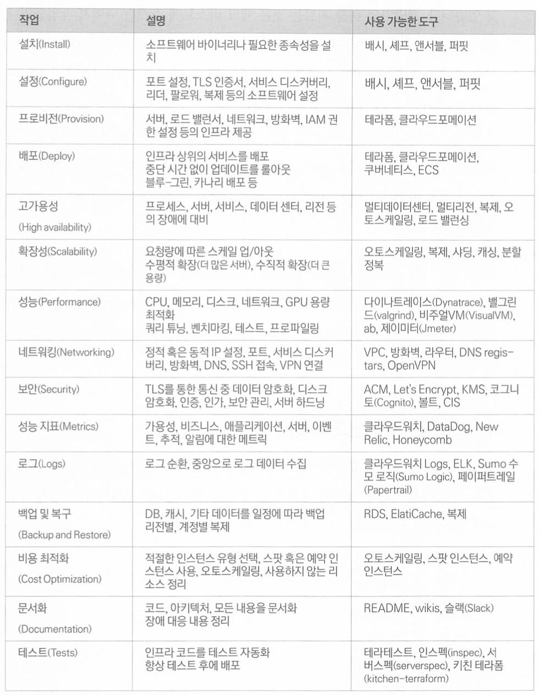

# 06. 프로덕션 수준의 테라폼 코드

## 1. 프로덕션 수준 인프라 구축에 오랜 시간이 걸리는 이유
데브옵스 작업이 오래 걸리는 이유
1. 데브옵스 산업이 여전히 석기 시대에 있다. ( = 아직 산업 초기 단계이다.)
2. '야크 털 깎기'에 취약하다. (대공감🙀)
   - 원래 하고 싶었던 작업을 수행하기 전 해야 하는 하찮고, 겉으로 볼 때는 관련이 없는 작업들을 말한다. </br>
=> 우발적인 복잡성 : 선택한 특정 도구와 프로세스에 의해 발생하는 문제
3. 데브옵스는 빌드부터 배포 보안 등 광범위한 주제를 모두 포함하기 때문에 많은 밀결합과 중복을 수반한다.
   - 프로적션 인프라를 준비하기 위해 수행해야 하는 작업의 체크 리스트가 너무 길다. </br>
=> 본질적인 복잡성 

---

## 2. 프로덕션 수준 인프라 체크 리스트
🦄 프로덕션 수준의 인프라 체크 리스트 </br>


---

## 3. 프로덕션 수준 인프라 모듈
재사용 가능한 모듈을 구축하는 모범 사례


### **소형 모듈**
각각 한 가지 일을 하는 소형 모듈로 코드를 작성해야 한다.
```
📌 함수는 첫 번째 규칙은 작아야 한다는 것입니다. 
함수의 두 번째 규칙은 그보다 더 작아야 한다는 것입니다.
- 로버트 C. 마틴
```

지금까지 구축한 `webserver-cluster`모듈이 커지기 시작했으며 다소 관련성이 없는 다음 3가지 작업을 처리하고 있다.
- 오토스케일링 그룹(ASG)
  - webserver-cluster 모듈은 무중단 롤링 배포를 수행할 수 있는 ASG를 배포한다.
- 애플리케이션 로드 밸런서(ALB)
  - webserver-cluster는 ALB를 배포한다.
- Hello, World 애플리케이션
  - webserver-cluster 모듈은 간단한 'Hello, World'앱도 배포한다.

아래의 세 개의 모듈로 리팩터링 해보자 !
- modules/cluster/asg-rolling-deploy
  - 무중단 롤링 배포를 수행할 수 있으며 ASG를 배포하기 위한 재사용 가능한 일반 독립형 모듈
- modules/networking/alb
  - ALB를 배포하기 위한 재사용 가능한 일반 독립형 모듈
- modules/services/hello-world-app
  - 'Hello, World' 앱을 배포하기 위한 모듈

</br>

### **합성 가능한 모듈**
```
📌 한 가지 일을 잘 해내는 프로그램을 여러 개 작성하세요.
그리고 그 프로그램이 함께 작동하게 하세요. 이것이 바로 유닉스 철학입니다.
- 더그 매클로이 -
```
모듈을 함께 작동시키는 한 가지 방법은 함수 합성을 통해 한 함수의 출력을 다른 함수의 입력으로 전달하는 것이다. </br>
합성 함수를 만드는 주요 방법 중 하나는 부작용을 최소화하는 것이다. </br> 
즉, 외부에서 상태를 읽는 대신 입력 매개 변수를 통해 전달하고, 외부에 상태를 쓰는 대신 출력 매개 변수를 통해 계산 결과를 반환한다.  </br> 
부작용을 최소화하는 것인 함수형 프로그래밍의 핵심 원칙 중 하나이다. </br>
</br>
인프라 코드로 작업할 때 부작용을 피할 수는 없지만, 테라폼 모듈에서 동일한 기본 원칙을 따를 수 있다. </br>
모든 것은 입력 변수를 통해 전달하고 모든 것을 출력 변수를 통해 반환하며 간단한 모듈들을 결합해 더 복잡한 모듈을 만들 수 있다. </br>

</br >
📌 입력 변수 추가 및 반영하기 </br>

- before
    ```
    resource "aws_autoscaling_group" "example" {
    launch_configuration = aws_launch_configuration.example.name
    vpc_zone_identifier  = data.aws_subnet_ids.default.ids

    target_group_arns = [aws_lb_target_group.asg.arn]
    health_check_type = "ELB"
    ...
    ```
- after
  - webserver-cluster 모듈에는 ALB가 내정되어 있지만 asg-rolling-deploy 모듈은 일반 모듈이므로 로드밸런서 설정을 입력 변수로 노출하면 다양한 상황에서 ASG를 사용할 수 있다. </br>
    ```
    resource "aws_autoscaling_group" "example" {
    launch_configuration = "${var.cluster_name}-${aws_launch_configuration.example.name}"
    vpc_zone_identifier  = var.subnet_ids

    target_group_arns = var.target_group_arns
    health_check_type = var.health_check_type
    ...
    ```

</br>
📌  출력 변수 추가하기 </br>
이 데이터를 출력하면 모듈의 소비자가 이러한 출력을 사용하여 보안 그룹에 사용자 정의 규칙을 추가하는 등 새로운 동작을 추가할 수 있기 때문에 asg-roll-deploy 모듈의 재사용성을 높인다. </br>

```
output "asg_name" {
  value       = aws_autoscaling_group.example.name
  description = "The name of the Auto Scaling Group"
}

output "instance_security_group_id" {
  value       = aws_security_group.instance.id
  description = "The ID of the EC2 Instance Security Group"
}
```

</br>

📌  실제 합성 함수 예제 보기
- `modules/services/hello-world-app/main.tf`
- ASG 및 ALB 모듈 같은 간단한 부품에서 'Hello, World' 앱 가은 더 복잡한 동작을 수행하는 모듈을 구축하고 있다.

</br>

📌  테라폼 모듈 세분화 패턴
- 일반 모듈
  - asg-rolling-deploy 및 alb와 같은 모듈은 코드의 기본 구성 요소이며 다양한 사례에서 재사용할 수 있다.
- 사용 사례별 모듈
  - hello-world-app과 같은 모듈은 여러 개의 일반 모듈을 결합하여 'Hello, World' 앱 배포와 같은 특정 사례에 사용할 수 있다.

</br>

세분화는 간단한 'Hello, World' 앱에는 과도한 작업이 될 수 있지만 복잡한 실제 인프라의 경우 다른 배포 패턴을 지원하기 위해서 보안 그룹 규칙, IAM 정책 및 기타 교차 문제를 별도의 독립형 모듈로 분리하는 것이 필수적이다.

</br>

좋은 예시 참고하기 </br>

- [terraform-aws-consul](https://github.com/hashicorp/terraform-aws-consul)
- [terraform-aws-vault](https://github.com/hashicorp/terraform-aws-vault)

</br>

### **테스트 가능한 모듈**
생성한 모듈은 직접 배포하기 위한 루트 모듈이 아니다. </br>
모듈을 배포하려면 원하는 인수를 지정하고 provider를 설정하고 backend를 구성하는 등의 테라폼 코드를 작성해야 한다. </br>
이를 수행하는 가장 좋은 방법은 예제 폴더를 만드는 것이다 . </br>

📌  예제 코드 작성하기 (example/asg/main.tf)
1. asg-rolling-deploy 모듈을 사용하여 크기가 1인 ASG를 배포한다.
   - terraform init 및 terraform apply를 실행함으로써 오류 없이 실행되고 실제로 ASG가 동작하는 확인한다.
2. README.md 파일을 추가 작성한다.

새 모듈을 개발할 때 모듈 코드 행을 작성하기 전에 예제 코드를 먼저 작성하는 것이 모범 사례이다. </br>
예제 코드는 모듈을 테스트하는 기본 방법이며 TDD(Test-Driven-Development)의 한 형태이다.  </br>

 </br>

📌  버전 고정하기
모든 테라폼 모듈을 required_version 인수를 사용하여 테라폼의 특정 버전에 고정한다.  </br>
```
terraform {
  required_version = ">= 0.12, < 0.13"
}
```
모듈 공급자 버전도 고정하는 것을 권장한다.
```
provider "aws" {
  region = "us-east-2"
  version = "~> 2.0"
}
```

 </br>

### **릴리스 가능한 모듈**
모듈을 작성하고 테스트한 후 다음 단계는 모듈을 릴리스하는 것이다. </br>
다음과 같이 시맨틱 버전 관리와 함께 깃 태그를 사용할 수 있다. </br>
```
$ git tag -a "v0.0.5" -m "Create new hello-world-app module"
$ git push --follow-tags
```

1. 모듈 및 출력 변수 코드 작성
   - `live/stage/services/hello-world-app`
2. `terraform init`
3. `terraform apply`

</br>

모듈을 릴리즈 하는 또 다른 옵션은 테라폼 레지스트리에 모듈을 게시하는 것이다. </br>
테라폼 레지스트에서 모듈을 사용하기 위한 특수 구문도 지원한다. </br> 
알아보기 어려운 ref 매개 변수가 있는 깃 URL 대신 source 인수에 있는 짧은 레지스트리 URL을 사용하고 다음 구문처럼 별도의 version 인수를 통해 버전을 지정할 수 있습니다. </br>

```
module "<NAME>" {
  source  = "<OWNER>/<REPO>/<PROVIDER>"
  version = "<VERSION>"
  # (...)
}
```

</br>

### **테라폼 모듈을 넘어서**
전체 프로덕션 수준의 인프라를 구축하려면 도커, 패커, 셰프, 퍼핏뿐만 아니라 배시 스트립트 등 다른 도구도 사용해야 한다. </br>
더 나아가 테라폼 모듈에서 직접 스크립트와 같은 비테라폼 코드를 실행해야 할 수도 있다. </br>
또한 누락된 공급자 API나 선언적 특성으로 인해 복잡한 논리를 구현할 수 없는 것과 같은 테라폼의 한계를 해결하려고 사용하기도 한다. </br>

📌 테라폼의 한계를 해결하는 비상구

1. 프로비저너 </br>
    테라폼 프로비저너는 테라폼을 실행할 때 부트스트랩, 구성 관리 또는 정리 작업을 수행하기 위해 로컬 시스템이나 원격 시스템에서 스크립트를 실행하는 데 사용된다.
    - local-exec : 로컬 시스템에서 스트립트 실행
      ```
      resource "aws_instance" "example" {
        ami           = "ami-xxxx"
        instance_type = "t2.micro"

        provisioner "local-exec" {
          command = "echo \"Hello, World from $(uname -smp)\""
        }
      }
      ```
    - remote-exec : 원격 리소스에서 스크립트 실행
      - 네트워크를 통해 EC2 인스턴스와 통신
        ```
        resource "aws_security_group" "instance" {
          ingress {
            from_prot = 22
            to_port   = 22
            protocol  = "tcp
          }

          cider_blocks = ["0.0.0.0/0"]
        }
        ```
      - EC2 인스턴스에 인증 (SSH 키 구성)
        ```
        resource "tls_private_key" "example" {
          algorithm = "RSA"
          rsa_bits  = 4096
        }
        ```
        ```
        resource "aws_key_pair" "generated_key" {
          public_key = tls_private_key.example.public_key_openssh
        }
        ```
      - EC2 인스턴스 코드 작성
        ```
        resource "aws_instance" "example" {
          ami           = "ami-xxxx"
          instance_type = "t2.micro"
          vpc_security_group_ids = [aws_security_group.instance.id]
          key_name               = aws_key_pair.generated_key.key_name

          provisioner "remote-exec" {
            inline = ["echo \"Hello, World from $(uname -smp)\""]
          }

          connection {
            type = "ssh"
            host = self.public_ip
            user = "ubuntu"
            private_key = tls_private_key.example.private_key_pem
          }
        }
        ```
      기본적으로 프로비저너를 지정하면 생성할 때 실행되는 프로비저너가 된다. </br>
      이는 `terraform apply`를 실행 중일 때 그리고 초기 리소스 생성 중에만 실행 된다. </br>
      프로비저너는 주로 초기 부트스트랩 코드를 실행하는 데 유용하다. </br>
      프로비저너에 `when = "destroy"` 인수를 설정하면 삭제할 때 실행되는 프로비저너가 된다. </br>
      삭제할 때 실행되는 프로비저너는 리소스가 삭제되기 직전에 실행된다.
    - chef : 원격 리소스에서 셰프 클라이언트 실행
    - file : 원격 리소스로 파일 복사

</br>

2. null_resource를 사용한 프로비저너  </br>
    프로비저너는 리소스 내에서만 정의할 수 있지만 특정 리소스에 연결하지 않고 프로비저너를 실행하려 할 수 있다.
    ```
    resource "null_resource" "example" {
      provisioner "local-exec" {
        command = "echo \"Hello, World from $(uname -smp)\""
      }
    }
    ```
    null_resource에는 키와 값을 맵 형태로 전달하는 trigger라는 편리한 인수도 있다. </br>
    값이 변경될 때마다 null_resource가 다시 만들어지므로 그 안에 있는 모든 프로비저너가 다시 실행된다. </br>
    ```
    resource "null_resource" "example" {
      # UUID를 사용하여 이 null_resource를 매번 다시 만들도록 한다.
      # terraform apply를 호출 시
      triggers = {
        uuid = uuid()
      }

      provisioner "local-exec" {
        command = "echo \"Hello, World from $(uname -smp)\""
      }
    }
    ```
3. 외부 데이터 소스  </br>
    스크립트를 실행하여 데이터를 가져와서 테라폼 코드 자체에 해당 데이터를 사용하고 싶은 경우 </br>
    특정 프로토콜을 구현하는 외무 명령어 데이터 소스로 작동할 수 있게 하는 external 데이터 소스를 사용하면 된다.
    - external 데이터 소스의 query 인수를 사용하여 테라폼에서 외부 프로그램으로 데이터를 전달한다. </br>
      외부 프로그램은 stdin을 통해 이 인수들을 JSON 형식으로 읽을 수 있다.
    - 외부 프로그램은 JSON을 stdout에 작성하여 데이터를 테라폼으로 다시 전달할 수 있다. </br>
      이렇게 하면 테라폼 코드는 외부 데이터 소스의 result 출력 속성을 사용하여 이 JSON에서 데이터를 가져올 수 있다.
    ```
    data "external" "echo" {
      program = ["bash", "-c", "cat /dev/stdin"]

      query   = {
        foo = "bar"
      }
    }

    output "echo"{
      value = data.external.echo.result
    }

    output "echo_foo" {
      value = data.external.echo.result.foo
    }
    ```

🚨 external 데이터 소스와 다른 모든 테라폼의 '비상구'를 사용하면 코드 이식성이 저하되고 코드를 불안정하게 만들기 때문에 **신중**해야 한다. </br>
예를 들어 방금 본 external 데이터 소스는 배시에 의존하며, 이는 윈도우에서 해당 테라폼 모듈을 배포할 수 없음을 의미한다. </br>

---

### 4. 결론

새 모듈 작업을 시작할 때 다음의 프로세스 시작하기.
1. 프로덕션 수준의 인프라 체크 리스트를 살펴보고 구현할 항목과 건너뛸 항목을 명시적으로 구분한다.
2. example 폴더를 만들고 예제 코드를 먼저 작성한다. </br>
   이 코드를 사용하여 모듈에 대해 생각할 수 있는 최상의 사용자 환경과 가장 클린한 API를 정의한다. </br>
   모듈의 각 중요한 조합에 대한 예제를 작성하고 예제를 가능한 쉽게 배포할 수 있도록 충분한 문서 및 합리적인 기본값을 포함한다.
3. modules 폴더를 생성하고 작고 재사용 가능하며 합성 가능한 모듈 모음을 제공하는 API를 구현한다. </br>
   테라폼과 도커, 패커 및 배시와 같은 다른 도구를 조합하여 모듈을 구현한다. </br>
   테라폼과 공급자 버전을 고정하는 것 역시 잊지 않아야 한다.
4. test 폴더를 생성하고 각 예제에 대한 자동 테스트를 작성한다.