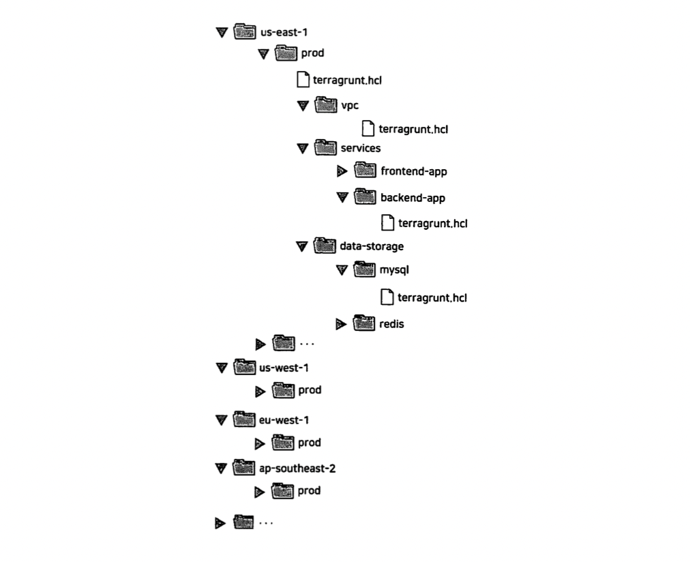
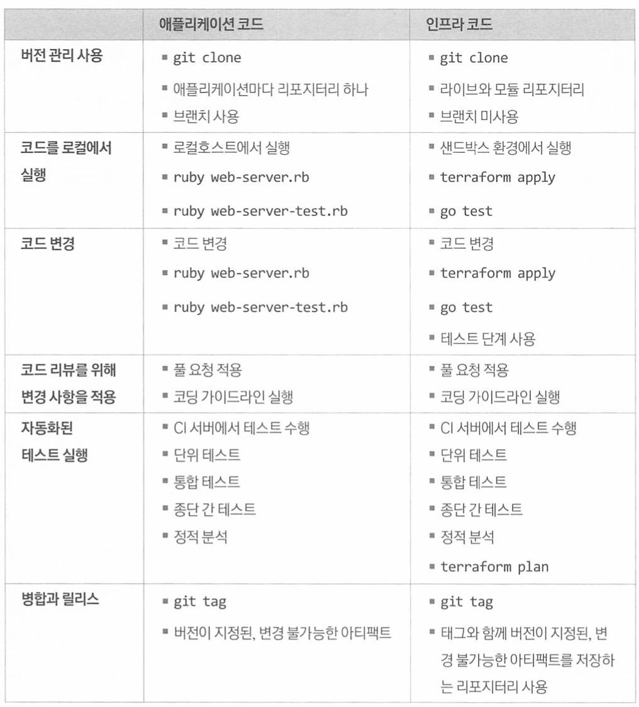
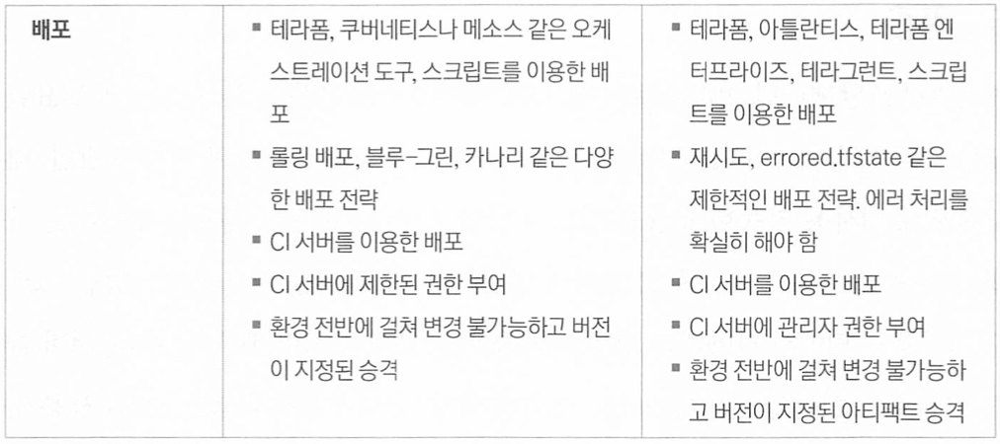

# 8장 테라폼을 팀에서 사용하는 방법

이 장에서는 테라폼과 코드형 인프라를 팀에서 실행하는 데 필요한 주요 프로세스에 대해 알아보겠다.

- 팀에 코드형 인프라 도입
- 애플리케이션 코드 배포를 위한 워크플로
- 인프라 코드 배포를 위한 워크플로
- 배포 워크플로 비교

## 1. 팀에 코드형 인프라 도입

### 1.1 상사 설득

코드형 인프라 도구를 채택하는 데 드는 대가

- 기술 격차
    
    코드형 인프라로의 이동은 운영팀이 대부분의 시간을 테라폼 모듈, Go 테스트, 셰프 레시피 등 대량의 코드를 작성하는 데 할애해야 한다는 것을 의미한다.
    
    일부 운영 엔지니어는 하루 종일 코딩하는 데 익숙하고 변경 사항을 좋아할 수 있지만, 다른 엔지니어에게는 힘든 변화일 수 있다.
    
- 새로운 도구
    
    일부 개발자들은 자신이 아는 것을 고수하고 새로운 언어와 기술을 배우는 데 많은 시간과 에너지를 투자하는 것을 거부할 수 있다.
    
- 사고방식 변화
    
    팀 구성원이 인프라를 수동으로 관리하는 데 익숙하다면 모든 변경을 직접 수행하는 데 익숙할 것이다.
    
- 기회 비용
    
    다른 프로젝트에 투자할 수 있는 시간과 자원을 코드형 인프라로 마이그레이션 하기 위해 사용한다.
    

팀에 코드형 인프라를 채택하도록 상사를 설득하고 싶다면 코드형 인프라의 가치가 아니라 그 기간동안 다른 어떤 일을 하는 것보다도 팀에 더 많은 가치를 가져다준다는 것을 증명해야 한다.

### 1.2 점진적 도입

코드형 인프라를 성공적으로 채택하고 싶거나 다른 유형의 마이그레이션 프로젝트를 성공시키는 유일한 방법은 점진적으로 도입하는 것이다.

점진주의의 핵심은 단순히 작업을 일련의 작은 단계로 나누는 것만이 아니라 이후 단계를 실행하지 않는다 하더라도 모든 단계가 고유한 가치를 가져다주는 방식으로 작업을 나누는 것이다.

어떤 가치를 얻기 위해 프로젝트가 끝날 때까지 기다르는 것은 커다란 위험이다.

예를 들어 다음과 같은 상황이다.

- 프론트엔드 개선 → (의존) → 백엔드 개선 → (의존) → 데이터 마이그레이션

어떤 가치를 얻기 위해 프로젝트가 끝날 때까지 기다리는 것은 커다란 위험이다. 만약 프로젝트가 취소되거나 보류되거나 부분적으로 크게 변경된 경우 많은 투자에도 불구하고 프로젝트에서 어떠한 가치도 얻을 수 없다.

잘못된 점진주의를 적용하면 엄청난 비용을 지불하고도 전혀 대가를 얻지 못하는 최악의 결과를 초래할 수도 있다.

점진주의는 필수적이다. 프로젝트가 완료되지 않아도 프로젝트가 어떤 단계를 거쳤든 간에 작업을 수행할 가치가 있어야 한다. 이를 달성하는 가장 좋은 방법은 한 번에 작고 구체적인 문제 하나를 해결하는 데 집중하는 것이다.

예를 들어 클라우드로의 ‘빅뱅’ 마이그레이션을 수행하는 대신 어려움을 겪고 있는 소규모의 특쟁 앱 또는 팀을 식별해 이들만 마이그레이션하도록 시도한다.

현실적이고 구체적인 문제를 성공적으로 해결해 팀이 빠르게 승리를 거둘 수 있다면 추진력을 얻을 수 있다. 

### 1.3 팀에 학습 시간 부여

팀이 필요한 시간과 자원을 확보하지 못하면 코드형 인프라 마이그레이션이 성공할 가능성이 낮다. 

팀이 코드형 인프라를 더 빨리 채택하도록 도울 수 있는 한 가지 방법은 잘 저의된 프로세스를 갖는 것이다. 소규모 팀에서 코드형 인프라를 배우거나 사용할 때는 개발자의 컴퓨터에서 애드혹 형태로 실행하는 것으로 충분하다. 그러나 회사가 성장하고 코드형 인프라 사용량이 증가함에 따라 배포가 어떻게 이루어지는지에 대한 보다 체계적이고 반복 가능하며 자동화된 워크플로를 정의해야 한다.

## 2. 애플리케이션 코드 배포를 위한 워크플로

이 장에서는 개발에서 프로덕션까지 테라폼 모듈 같은 인프라 코드를 가져오는 워크플로에 대해 설명한다.

다음은 애플리케이션 코드 워크플로 단계이다.

```jsx
1. 버전 관리 사용
2. 코드를 로컬에서 실행
3. 코드 변경
4. 코드 리뷰를 위해 변경 사항 반영
5. 자동화된 테스트 실행
6. 병합과 릴리스
7. 배포
```

### 2.1 버전 관리 사용

모든 코드는 버전 관리 상태에 있어야 한다.

```jsx
$ git clone https://github.com/brikis98/terraform-up-and-running-code.git
$ cd terraform-up-and-running-code
$ git checkout -b example-feature
```

### 2.2 코드를 로컬에서 실행

이제 코드가 컴퓨터에 있으므로 로컬에서 실행할 수 있다.

중요한 점은 애플리케이션 코드에 대한 수동 및 자동화된 테스트를 모두 사용자 컴퓨터에서 완전히 로컬로 실행할 수 있다는 것이다. 이 장의 뒷부분에서 인프라를 변경하는 워크플로는 로컬로 실행할 수 없다는 점을 알게 될 것이다.

### 2.3 코드 변경

이제 애플리케이션 코드를 실행할 수 있게 되었으니 변경 작업을 시작할 수 있다.

이것은 변경을 수행하고 수동 또는 자동화된 테스트를 재실행하여 변경 사항이 작동하는지 확인하고 다른 변경을 수행하고 테스트를 재실행하는 등의 반복적인 프로세스이다.

자동화된 테스트가 여전히 이전 값을 예상하고 있다는 피드백을 즉시 받기 때문에 신속하게 수정할 수 있다. 워크플로 중 이 부분의 개념은 변경과 작동 여부 확인 사이의 시간을 최소화하도록 피드백 루프를 최적화하는 것이다.

작업할 때 정기적으로 코드를 커밋해야 하며 변경 내용을 설명하는 명확한 커밋 메시지가 표시되어야한다.

```jsx
$ git commit -m "Updated Hello, World text"
```

### 2.4 코드 리뷰를 위해 변경 사항 반영

변경된 코드에 대해 브랜치를 원본으로 다시 푸시한다. 즉, 깃허브 자체로 되돌린다.

```jsx
$ git push origin example-feature
```

브라우저에서 풀 요청 제목과 설명을 입력한 다음 PR을 날린다.

### 2.5 자동화된 테스트 실행

버전 관리 시스템에 푸시하는 모든 커밋에 대해 자동화된 테스트를 실행하도록 커밋 후크를 설정해야 한다. 이를 위한 가장 일반적인 방법은 젠킨스, 서클 CI 또는 트래비스 CI와 같은 CI 서버를 사용하는 것이다.

가장 널리 사용되는 CI 서버에는 깃허브용으로 내장된 통합 기능이 있기 때문에 모든 커밋은 자동으로 테스트를 실행할 뿐만 아니라 해당 테스트 결과가 풀 요청 자체에 표시된다.

### 2.6 병합과 릴리스

팀 구성원은 코드 변경 사항을 리뷰하고 잠재적인 버그를 찾고 코딩 지침을 적용하고 기존 테스트가 통과했는지 확인하고 추가한 새로운 동작에 대한 테스트를 추가했는지 확인해야 한다. 모든 것이 잘되었다면 코드를 master 브랜치에 병합할 수 있다.

다음 단계는 코드를 릴리스하는 것이다. 변경 불가능한 인프라 방식을 사용하는 경우 애플리케이션 코드를 릴리스한다는 것은 해당 코드를 변경 불가능한 새 아티팩트로 패키징하는 것을 의미한다.

아티팩트가 변경 불가능하고 고유한 버전 번호를 가지고 있는지, 즉 이 아티팩트를 다른 모든 아티팩트와 구별할 수 있는지 확인한다.

예를 들어 도커를 사용하려 애플리케이션을 패키징하는 경우 도커 태그에 버전 번호를 저장할 수 있다. 배포하려는 도커 이미지를 다음 항목이 포함된 정확힌 코드에 매핑할 수 있도록 sha1 해시인 커밋 ID를 태그로 사용할 수 있다.

```jsx
$ commid_id=$(git rev-parse HEAD)
$ docker build -t brikis98/ruby-web-server:$commit_id
```

나중에 도커 이미지에서 문제를 디버깅하는 경우 도커 이미지가 가진 커밋 ID를 태그로 체크아웃하여 정확한 코드를 확인할 수 있다.

커밋 ID의 한 가지 단점은 읽기 어렵거나 기억하기 어렵다는 것이다. 대안은 깃 태그를 만드는 것이다. 도커의 이미지에서 이 깃 태그를 사용할 수 있다.

```jsx
$ git tag -a "v0.0.4" -m "Update Hello, World text"
$ git push --follow-tags
$ git_tag=$(git describe --tags)
$ docker build -t brikis98/ruby-web-server:$git_tag .
```

디버깅할 때 특정 태그의 코드를 체크아웃한다.

```jsx
$ git checkout v0.0.4
```

### 2.7 배포

배포 시 고려해야 할 사항

- 배포 도구
- 배포 전략
- 배포 서버
- 환경 전반에 걸쳐 아티팩트 승격

### 배포 도구

애플리케이션을 패키지하는 방법과 실행 방법에 따라 애플리케이션을 배포하는 데 사용할 수 있는 다양한 도구가 있다.

- 테라폼
    - 패커와 같은 도구를 사용해 애플리케이션을 AMI로 패키징하는 경우 테라폼 코드의 ami 매개 변수를 업데이트하고 terraform apply 명령을 실행하여 새 AMI 버전을 배포할 수 있다.
- 도커 오케스트레이션 도구
    - 애플리케이션을 도커 이미지로 패키징하는 경우 쿠버네티스에서 kubectl apply를 실행하고 배포할 도커 이미지 이름과 태그를 정의하는 YAML 파일로 전달하여 도커 이미지 버전을 배포할 수 있다.
- 스크립트
    - 테라폼 및 대부분의 오케스트레이션 도구는 제한된 배포 전략만 지원한다. 더 복잡한 요구 사항이 있는 경우 파이썬이나 루비 같은 범용 프로그래밍 언어, 앤서블이나 셰프 같은 구성 관리 도구 또는 캐피스트라노 같은 기타 서버 자동화 도구로 사용자 지정 스크립트를 작성해야할 가능성이 높다.

### 배포 전략

앱의 이전 버전 복사본을 5개 실행 중이며 새 버전을 롤아웃한다고 가정한다.

- 교체를 통한 롤링 배포
    - 앱의 이전 복사본 중 하나를 제거하고, 이를 교체할 새 사본을 배포한다. 새 사본이 올라올 때까지 기다렸다가 상태 확인을 통과하면 새 복사본에 라이브 트래픽을 전송하기 시작한다.  그리고 이전 복사본이 모두 교체될 때까지 프로세스를 반복한다.
    - 교체를 통한 롤링 배포는 애플리케이션 복사본이 5개 이상 실행되지 않도록 보장하는데 각 복사본이 물리적 서버에서 실행되는 것 같이 용량이 제한적인 경우 유용하다.
    - 각 앱이 고유한 ID를 갖는 상태 저장 시스템을 다룰 경우에도 유용한다. 아파치 주키퍼와 같이 합의 알고리즘으로 동작하는 상태 저장 시스템을 컨센서스 시스템이라고도 한다.
    - 이 배포 전략은 큰 배치 크기로 작동할 수 있다. 즉, 로드를 처리할 수 있고 더 적은 수의 앱을 실행하도 데이터가 손실되지 않는다고 가정하여 앱 복사본을 한 번에 둘 이상 교체할 수 있다.
- 교체 없는 롤링 배포
    - 앱의 새 복사본 하나를 배포하고 새 복사본이 올라올 때까지 기다렸다가 상태 확인이 통과되면 새 복사본에 라이브 트래픽을 보내기 시작한 후 앱의 이전 복사본 배포를 취소한다. 이전 복사본이 모두 교체될 때까지 프로세스를 반복한다.
    - 유연한 용량이 있고 복사된 애플리케이션을 동시에 5개 이상 실행했을 때 견딜 수 있는 경우에만 작동한다.
    - 실행 중인 앱 복사본이 5개 미만일 경우가 절대 없기 때문에 배포 중 용량이 줄어든 상태로 실행되지 안흔 것이 장점이다.
    - 이 배포 전략은 더 큰 배치 크기에서 작동할 수 있다.
- 블루-그린 배포
    - 앱의 새 복사본 5개를 배포하고 모든 복사본이 올라올 때까지 기다린다. 상태 확인을 통과한 후 모든 라이브 트래픽을 새 복사본으로 이동한 이전 복사본 배포를 취소한다.
    - 유연한 용량이 있고 복사된 애플리케이션을 동시에 5개 이상 실행했을 때 견딜 수 있는 경우에만 작동한다.
    - 사용자에게 앱의 버전이 한 번에 하나만 보이는 것과 실행 중인 앱 복사본이 5개 미만일 경우가 절대 없기 때문에 배포 중 용량이 줄어든 상태로 실행되지 안흔 것이 ㅈ아점이다.
- 카나리 배포

### 배포 서버

개발자 컴퓨터가 아닌 CI 서버에서 배포를 실행해야 한다. 배포 서버를 사용하면 다음과 같은 이점이 있다.

- 완전 자동화
    - CI 서버에서 배포를 실행하려면 모든 배포 단계르르 완전 자동화해야 한다.
- 일관된 환경에서 실행
    - 개발자가 자신의 컴퓨터에서 배포를 실행하면 해당 컴퓨터 구성 방법 차이로 인해 버그가 발생할 수 있다.
- 보다 나은 권한 관리
    - 프로덕션 환경의 경우 모든 개발자에게 배포 권하는 부여하는 대신 CI 서버에만 해당 권한을 부여할 수 있다.

### 환경 전반에 걸쳐 아티팩트 승격

불변 인프라 방식을 사용하는 경우 새로운 변경 사항을 롤아웃하는 방법은 한 환경에서 다른 환경으로 정확히 동일한 버전의 아티팩트를 승격하는 것이다.

예를 들어 개발, 스테이징, 프로덕션 환경이 있는 경우 애플리케이션의 v0.0.4를 출시하려면 다음과 같이 수행한다.

1. 개발 환경에 앱 v0.0.4를 배포한다.
2. 개발 환경에서 수동 및 자동 테스트를 실행한다.
3. v0.0.4가 개발 환경에서 잘 작동하는 경우 1단계와 2단계를 반복하여 v0.0.4를 스테이징 환경에 배포한다. 이를 아티팩트 승격이라고 한다.
4. v0.0.4가 스테이징 환경에서 잘 작동하는 경우 1단계와 2단계를 다시 반복하여 v0.0.4를 운영환경으로 승격한다.

## 3. 인프라 코드 배포를 위한 워크플로

인프라 코드를 배포하는 워크플로는 다음과 같다.

1. 버전 관리 사용
2. 코드를 로컬에서 실행
3. 코드 변경
4. 코드 리뷰를 위해 변경 사항 반영
5. 자동화된 테스트 실행
6. 병합 및 릴리스
7. 배포

표면적으로는 애플리케이션 코드를 배포하는 워크플로와 동일하게 보이지만 내부적으로는 중요한 차이가 있다. 인프라 코드 변경 사항을 배포하는 것은 더 복잡하고 기술을 이해하기 어렵다.

### 3.1 버전 관리 사용

애플리케이션 코드와 마찬가지로 모든 인프라 코드는 버전 상태에 있어야 한다.

인프라 코드 버전 관리에는 몇 가지 추가 요구 사항이 있다.

- 라이브 리포지터리 및 모듈 리포지터리
- 테라폼의 황금 법칙
- 브랜치 문제

### 라이브 리포지터리 및 모듈 리포지터리

- 테라폼 코드에 대한 모듈 리포지터리 1개
    - 재사용 가능한, 버전이 지정된 모듈을 생성하는 곳
- 라이브 인프라 리포지터리 1개
    - 개발, 스테이징, 운영 등 각 환경에 배포한 라이브 인프라 정의

라이브러리를 구축하거나 판매되고 있는 제품을 구매하면 회사의 다른 모든 팀이 자체 인프라를 배포하고 관리하기 위해 서비스 카탈로그와 비슷한 방식으로 이 모듈을 사용할 수 있다.

이렇게 하면 각 팀이 처음부터 인프라를 구축하는 데 수 개월을 투자하거나 또는 운영팀이 모든 팀의 인프라를 구축하고 관리하느라 서비스 배포가 지연되지 않는다.

테라폼의 황금 법칙에 따라 테라폼 코드를 유지보수할 수 있다.

### 테라폼의 황금 법칙

```
라이브 리포지터리의 마스트 브랜치는 프로덕션에 실제로 배포된 것을 1:1로 표현해야 한다.
```

- 실제로 배포된 것
    - 라이브 리포지터리의 테라폼 코드가 실제로 배포된 최신 내용인지 확인할 수 있는 유일한 방법은 절대 테라폼을 사용하지 않고 변경하지 않는 것이다.
- 1:1로 표현
    - 모든 리소스는 라이브 리포지터리에 체크인된 일부 코드와 1:1로 일치해야 한다.
    - 각 환경을 별도의 파일을 이용해 개별 폴더에 정의해야 한다.
- 마스터 브랜치
    - 실제 프로덕션에 배포된 내용을 이해하려면 단일 브랜치만 살펴봐야 한다.
    - 프로덕션 환경의 경우 반드시 master 브랜치만 terraform apply 명령을 사용하려 배포해야 한다.

### 브랜치 문제

3장에서 테라폼 백엔드에 내장된 잠금 메커니즘을 사용하여 팀의 두 구성원이 동일한 테라폼 구성에 동시에 terraform apply를 실행하는 경우 변경 사항을 서로 덮어 쓰지 않도록 할 수 있음을 확인했다.

그러나 이것은 문제의 일부만 해결한다.테라폼 백엔드가 테라폼 상태 잠금 기능을 제공하지만 테라폼 코드 수준의 잠금 기능을 제공하진 않는다.

테라폼은 암묵적으로 테라폼 코드에서 실제 세계에 배포된 인프라의 매핑이다. 실제 세계는 하나뿐이므로 테라폼 코드가 여러 브랜치를 가질 수는 없다. 스테이징, 프로덕션 같은 모든 공유 환경은 항상 단일 브랜치에서 배포해야 한다.

### 3.2 코드를 로컬에서 실행

코드를 컴퓨터에서 체크아웃했으니 다음 단계는 코드를 실행하는 것이다. 테라폼은 애플리케이션 코드와 달리 ‘로컬호스트’가 없다.

### 3.3 코드 변경

애플리케이션 코드와 마찬가지로 반복적으로 변경 작업을 시작할 수 있다. 변경할 때마다 terraform apply를 다시 실행하여 변경 사항을 배포하고 curl을 다시 실행하여 변경 사항이 제대로 작동하는지 확인한다.

변경 작업을 수행할 때 정기적으로 작업을 커밋하는 것을 잊으면 안된다.

### 3.4 코드 리뷰를 위해 변경 사항을 반영

코드가 예상대로 작동한 후에는 애플리케이션 코드와 마찬가지로 코드를 리뷰하기 위한 풀 요청을 생성할 수 있다. 팀으로써 어떤 종류의 코드를 작성하든 여러분은 모든 사람이 따를 수 있는 지침을 정해야 한다.

```
10명의 다른 엔지니어가 작성한 하나의 파일을 볼 때 
어떤 사람이 어느 부분을 작성했는지 거의 구별할 수 없으면 이것이 제게는 클린 코드입니다.
코드 리뷰를 통해 스타일 가이드, 패턴, 언어 관용구를 게시하면
이를 수행할 수 있다.
일단 한 번 배우면 모두 같은 방식으로 코드를 작성하는 방법을 알고 있기 때문에
훨씬 더 생산적이다.
그쯤 되면 어떻게 쓰느냐가 아니라 무엇을 쓰느냐가 더 중요하다.
```

유용한 몇 가지 일반적인 지침들

- 문서화
- 자동화된 테스트
- 파일 레이아웃
- 스타일 가이드

### 문서화

코드 자체를 넘어 코드형 인프라를 포함한 모든 소프트웨어에 문서화가 필요하다. 다음은 코드 리뷰를 위해 고려할 만한 몇 가지 문서화 유형이다.

- 서면 문서화
    
    대부분의 테라폼 모듈에는 모듈의 기능, 모듈이 존재하는 이유, 모듈의 사용 방법, 수정 방법을 설명하는 README가 있어야 한다. 실제로 테라폼 코드보다 먼저 README를 작성하는 것이 좋다. 이렇게 하면 코드에 몰두해 어떻게 작성해야 하는지에 대한 세부 사항에서 길을 잃기 전에 무엇을 작성하는지 그리고 왜 만들어야 하는지를 고려하기 때문이다.
    
- 코드 문서화
    
    코드 자체 내에서 주석을 문서화의 한 형태로 사용할 수 있다. 테라폼은 해시로 시작하는 모든 텍스트를 주석으로 처리한다.
    
- 예제 코드
    
    모든 테라폼 모듈은 해당 모듈을 어떻게 사용해야 하는지를 보여주는 예제 코드를 포함해야 한다.
    

### 파일 레이아웃

팀은 테라폼 코드가 저장되는 위치 및 사용하는 파일 레이아웃에 대한 규칙을 정의해야 한다.

테라폼의 파일 레이아웃은 테라폼 상태가 저장되는 방식도 결정한다. 그러므로 스테이징 환경의 변경으로 인해 우연히 프로덕션에 문제가 발생하지 않도록 하기 위해 파일 레이아웃을 이용해 격리 보장 기능을 사용하는 것을 염두에 두어야 한다.

코드 리뷰에서 ‘파일 레이아웃을 이용한 격리’에서 언급한 파일 레이아웃을 적용해야 한다.

### 스타일 가이드

모든 팀은 공백, 줄 바꿈, 들여쓰기, 중괄호, 변수 이름 지정 등을 포함하여 코드 스타일에 대한 일련의 규칙을 정해야 한다. 프로그래머는 공백과 탭, 중괄호가 어디로 가야 하는지에 대한 토론을 좋아하지만 실제 선택은 그다지 중요하지 않다. 정말 중요한 것은 코드베이스 전체에 일관성이 있어야 한다는 것이다. 

테라폼에는 일관된 스타일로 코드를 자동으로 재포맷할 수 있는 내장 fmt 명령도 있습니다.

```
$ terraform fmt
```

이 명령을 커밋 혹은 일부로 실행하여 버전 관리에 커밋된 모든 코드가 일관된 스타일인지 자동으로 확인할 수 있다.

### 3.5 자동화된 테스트 실행

애플리케이션 코드와 마찬가지로, 인프라 코드는 모든 커밋 후에 CI 서버에서 자동화된 테스트를 시작하는 커밋 훅을 가지고 있어야 하며 풀 요청에서 해당 테스트의 결과를 표시해야 한다.

```
apply 명령어를 실행하기 전에 항상 plan을 먼저 실행하세요.
```

테라폼은 apply를 실행할 때 자동으로 plan을 출력하므로 실제로 이 규칙은 항상 작업을 잠시 멈추고, 출력된 내용을 읽어야 한다는 것을 의미한다.

이 규칙을 장려하는 좋은 방법은 plan을 코드 리뷰 흐름에 통합하는 것이다. 예를 들어 아틀란티스는 커밋에 terraform plan 명령을 실행하고 풀 요청에 plan 출력을 주석으로 자동 추가하는 오픈 소스 도구이다.

plan 명령을 사용하면 diff 출력을 파일에 저장할 수도 있다.

```
$ terraform plan -out=example.plan
```

그런 다음 저장된 plan 파일에서 apply 명령을 실행하여 변경 사항을 정확히 적용했는지 확인할 수 있다.

```
$ terraform apply example.plan
```

테라폼 상태와 마찬가지로 저장된 plan 파일에 시크릿이 포함될 수 있다는 점에 유의해야 한다. plan 파일은 암호화되지 않으므로 일정 기간 동안 저장하려면 별도의 자체 암호화를 제공해야 한다.

### 3.6 병합과 릴리스

팀 구성원이 코드 변경과 plan 출력을 검토했고 모든 테스트를 통과했다면 변경 사항을 master 브랜치에 병합하고 코드를 릴리스할 수 있다. 애플리케이션 코드와 마찬가지로 깃 태그를 사용하여 버전이 지정된 릴리스를 만들 수 있다.

```
$ git tag -a "v0.0.6" -m "Updated hello-world-example text"
$ git push --follow-tags
```

애플리케이션 코드는 도커 이미지나 VM 이미지나 같이 배포할 별도의 아티팩트가 있는 경우가 많지만 테라폼은 기본적으로 깃 리포지터리에서 다운로드한 코드 자체가 태그와 버전이 지정된 불변 아티팩트가 된다.

### 3.7 배포

이제 변경할 수 없는 버전이 지정된 아티팩트가 있으니 배포할 차례이다. 다음은 테라폼 코드를 배포하기 위한 몇 가지 주요 고려 사항이다.

- 배포 도구
- 배포 전략
- 배포 서버
- 환경 전반에서 아티팩트 승격

### 배포 도구

- 아틀란티스
    
    풀 요청에 plan 출력을 추가할 수 있을 뿐만 아니라 풀 요청에 특별한 주석을 추가하여 terraform apply 명령을 시작할 수도 있다.
    
- 테라폼 엔터프라이즈
    
    해시코프의 엔터프라이즈 제품은 변수, 시트릿, 엑세스 권한 관리뿐만 아니라 terraform plan 및 terraform apply를 실행하는 데 사용할 수 있는 웹 UI를 제공한다.
    
- 테라그런트
    
    이 도구는 테라폼의 일부 공백을 메우는 테라폼용 오픈 소스 래퍼 도구이다. 
    
- 스크립트
    
    파이썬, 루비, 배시와 같은 범용 프로그래밍으로 스크립트를 작성할 수 있다.
    

### 배포 전략

테라폼 자체는 어떤 배포 전략도 제공하지 않는다. 롤링 배포 또는 블루-그린 배포에 대한 내장 지원이 없으며 대부분의 테라폼 변경 사항을 기능 전환할 수 있는 방법이 없다. 기본적으로 코드에 있는 모든 구성을 실행하는 terraform apply 명령만 수행할 수 있다. 테라폼은 선언적 언어이기 때문에 배포 전략이 상당히 제한된다.

이러한 한계 때문에 배포가 잘못되었을 때 어떤 일이 일어나는지 고려하는 것이 매우 중요하다. 애플리케이션 배포의 경우 배포 전략에 따라 많은 유형의 오류가 포착된다. 반면 테라폼은 오류 발생 시 자동으로 롤백하지 않는다. 임의 인프라 코드를 사용하면 안전하지 않거나 안전하지 않을 가능성이 있기 때문이다.

테라폼에서 오류는 매우 일반적이다. 따라서 배포 전략에서는 오류를 비교적 평범한 것으로 간주하고 오류를 처리하는 최상의 방법을 제공해야 한다.

- 재시도
    
    특정 유형의 테라폼 오류는 일시적이며 terraform apply를 다시 실행하면 사라진다. 테라폼과 함께 사용하는 배포도구는 이러한 알려진 오류를 감지하고 잠시 후 다시 시도해야 한다. 테라그런트에는 알려진 오류에 대한 자동 재시도 기능이 내장되어 있다.
    
- 테라폼 상태 오류
    
    때때로 terraform apply를 실행한 후 테라폼이 상태를 저장하지 못할 수도 있다. 예를 들어 apply 도중에 인터넷 연결이 끊이지면 apply 명령이 실패할 뿐만 아니라 아마존 S3 같은 원격 백엔드에 업데이트된 상태 파일을 쓸 수 없게 된다. 이 경우 테라폼은 errored.tfstate라는 디스크에 상태 파일을 저장한다. CI 서버에서 빌드 후 작업 공간을 정리할 때 이러한 파일을 삭제하지 않도록 주의해야 한다. 배포 실패 후에도 여전히 이 파일에 엑세스할 수 있는 경우 인터넷 연결이 복원되는 즉시 state push 명령을 사용해 이 파일을 S3 같은 원격 백엔드로 푸시하여 상태 정보가 손실되지 않도록 할 수 있다.
    
    ```
    $ terraform state push errored.tfstate
    ```
    

- 잠금 해제 오류
    
    테라폼은 가끔 잠금 해제에 실패하기도 한다. terraform apply 실행 중간에 CI 서버 충돌이 발생하면 테라폼은 영구적으로 잠금 상태로 유지된다. 동일한 모듈에서 apply를 실행하려는 다른 사용자는 상태가 잠겨있다는 오류 메시지와 잠금 ID를 받는다. force-unlock 명령을 사용하여 오류 메시지에서 받은 잠금 ID를 전달하여 잠금을 강제로 해제할 수 있다.
    
    ```
    $ terraform force-unlock <LOCK_ID>
    ```
    

### 배포 서버

애플리케이션 코드와 마찬기지로 모든 인프라 코드 변경은 개발자의 컴퓨터가 아닌 CI 서버에서 적용해야 한다. 젠킨스, 서클 CI, 테라폼 엔터프라이즈, 아틀란티스 또는 다른 안전한 자동화된 플랫폼에서 terraform 명령을 실행할 수 있다. 이렇게 하면 애플리케이션 코드와 동일한 이점을 얻을 수 있다. 배포 프로세스를 완전히 자동화하고 항상 일관된 환경에서 배포가 이루어지도록 하며 프로덕션 환경에 엑세스할 수 있는 권한을 가진 사용자를 보다 효과적으로 통제할 수 있게 해준다.

### 환경 전반에 걸쳐 아티팩트 승격

애플리케이션의 아티팩트를 배포하는 것과 마찬가지로 변경 불가능하고 버전이 지정된 인프라 아티팩트를 승격시키고 싶을 것이다. 이를 위한 규칙은 간단하다.

```
프로덕션 환경으로 가기 전 항상 사전 프로덕션 환경에서 테라폼 변경 사항을 테스트하세요.
```

테라폼으로 모든 것이 자동화되어 있기 때문에 프로덕션 전에 스테이징에서 변경을 시도하는 데 많은 노력이 필요하지는 않지만 엄청난 수의 오류를 발견할 것이다. 테라폼은 오류가 발생할 때 변경 사항을 롤백하지 않기 때문에 사전 프로덕션 환경에서 테스트하는 것이 특히 증요하다.

테라폼 코드를 환경에 걸쳐 승격하는 프로세스는 terraform plan을 실행하고 수동으로 출력을 리뷰하는 추가 단계가 있다는 점을 제외하면 애플리케이션 아티팩트를 승격하는 프로세스와 유사하다. 예를들어 개발, 스테이징, 프로덕션 환경에 걸쳐 테라폼 모듈의 v0.0.6을 승격하는 프로세스는 다음과 같다.

1. 개발 환경을 v0.0.6으로 업데이트하고 terraform plan을 실행한다.
2. 누군가에게 plan을 리뷰하고 승인하도록 요청한다. 예를 들어 슬랙을 통해 자동화된 메시지를 보낸다.
3. plan이 승인되면 terraform apply를 실행하여 v0.0.6을 개발 환경에 배포한다.
4. 개발 환경에서 수동 및 자동 테스트를 실행한다.
5. v0.0.6이 개발 환경에서 잘 작동하면 1~4단계를 반복하여 v0.0.6을 스테이징으로 승격한다.
6. v0.0.6이 스테이징에서 잘 작동하면 1~4단계를 다시 반복하여 v0.0.6을 프로덕션으로 승격한다.

이때 라이브 리포지터리에서 환경 간의 모든 코드 중복 문제를 처리하는 것이 중요하다.

코드를 DRY, 즉 반복하지 않게 하고 여러 환경 간에 테라폼 코드를 더 쉽게 승격하기 위해 **테라그런트**라는 오픈 소수 도구를 사용한다.

```
$ terragrunt plan
$ terragrunt apply
$ terragrunt output
```

테라그런트는 지정한 명령으로 테라폼을 실행하지만 terragrunt.hcl 파일에 지정한 구성에 따라 몇 가지 추가 동작을 실행할 수 있다. 기본 개념은 모든 테라폼 코드를 모듈 리포지터리에서 정확히 한 번 정의하고 라이브 리포지터리에는 각 환경에 각 모듈을 구성하고 배포하는 DRY 방법을 제공하는 terragrunt.hcl 파일만 갖는 것이다. 



1. provider 구성을 추가한다.
    - modules/data-stores/mysql/main.tf
    - modules/services/hello-world-app/main.tf
    
    ```
    provider "aws" {
    	region = "us-east-2"
    
    	# AWS 공급자의 2.X 버전을 지정한다.
    	version = "~> 2.0"
    }
    ```
    
2. backend 구성을 추가하고 config 블록을 비워둔다.
    - modules/data-stores/mysql/main.tf
    - modules/services/hello-world-app/main.tf
    
    ```
    terraform {
    	# 0.12.X 버전의 피요한 테라폼 버전 요청
    	required_version = ">= 0.12, < 0.13"
    	
    	# 부분적 구성. 나머지는 테라그런트에서 설정
    	backend "s3 {}
    }
    ```
    
3. 모듈 리포지터리의 새 버전을 릴리스한다.
    
    ```
    $ git add modules/data-stores/mysql/main.tf
    $ git add modules/services/hello-world-app/main.tf
    $ git commit -m "Update mysql and hello-world-app for Terragrunt"
    $ git tag -a "v0.0.7" -m "Update Hello, World text"
    $ git push --follow-tags
    ```
    
4. 라이브 리포지터리의 모든 테라폼 코드를 각 모듈에 대한 하나의 terragrunt.hcl 파일로 대체한다.

```
# live/stage/data-stores/mysql/terragrunt.hcl

terraform {
	source = "github.com/<OWNER>/modules//data-stores/mysql?ref=0.0.7"
}

inputs = {
	db_name     = "example_stage"
  db_username = "admin"

	# TF_VAR_db_password 환경 변수를 사용하여 패스워드 설정
}
```

terragrunt.hcl 파일은 테라폼 자체와 동일한 해시코프 구성 언어 구문을 사용한다. terragrunt apply를 실행하고 terragrunt.hcl 파일에서 source 매개 변수를 찾으면 테라그런트는 다음을 수행한다.

1. 임시 폴더의 source에 지정된 URL을 확인한다. 
2. 임시 폴더에서 terraform apply를 실행하면 inputs = {…} 블록에서 지정한 입력 변수를 전달한다.

라이브 리포지터리의 코드가 모듈당 하나의 terragrunt.hcl 파일로 축소된다는 이점을 가지고 있다. 이 파일에는 특정 버전에서 사용할 모듈에 대한 포인터만 포함되어 있고 그 특정 환경에 설정할 입력 변수만 포함되어 있다.

테라그런트는 또한 backend 구성을 DRY하게 유지하는 데 도움을 준다. bucket, key, dynamodb_table 등을 모든 모듈에 정의하는 대신 각 환경 당 하나의 terragrunt.hcl 파일에 정의할 수 있다. 

```
# live/stage/terragrunt.hcl

remote_state {
	backend = "s3"

	config = {
		bucket         = "<YOUR_BUCKET>"
		key            = "${path_relative_to_include()}/terraform.tfstate"
		region         = "us-east-2"
		encrypt        = true
    dynamodb_table = "<YOUR_TABLE>"
	}
}
```

path_relative_to_include()라는 테라그런트 내장 함수는 terragrunt.hcl 파일과 이를 포함하는 모든 자식 모듈 간의 상대 경로를 반환한다.

include 블록은 테라그런트 내장 함수 `find_in_parent_folders()` 를 사용하여 루트 terragrunt.hcl을 찾고 remote_state 구성을 포함하여 해당 부모 파일의 모든 설정을 자동으로 상속한다.

```
# live/stage/data-stores/mysql/terragrunt.hcl

terraform {
	source = "github.com/<OWNER>/modules//data-stores/mysql?ref=0.0.7"

	include {
		path = find_in_parent_folders()
	}

	inputs = {
		db_name     = "example_stage"
		db_username = "admin"
	}
} 
```

결과적으로 이 mysql 모듈은 루트 파일과 동일한 backend 설정을 모두 사용하고 key 값은 자동으로 data-stores/mysql/terraform.tfstate로 해석한다.

`terragrunt apply` 를 실행한다. 다음을 수행하는 것을 확인할 수 있다.

1. terragrunt.hcl 파일을 읽는다.
2. 지정한 모듈을 다운로드한다.
3. terraform init을 실행한다.
4. backend를 구성한다.
5. terraform apply를 실행한다.

### 4. 배포 워크플로 비교




