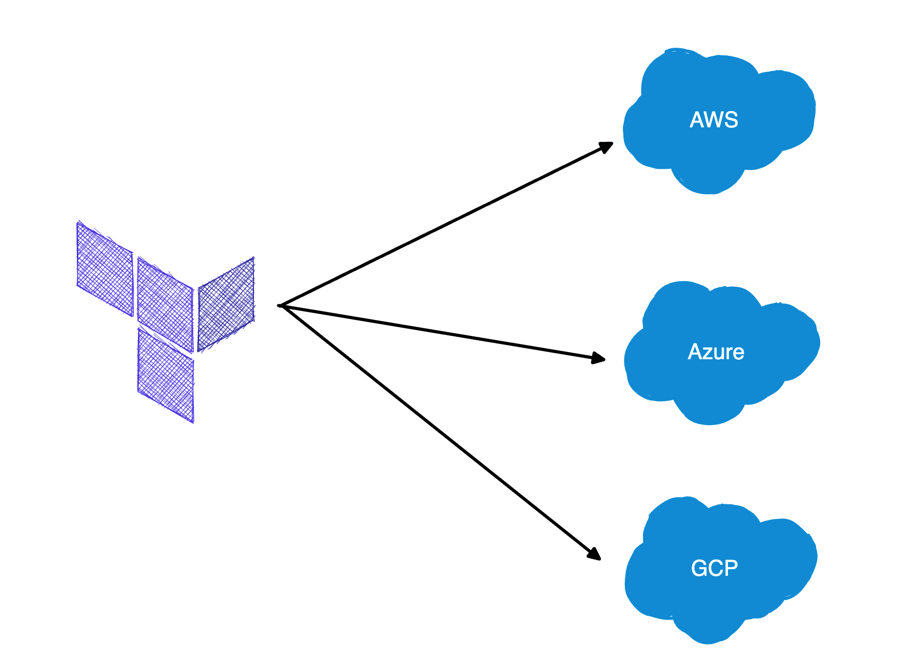

# 왜 테라폼인가?

## 데브옵스의 등장
### 수동으로 운영을 할때 문제점

예전에는 서버를 설치하고 네트워크를 구성하는 등의 하드웨어를 관리하는 팀인 운영팀과 소프트웨어를 개발하는 개발팀이 완전히 분리되어있었습니다.

개발팀이 애플리케이션을 만들면 운영팀에 넘겨주고 운영팀은 애플리케이션을 어떻게 배포하고 운영할 것인지 결정합니다.

그리고 이러한 작업들이 대부분 수동으로 이루어졌습니다.

규모가 작을때는 수동으로 해도 문제가 발생하지 않을 수 있지만 규모가 커질수록 문제가 발생하게 됩니다.

예를 들어, 운영팀의 실수로 모든 서버가 똑같이 설정되지 않고 일부 설정이 미묘하게 다른 ‘구성 드리프트’가 발생할 수 있습니다.

이런 사소한 설정의 차이 때문에 버그가 계속해서 발생할 수 있고 개발자는 `내 컴퓨터에서 잘 동작하는데` 같은 상황이 벌어지기 쉽습니다.

이러한 상황에서 배포 주기까지 짧다면 배포가 미뤄지거나 중단되는 심각한 상황들이 여러번 만들어질 것 입니다.

### 온프레미스에서 클라우드로

예전에 온프레미스 환경에서 운영했던 것과 달리 AWS, Azure와 같은 클라우드 플랫폼의 사용이 증가하기 시작했습니다.

이러한 흐름에 맞춰 운영팀은 하드웨어를 관리하는 노력을 투자하는 대신 셰프(Chef), 퍼핏(Puppet), 테라폼(Terraform), 도커(Docker) 같은 소프트웨어 작업에 더 많은 시간을 들이고 있습니다.

즉, 시스템 관리자가 서버를 설치하고 네트워크 케이블 작업을 하는 대신 `코드를 작성하는 방향`으로 변화하고 있습니다.

### 데브옵스의 대두

결과적으로 개발팀과 운영팀이 모두 소프트웨어 작업에 대부분의 시간을 소비하며 두 팀의 구분이 점점 모호해지고 있습니다.

이러한 흐름을 통해 개발팀과 운영팀이 보다 밀접하게 작업하게 되었고 이 과정에서 데브옵스가 태동하기 시작했습니다.

데브옵스는 팀이나 직책 또는 특정 기술을 아닙니다.

데브옵스는 일련의 프로세스, 아이디어, 테크닉을 의미하며 다음과 같이 정의할 수 있습니다.

```
💡 데브옵스는 소프트웨어를 효율적으로 전달하는 프로세스다.
```

이제 프로젝트를 병합하느라 고생하는 대신 지속적으로 코드를 통합하고 항상 배포 가능한 상태로 유지할 수 있습니다.

한달에 한번 코드를 배포하는 대신 하루에도 수십번 배포할 수 있고 심지어 코드 변경 내용을 커밋(commit)할 때마다 배포할 수도 있습니다.

또한 탄력적이고 자가 치유적인 시스템을 구축하고, 모니터링 및 알림 기능을 사용하여 자동으로 해결할 수 없는 문제에 대비할 수 있습니다.

다양한 회사에서 데브옵스를 조직에 적용하고 나서 운영에 걸리는 시간 및 배포 주기를 더 자주 가져갈 수 있게 되었습니다.

### 데브옵스의 5가지 핵심 가치

데브옵스에는 다음과 같은 5가지 핵심 가치가 존재합니다.

- 문화(Culture)
    - 데브옵스 문화는 개발, 운영, 품질 보증 및 기타 관련 팀들이 협력하고 서로를 존중하는 환경을 만드는 것에 중점을 둡니다.
    - 이를 통해 서로 간의 의사소통과 협업이 원활해지며, 개방성과 신뢰가 올라갑니다.
- 자동화 (Automation)
    - 코드 빌드, 테스트, 통합, 배포 및 모니터링과 같은 과정을 자동함으로써, 빠른 피드백 및 높은 품질의 소프트웨어 개발이 가능해집니다.
    - 이러한 과정에 지속적 통합(CI), 지속적 전달/배포(CD) 인프라 스트럭쳐 코드 관리(IaC), 테스트 자동화, 모니터링 및 로깅 등이 포함됩니다.
- 학습 (Lean)
    - 개선을 위해 지속적으로 프로세스를 검토하고 낭비를 줄이고, 가치를 극대화하는 것이 중요합니다.
    - 이는 실험과 혁신을 통해 빠르게 변화하는 시장에 적응할 수 있는 능력을 향상시킵니다.
- 측정 (Measurement)
    - 팀의 작업 효율성, 프로세스 개선 및 가치 창출을 평가하기 위해 품질, 퍼포먼스, 가용성 등 다양한 지표를 사용합니다.
    - 이를 통해 객관적인 의사결정이 가능하며, 소프트웨어의 지속적인 개선이 이루어집니다.
- 공유 (Sharing)
    - 공유를 통해 팀 간의 의사소통과 협업을 촉진하며 모범사례, 실폐 사례, 기술 및 경험을 공유함으로써 서로 배우고 성정할 수 있는 환경을 조성합니다.

우리는 테라폼을 통해 소프트웨어 배포를 최대한 자동화하는 것입니다.

이를 위해 웹 페이지 클릭 또는 셸 명령을 수동으로 입력하는 방식이 아닌 코드를 통해 자동으로 인프라를 관리할 것입니다.


## 코드형 인프라란?
### 코드형 인프라

코드형 인프라(Infrastructure as Code)란 코드를 작성 및 실행하여 인프라를 생성, 배포 수정, 정리하는 것을 말합니다.

코드형 인프라 덕분에 서버, 데이터베이스, 네트워크, 로그 파일, 애플리케이션 구성, 문서, 자동화된 테스트, 배포 프로세스 등 거의 모든 것을 코드로 관리할 수 있게 되었습니다.

### 코드형 인프라의 주요 이점

- 속도 및 효율성
    - 코드를 사용하여 인프라를 구성하면 수동 프로세스보다 빠르게 인프라를 배포하고 관리할 수 있습니다.
- 일관성
    - 코드를 사용하면 인프라 구성의 일관성이 향상되어 인프라 오류 및 구성 이슈를 줄일 수 있습니다.
- 가독성
    - 코드로 인프라를 구술하면 인프라 구성이 명확해지고, 개발자와 시스템 관리자가 이해하기 쉬워집니다.
- 재사용성
    - 코드 기반 인프라는 모듈화가 가능해져, 재사용성이 높아집니다. 이를 통해 시간과 노력을 절약할 수 있습니다.
- 버전 관리
    - 코드형 인프라는 버전 관리 시스템과 호환되므로, 변경 사항 추적, 롤백 및 협업이 용이해집니다.

### 코드형 인프라의 다섯가지 범주

코드형 인프라 도구에는 다음과 같은 다섯가지 범주가 존재합니다.

- 애드혹 스크립트
- 구성 관리 도구
- 서버 템플릿 도구
- 오케스트레이션 도구
- 프로비전 도구

### 애드혹 스크립트

자동화하는 가장 간단한 방법은 애드혹 스크립트를 사용하는 것입니다.

애드혹 스크립트는 특정 작업이나 문제를 해결하기 위해 임시로 작성된 스크립트를 의미합니다.

보통 일회성 작업이나 일시적인 요구사항에 대응하기 위해 작성되며, 일반적으로 재사용성이 낮고 코드 구조가 비효율적일 수 있습니다.

예를 들어 필요한 모듈을 다운받은 후 깃 레포지터리의 코드를 내려받고 아파치 웹서버를 실행하여 서버를 구동하는 애드 혹 스크립트가 있다고 가정해봅시다.

```bash
# apt-get 캐시를 업데이트
sudo apt-get update

# PHP와 아파치 설치
sudo apt-get install -y php apache2

# 깃 레포지터리에서 코드를 다운로드
sudo git clone https://github.com/brikis98/php-app.git /var/www/html/app

# 아파치 웹 서버 시작
sudo service apache2 start
```

위와 같이 특정 동작을 관리하면 하나하나 적는 것보다는 편리하지만 상황에 따라 매번 맞춤 코드를 작성해야 한다는 문제점이 존재합니다.

코드형 인프라를 위해 특수 제작된 도구들을 사용하면 이런 복잡한 작업들을 간단한 API로 해결할 수 있습니다.

그리고 코드형 인프라용으로 설계된 도구를 사용하면 대체로 코드에 정해진 구조가 적용됩니다.

그리고 현재 코드의 경우 동작이 얼마 되지 않지만, 수십 개의 서버, 데이터베이스, 로드 밸런서, 네트워크 구성을 관리할 경우 이러한 애드혹 스크립트는 스파게티 코드로 전락하게 될 것입니다.

이러한 상황을 막기 위해서는 작업 목적에 맞게 설계된 코드형 인프라 도구를 사용해야 합니다.

### 구성 관리 도구

구성 관리 도구는 서버 및 애플리케이션의 구성을 자동화하고 표준화하는데 사용됩니다.

예를 들어 앞에서 보았던 애드혹 스크립트를 다음과 같은 앤서블 파일로 변경한다고 가정해봅시다.

```bash
- name: Update the apt-get cache
	apt:
		update_cache: yes

- name: Install PHP
	apt:
		name: php

- name: Install Apache
	apt:
		name: apache2

- name: Copy the code from the repository
	git: repo=https://github.com/brikis98/php-app.git dest=/var/www/html/app

- name: Start Apache
	service: name=apache2 state=started enabled=yes
```

위의 앤서블 코드는 애드혹 스크립트와 큰차이가 없어보이지만 앤서블 코드로 작성하면 다음과 같은 이점을 얻을 수 있습니다.

- 코딩 규칙
    - 앤서블은 문서화, 파일 레이아웃, 명확하게 이름 붙여진 매개 변수, 시크릿 관리 등을 포함하는 일관되고 예측 가능한 구조를 제공합니다.
    - 애드혹 스크립트 같은 경우 개발자마다 다른 방식으로 작성할 수 있지만 앤서블은 코딩 규칙이 존재하여 좀 더 쉽게 탐색할 수 있게 됩니다.
- 멱등성
    - 실행 횟수에 상관없이 항상 같은 동작을 기대할 수 있는 코드를 멱등성을 가진 코드라고 합니다.
    - 셸 스크립트로 멱등성을 가진 코드를 작성하려면 많은 조건문이 포함된 복잡한 코드를 작성해야하지만 앤서블 같은 도구를 사용하면 기본적으로 멱등성을 보장할 수 있습니다.
        - 예를 들어, 앤서블은 특정 패키지가 설치되어 있지 않을 때만 설치하고 동작하지 않는 경우에만 동작하도록 구현되어 있습니다.
- 분산형 구조
    - 애드혹 스크립트는 단일 로컬 머신에서만 실행되도록 설계되었습니다.
    - 앤서블과 같은 구성 관리 도구는 원격의 수많은 서버를 관리하기 위해 특별히 설계된 도구로 분산 환경에서도 간단하게 배포를 진행할 수 있습니다.

### 서버 템플릿 도구

구성 관리 도구의 대안으로 최근에 도커, 패커, 베이그런트와 같은 서버 템플릿 도구의 인기도 높아지고 있습니다.

여러 서버를 시작하고 각각 동일한 코드를 실행하여 서버를 구성하는 기존 방식과는 다르게 서버 템플릿 도구는 운영 체제, 소프트웨어, 파일 및 기타 필요한 모든 내용을 포함하고 있는 스냅샷으로 이미지를 생성합니다.

이미지 작업을 하기 위한 도구로는 크게 두가지 범주로 나뉩니다.

- 가상머신
    - 가상 머신은 하드웨어를 포함한 전체 컴퓨터 시스템을 에뮬레이트합니다.
    - 버추얼 박스 또는 페러렐즈와 같은 하이퍼바이저를 사용하여 CPU, 메모리, 하드 드라이브, 네트워크 같은 자원들을 가상화합니다.
    - 호스트 시스템 및 다른 가상 머신과 완전히 분리되기 때문에 개인 컴퓨터, QA 서버, 실제 운영 환경 등 모든 환경에서 정확히 동일한 방식으로 실행됩니다.
    - 단점은 모든 하드웨어를 가상화하고 다른 VM과도 완전히 분리했기 때문에 VM 마다 별도의 CPU, 메모리, 리소스가 할당되는 오버헤드가 발생합니다.
    - 패커와 베이그런트와 같은 도구를 사용하면 가상 머신 이미지를 코드로 정의할 수 있습니다.
- 컨테이너
    - 컨테이너는 OS의 사용자 공간을 에뮬레이트합니다.
    - 도커, 코어 OS의 rkt 또는 크라이오(cri-o)와 같은 컨테이너 엔진을 실행하여 격리된 프로세스, 메모리, 마운트 지점, 네트워킹을 만듭니다.
    - 호스트 시스템 및 다른 컨테이너와는 격리되어 모든 환경에서 정확하게 동일하게 실행된다는 것이 장점입니다.
    - 커널과 하드웨어가 공유되므로 밀리세컨드 단위로 부팅할 수 있으며 CPU 메모리에 대한 오버헤드가 거의 없는 것도 장점입니다.
    - 단점은 단일 서버에서 실행되는 모든 컨테이너가 해당 서버의 OS 커널과 하드웨어를 공유하므로 VM을 사용하는 것 만큼의 격리 및 보안 수준을 달성하기가 훨씬 어려울 수 있습니다.
    - 도커 및 코어 OS의 rkt와 같은 도구를 사용하여 컨테이너 이미지를 코드로 정의할 수 있습니다.

패커를 사용하면 다음과 같이 인스턴스를 정의할 수 있습니다.

```json
"builders": [{
	"ami_name": "packer-example",
	"instance_type": "t2.micro",
	"region": "us-east-2",
	"type": "amazon-ebs",
	"source_ami": "ami-0c55b159cbfafe1f0",
	"ssh_username": "ubuntu"
}],
"provisioners": [{
	"type": "shell",
	"inline": [
		"sudo apt-get update",
		"sudo apt-get install -y php apache2",
		"sudo git clone https://github.com/brikis98/php-app.git /var/www/html/app"
	],
	"environment_vars": [
		"DEBIAN_FRONTEND=nonineractive"
	]
}]
```

위와 같이 작성하면 항상 똑같은 이미지의 서버가 생성될 수 있습니다.

추가로, 서버 템플릿 도구들은 다음과 같이 각각의 목적이 약간씩 다릅니다.

- 패커
    - 프로덕션 서버에서 직접 실행하는 이미지를 생성하는데 주로 사용합니다.
- 베이그런트
    - 개발 컴퓨터에서 실행되는 이미지를 만드는 데 주로 사용합니다.
- 도커
    - 개별 응용 프로그램의 이미지를 만드는데 주로 사용됩니다.

서버 템플릿은 불변 인프라로 전환하는데 있어 핵심적인 구성요소입니다.

불변 인프라의 개념은 함수형 프로그래밍에서 사용하는 불변 변수 개념에서 영감을 얻어 등장한 것으로 함수형 프로그래밍에서는 변수를 설정한 후에는 해당 변수를 다시 설정할 수 없습니다.

그러므로 값을 변경해야 하는 경우 새로운 변수를 만들어야 합니다.

이러한 점 덕분에 변수 값이 바뀌지 않기 때문에 코드를 추론하기 훨씬 쉬워집니다.

불변 인프라는 이러한 함수형 프로그래밍과 비슷하게 한번 배포한 이미지는 다시 변경되지 않습니다.

그렇기 때문에 함수형 프로그래밍에서 새 버전의 코드를 배포하는 것과 같이 서버를 변경해야 하는 경우 서버 템플릿에서 새 이미지를 만들어 배포해야 합니다.

서버는 절대 변경되지 않기 때문에 배포된 부분을 관리하기 쉬워집니다.

### 오케스트레이션 도구

서버 템플릿 도구는 VM이나 컨테이너를 생성하기에 더 없이 좋은 도구입니다.

하지만 실제 운영환경에서는 다음과 같은 항목들을 수행할 수 있어야 합니다.

- VM 컨테이너를 하드웨어에 효율적으로 배포하기
- 롤링 배포, 블루-그린 배포, 카나리 배포 전략을 사용하여 기존의 VM이나 컨테이너를 효율적으로 업데이트하거나 롤백하기
- VM과 컨테이너의 상태를 모니터링하고 비정상적인 부분을 자동으로 대체하기 (자동 복구)
- 발생하는 트래픽에 따라 VM과 컨테이너의 수를 늘리거나 줄이기 (자동 확장)
- VM과 컨테이너의 트래픽을 분산하기 (로드 밸런싱)
- 서로 다른 네트워크에 있더라도 VM과 컨테이너가 서로 식별하고 통신할 수 있게 하기 (서비스 검색)

이러한 작업들을 처리하기 위해 쿠버네티스, 도커 스웜, AWS ECS와 같은 오케스트레이션 도구들을 사용할 수 있습니다.

오케스트레이션 도구란 여러 개의 서버, 애플리케이션, 서비스 및 네트워크 구성 요소 간의 자동화된 작업 및 워크플로우를 관리하고 조율하는데 사용합니다.

기존의 작성했던 애드혹 스크립트를 쿠버네티스를 이용해서 작성하면 다음과 같습니다.

```yaml
apiVersion: apps/v1

# Deployment를 사용해 도커 컨테이너의 여러 복제본을 배포하고 이에 대한 업데이트를 선언적으로 롤아웃
kind: Deployment

# 이름을 포함한 Deployment에 대한 메타데이터
metadata:
	name: example-app

# Deployment 설정
spec:
	# Deployment가 컨테이너를 찾는 방법을 지정
	selector:
		matchLabels:
			app: example-app

# Deployment가 컨테이너의 복제본 3개를 실행하도록 지정
replicas: 3

# Deployment를 업데이트 하는 방법을 지정, 롤링 업데이트(rolling update) 방법 선택
strategy:
	rollingUpdate:
		maxSurge: 3
		maxUnavailable: 0
	type: RollingUpdate

# 배포할 컨테이너의 템플릿
template:
	# 라벨을 포함한 컨테이너의 메타 데이터
	metadata:
		labels:
			app: example-app

# 컨테이너 사양
spec:
	containers:
	
		# 아파치 웹 서버가 80번 포트를 사용하도록 설정
		- name: example-app
			image: httpd:2.4.39
			ports:
				- containerPort: 80
```

### 프로비전 도구

프로비전 도구는 인프라 리소스를 자동으로 생성, 설정 관리하는 데 사용되는 도구입니다.

구성 관리, 서버 템플릿 및 오케스트레이션 도구가 각 서버에서 실행되는 코드를 정의한다면, 테라폼, 클라우드 포메이션, 오픈스택 히트와 같은 프로비전 도구는 서버 자체를 생성합니다.

프로비전 도구를 사용하면 서버만 생성하는 것이 아닌 데이터베이스, 캐시 로드 밸런서, 큐, 모니터링, 서브넷 구성, 방화벽 설정, 라우팅 규칙 설정, SSL 인증서 등 인프라에 관한 거의 모든 부분을 프로비저닝할 수 있습니다.

다음은 웹 서버를 배포하는 테라폼의 코드입니다.

```yaml
resource "aws_instance" "app" {
	instance_type = "t2.micro"
	availability_zone = "us-east-2a"
	ami = "ami-0c55b159cbfafe1f0"
}

user_data = <<-EOF
						#!/bin/bash
						sudo service apache2 start
						EOF
```

다음은 각각의 매개변수가 의미하는 바입니다.

- ami
    - 서버에 배포할 AMI의 ID를 지정하는 매개변수입니다.
- user_data
    - 웹 서버가 부팅될 때 실행되는 bash 스크립트입니다.

위의 코드는 프로비전 및 서버 템플릿 작업이 함께 수행되는 것을 알 수 있습니다.

이는 불변 인프라의 일반적인 패턴입니다.

## 코드형 인프라의 장점

### 배포 프로세스의 개선

수동으로 코드를 변환하지 않아도 되므로 소프트웨어를 효율적으로 배포할 수 있습니다.

2016년 데브옵스 보고서에 따르면 코드형 인프라와 같은 데브옵스를 도입한 조직은 배포 횟수를 200배 늘렸고 오류를 24배 빠르게 개선하며 배포 시간을 2555배 줄였습니다.

인프라가 코드로 정의되면 다음과 같은 배포 프로세스를 극적으로 개선할 수 있습니다.

- 자급식 배포
    - 인프라를 코드로 정의하면 전체 프로세스를 자동화할 수 있으며 개발자는 필요할 때마다 자체적으로 배포를 진행할 수 있습니다.
- 속도와 안전성
    - 배포 프로세스를 자동화하면 사람이 진행하는 것보다 훨씬 빠르게 컴퓨터가 배포를 진행할 수 있습니다.
    - 자동화된 프로세스는 일관되고 반복 가능하며 수동으로 진행했을 때 보다 오류가 적게 발생하기 때문에 더 안전합니다.
- 문서화
    - 시스템 관리자 조직만 인프라에 관한 정보를 독점하는 것이 아니라 누구나 읽을 수 있는 소스 파일로 인프라 상태를 나타낼 수 있습니다.
    - 즉, 코드형 인프라를 통해 문서화를 이룰 수 있어 모든 사람이 인프라 구조를 이해하는데 도움을 줍니다.
- 버전 관리
    - 인프라의 변경 내용이 모두 기록된 코드형 인프라 소스 파일로 저장할 수 있기 때문에 버전을 쉽게 관리할 수 있습니다.
- 유효성 검증
    - 인프라 상태가 코드로 정의되어 있으면 코드가 변경될 때마다 검증을 수행하고 일련의 자동화된 테스트를 실행할 수 있으며, 정적 분석 프로그램에 코드를 전달하여 오류 발생 위험을 줄일 수 있습니다.
- 재사용성
    - 인프라를 재사용 가능한 모듈로 패키징할 수 있으므로 모든 제품을 매번 처음부터 배포하는 대신 문서화되고 검증된 모듈로 일관되게 배포할 수 있습니다.
- 행복
    - 코드 배포나 수동적인 인프라 관리는 반복적이고 지루한 작업입니다.
    - 코드로 관리하는 것을 통해 개발자가 코드 개발 작업에 더 집중할 수 있도록 대안을 제시합니다.


### 테라폼이란?

테라폼은 하시코프사가 Go 언어로 개발한 오픈 소스 도구입니다.

운영 체제마다 바이너리 파일이 존재하는 Go 코드는 바이너리 파일로 컴파일되며 terraform이라는 명령어로 실행할 수 있습니다.

terrafrom 바이너리가 AWS, Azure, GCP와 같은 클라우드 공급자를 대신해 API를 호출하여 리소스를 생성합니다.

즉, 테라폼은 클라우드 공급자가 제공하는 API를 사용하는 것 뿐만 아니라 AWS에 이미 보유한 API 키 같은 인증 메커니즘도 같이 사용한다는 의미입니다.

### 테라폼 파일 예시

테라폼은 생성하려는 인프라 정보가 담겨있는 텍스트로 이루어진 테라폼 구성 파일을 생성하여 API를 호출합니다.

다음은 테라폼 설정의 예시입니다.

```yaml
resource "aws_instance" "example" {
	ami = "ami-0c55b159cbfafe1f0"
	instance_type = "t2.micro"
}
resource "google_dns_record_set" "a" {
	name = "demo.google-example.com"
	managed_zone = "example-zone"
	type = "A"
	ttl = 300
	rrdatas = [aws_instance.example.public_ip]
}
```

위와 같이 테라폼 구성 파일을 작성하고 데이터베이스, 로드 밸런서, 네트워크 토폴리지 등 전체 인프라를 정의하고 해당 파일의 버전을 관리할 수 있습니다.

그런 다음 terraform apply 같은 특정 명령어를 사용하여 인프라를 배포할 수 있습니다.

### 테라폼은 서로 다른 클라우드 공급자를 어떻게 실행하는가

terraform 바이너리는 사용자가 구성한 코드를 파싱하고 코드에 지정된 클라우드 공급자에 대한 일련의 API 호출로 변환합니다.



팀의 누군가가 인프라를 수정하고자 할 때, 서버에 직접 접속하여 수정하는 대신 테라폼을 이용하여 쉽게 인프라 변경을 진행할 수 있습니다.

### 클라우드 공급자 간 투명한 이식성

테라폼은 여러 클라우드 공급자를 지원하기 때문에 업체 간 투명한 이식성을 제공하는지 궁금할 수 있습니다.

투명한 이식성이란 동일한 소프트웨어가 다양한 환경에서 동일하게 동작하는 것을 의미합니다.

예를 들어, AWS에서 생성한 서버, 데이터베이스, 로드 밸런서 등의 인프라를 Azure나 GCP 같은 다른 클라우드 환경에서도 똑같이 생성할 수 있는지에 대한 내용입니다.

아쉽게도 클라우드 공급자들이 완전히 동일한 유형의 인프라를 제공하지 않기 때문에 테라폼으로 투명한 이식성을 보장할 수는 없습니다.