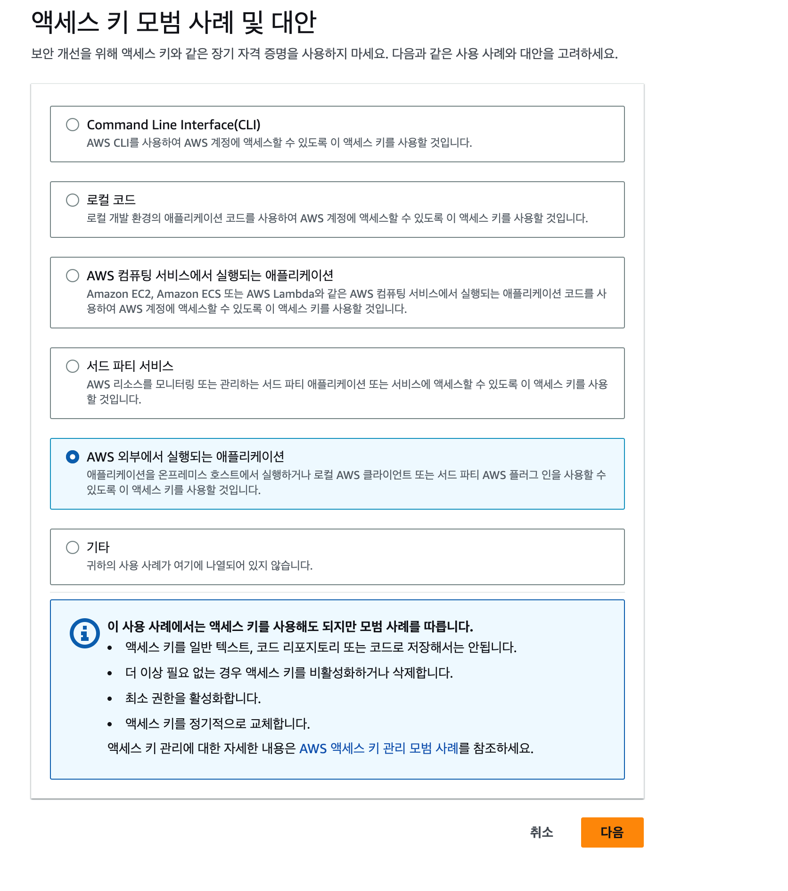

# 왜 테라폼인가?

## AWS 계정 설정

### IAM을 이용한 제한된 권한을 가진 사용자 만들기
AWS 콘솔에서 다음과 같이 IAM → 사용자 → 사용자 추가 버튼을 통해 계정을 생성합니다.


다음과 같이 사용자 이름만 추가합니다.


사용자에게 권한을 부여하려면 IAM 정책을 추가해주어야 합니다.

IAM 정책은 사용자가 무엇을 할 수 있는지 또는 할 수 없는지를 정의하는 JSON 문서입니다.

예제를 실행하려면 IAM 사용자에게 다음의 관리 정책들을 적용해야 합니다.
```
AmazonEC2FullAccess
AmazonS3FullAccess
AmazonDynamoDBFullAccess
AmazonRDSFullAccess
CloudWatchFullAccess
IAMFullAccess
```

해당 권한을 추가 완료했으면 사용자 생성을 통해 IAM 사용자를 추가합니다.

추가를 완료했으면 해당 사용자 클릭 → 보안 자격 증명 → 액세스키로 이동합니다.


다음과 같이 AWS 외부에서 실행되는 애플리케이션으로 액세스 키를 발급받습니다.


다음 버튼을 누르고 설명 태그를 지정한 후 다음을 누르면 액세스 키를 발급 받을 수 있습니다.


## 테라폼 설치

### MacOS에서 테라폼 설치

```yaml
brew install terraform
```

다음 명령을 입력했을때 도움말이 나오면 정상적으로 설치된 것 입니다.

```yaml
terraform
```

### AWS 서비스를 사용할 수 있도록 Key 등록

AWS API를 호출을 위해 액세스 키를 로컬에 등록해야 합니다.

`~/.zshrc` 경로에 다음 구문을 추가합니다.

```yaml
export AWS_ACCESS_KEY_ID=액세스키
export AWS_SECRET_ACCESS_KEY=비밀액세스키
```

그다음 다음 명령을 통해 적용합니다.

```yaml
source ~/.zshrc
```

### 인증 옵션

환경 변수 이외에도 ~/.aws/credentials 에서도 자격증명을 사용할 수 있습니다.

이 자격증명은 AWS CLI에서 configure 명령을 실행하면 자동 생성됩니다.
## 단일 서버 배포
### HCL

테라폼 코드는 확장자가 `.tf` 인 하시코프 구성 언어(HCL)로 작성됩니다.

하시코프 구성 언어는 선언적 언어이므로 원하는 인프라르 설명하기 위해 코드를 작성하고 테라폼이 인프라를 만드는 방법을 알아냅니다.

테라폼은 다양한 플랫폼에 걸쳐 인프라를 만들 수 있고 클라우드 공급자인 AWS, Azure, GCP 등에도 인프라를 만들 수 있습니다.

대부분의 텍스트 편집기에서 테라폼 코드를 작성할 수 있고 많은 편집기들이 자동완성기능을 제공합니다. 

### 테라폼 코드 작성하기

테라폼을 사용하는 첫 번째 단계는 공급자를 구성하는 것입니다.

```yaml
provider "aws" {
  region = "us-east-2"
}
```

위와 같이 지정하면 AWS 공급자를 사용하여 us-east-2 리전에 인프라를 배포하는 것을 의미합니다.

테라폼에서는 리소스를 생성할 때 다음과 같이 작성합니다.

```yaml
resource "<PROVIDER>_<TYPE>" "<NAME>" {
	[CONFIG...]
}
```

- PROVIDER : 공급자의 이름을 작성합니다 (ex : aws)
- TYPE : 공급자에서 생성할 수 있는 리소스 유형을 의미합니다. (ex : instance)
- NAME : 테라폼 코드에서 이 리소스를 참조하기 위한 식별자입니다. (ex : my_instance)
- CONFIG : 특정 리소스에 대한 하나 이상의 인수입니다.

다음은 리소스 생성 예시입니다.

```yaml
resource "aws_instance" "example" {
  ami = "ami-0c55b159cbfafe1f0"
  instance_type = "t2.micro"
}
```

위의 코드는 단일 가상 서버를 배포하는 테라폼 구문입니다.

aws_instance 리소스는 여러 가지 다른 인수를 제공하지만 지금은 2가지 필수 인수만 설정하면 됩니다.

- ami
    - EC2 인스턴스를 생성하는 아마존 머신 이미지입니다.
- instance_type
    - 실행할 EC2 인스턴스의 유형입니다.

### 테라폼 실행하기

이제 테라폼 코드를 작성한 폴더로 이동하여 terraform init 명령어를 실행합니다.

테라폼 바이너리에는 테라폼의 기본 기능이 포함되어 있지만 모든 공급자에 대한 코드가 포함되어 있지 않습니다.

그렇기 때문에 테라폼을 처음 사용할 때 terraform init 명령어를 실행하여 테라폼에 코드를 스캔하도록 지시하고 공급자를 확인하여 필요한 코드를 다운로드 해야합니다.

기본적으로 공급자 코드는 테라폼의 .terraform 폴더에 다운로드됩니다.

참고로 terraform init 명령은 멱등성을 제공합니다.

이제 공급자 코드를 다운로드 했으니 terraform plan 명령어를 실행합니다.

```yaml
terraform plan
```

plan 명령어를 사용하면 무언가를 실제로 변경하기 전에 테라폼이 수행할 작업을 확인할 수 있습니다.

이것은 실제 운영 환경에 적용하기 전에 코드가 문제 없는지 확인할 수 있는 좋은 방법입니다.

더하기(+)가 있는 항목은 추가되고, 빼기(-)가 있는 항목은 삭제되고, 물결표(~)가 있는 항목은 수정된다는 의미로 사용됩니다.

이제 실제로 인스턴스를 실행하기 위해 terraform apply 명령어를 실행합니다.

```yaml
terraform apply
```

인스턴스가 정상적으로 실행되는 것을 볼 수 있습니다.

인스턴스 이름을 추가하기 위해 테라폼 파일을 다음과 같이 수정해봅시다.

```yaml
provider "aws" {
  region = "us-west-1"
}

resource "aws_instance" "example" {
  ami = "ami-014d05e6b24240371" # ubuntu 22.04 LTS
  instance_type = "t2.micro"

  tags = {
	"Name" = "terraform-example"
  }
}
```

tags를 통해 리소스의 이름을 지정할 수 있게 되었습니다.

### 버전 관리시 주의사항

테라폼 코드가 동작하면 버전 관리 도구에 저장하는 것을 권장합니다.

모든 인프라 내용을 추적하거나 커밋 로그를 사용하여 디버깅할 수 있기 때문입니다.

버전 관리 시스템을 이용할 경우 다음 파일들이 올라가지 않도록 조심해야 합니다.

```yaml
.terraform
*.tfstate
*.tfstate.backup
```

## 트러블 슈팅

존재하는 VPC가 기본 VPC가 아닐경우 해당에러가 발생한다.

```yaml
│ Error: creating EC2 Instance: VPCIdNotSpecified: No default VPC for this user. GroupName is only supported for EC2-Classic and default VPC.
```

기본 VPC가 있는 리전으로 이동해서 해결했다.

따로 VPC를 지정해주는 방법도 있다.

## 단일 웹 서버 배포
### 간단 웹 서버 만들기

다음과 같이 Hello, World 페이지를 반환하는 간단한 페이지를 만드는 스크립트를 작성해봅시다.

```yaml
#!/bin/bash
echo "Hello, World" > index.html
nohup busybox httpd -f -p 8080 &
```

### 포트번호를 8080을 사용하는 이유

기본 HTTP 포트인 80이 아닌 8080을 사용하는 이유는 1024보다 숫자가 작은 포트를 사용하려면 루트 사용자 권한이 필요하기 때문입니다.

루트 계정으로 실행하게 되면 공격자가 루트 권한을 탈취하여 위험한 상황이 발생할 수 있습니다. 

그래서 루트 사용자가 아닌 권한이 제한된 사용자를 사용하기 위해 8080 포트로 사용하는 것입니다.

### 테라폼에 웹서버 스크립트 추가하기

 resource에서 user_data 인수를 설정하면 셸 스크립트를 사용자 데이터에 전달할 수 있습니다.

```yaml
provider "aws" {
  region = "us-west-1"
}

resource "aws_instance" "example" {
  ami = "ami-014d05e6b24240371" # ubuntu 22.04 LTS
  instance_type = "t2.micro"

	user_data = <<-EOF
				#!/bin/bash
				echo "Hello, World" > index.html
				nohup busybox httpd -f -p 8080 &
				EOF

  tags = {
	"Name" = "terraform-example"
  }
}
```

웹 서버를 구동하기 전에 한 가지 할 일이 남았습니다.

기본적으로 AWS EC2 인스턴스에 들어오거나 나가는 트래픽을 허용하지 않기 때문에 보안그룹을 생성해서 트래픽을 수신하도록 설정해주어야 합니다.

```yaml
resource "aws_security_group" "instance" {
	name = "terraform-example-instance"

	ingress {
		from_port = 8080
		to_port = 8080
		protocol = "tcp"
		cidr_blocks = ["0.0.0.0/0"]
	}
}
```

위의 코드는 누구든지 8080 포트에 TCP 요청을 할 경우 승인하도록 하는 보안그룹 설정입니다.

이제 보안 그룹을 만들고 난 후 EC2 인스턴스가 이를 사용할 수 있도록 해야합니다.

따라서 보안 그룹의 ID를 aws_instance 리소스의 vpc-security_group_ids 인수에 저장해야 합니다.

이를 위해 먼저 테라폼의 표현식을 학습해야 합니다.

### 테라폼의 표현식

값을 반환하는 것이라면 무엇이든지 테라폼의 표현식입니다.

ami 이미지의 문자열인 ami-014d05e6b24240371 도 테라폼의 표현식이라고 할 수 있습니다.

이 중 참조는 특히 유용한 표현 유형중 하나로 코드의 다른 부분에서 값에 액세스할 수 있게 해주는 표현식입니다.

보안 그룹의 ID에 액세스하려면 다음 구문을 사용하여 리소스 속성 값을 참조하면 됩니다.

```yaml
<PROVIDER>_<TYPE>.<NAME>.<ATTRIBUTE>
```

각각의 필드는 다음과 같은 의미를 가집니다.

- PROVIDER : 공급자의 이름 (aws)
- TYPE : 리소스 유형 (security_group)
- NAME : 보안 그룹의 이름(instance)
- ATTRIBUTE : 리소스의 인수 중 하나이거나 리소스가 내보낸 속성 중 하나

보안 그룹은 id라는 속성을 내보내므로 이를 참조하는 표현식은 다음과 같습니다.

```yaml
aws_security_group.instance.id
```

aws_instance의 vpc_security_group_ids 인수에서 이 보안 그룹 ID를 사용할 수 있습니다.

```yaml
provider "aws" {
  region = "us-west-1"
}

resource "aws_instance" "example" {
  ami = "ami-014d05e6b24240371" # ubuntu 22.04 LTS
  instance_type = "t2.micro"
  vpc_security_group_ids = [ "aws_security_group.instance.id" ]

	user_data = <<-EOF
				#!/bin/bash
				echo "Hello, World" > index.html
				nohup busybox httpd -f -p 8080 &
				EOF

  tags = {
	"Name" = "terraform-example"
  }
}

resource "aws_security_group" "instance" {
	name = "terraform-example-instance"

	ingress {
		from_port = 8080
		to_port = 8080
		protocol = "tcp"
		cidr_blocks = ["0.0.0.0/0"]
	}
}
```

하나의 리소스에서 다른 리소스로 참조를 추가하면 내재된 종속성이 작성됩니다.

테라폼은 이러한 종속성 구문을 분석하여 종속성 그래프를 작성하고 이를 사용하여 리소스를 생성하는 순서를 자동으로 결정합니다.

이러한 종속성 그래프를 표시하려면 graph 명령을 실행할 수 있습니다.

```yaml
terraform graph
```

결과 값은 DOT라는 그래프 설명 언어로 되어 있습니다.

출력된 언어를 그래프비즈 온라인에서 작성하면 [해당 이미지](https://dreampuf.github.io/GraphvizOnline/#digraph%20%7B%0A%20%20%20%20%20%20%20%20compound%20%3D%20%22true%22%0A%20%20%20%20%20%20%20%20newrank%20%3D%20%22true%22%0A%20%20%20%20%20%20%20%20subgraph%20%22root%22%20%7B%0A%20%20%20%20%20%20%20%20%20%20%20%20%20%20%20%20%22%5Broot%5D%20aws_instance.example%20(expand)%22%20%5Blabel%20%3D%20%22aws_instance.example%22%2C%20shape%20%3D%20%22box%22%5D%0A%20%20%20%20%20%20%20%20%20%20%20%20%20%20%20%20%22%5Broot%5D%20aws_security_group.instance%20(expand)%22%20%5Blabel%20%3D%20%22aws_security_group.instance%22%2C%20shape%20%3D%20%22box%22%5D%0A%20%20%20%20%20%20%20%20%20%20%20%20%20%20%20%20%22%5Broot%5D%20provider%5B%5C%22registry.terraform.io%2Fhashicorp%2Faws%5C%22%5D%22%20%5Blabel%20%3D%20%22provider%5B%5C%22registry.terraform.io%2Fhashicorp%2Faws%5C%22%5D%22%2C%20shape%20%3D%20%22diamond%22%5D%0A%20%20%20%20%20%20%20%20%20%20%20%20%20%20%20%20%22%5Broot%5D%20aws_instance.example%20(expand)%22%20-%3E%20%22%5Broot%5D%20provider%5B%5C%22registry.terraform.io%2Fhashicorp%2Faws%5C%22%5D%22%0A%20%20%20%20%20%20%20%20%20%20%20%20%20%20%20%20%22%5Broot%5D%20aws_security_group.instance%20(expand)%22%20-%3E%20%22%5Broot%5D%20provider%5B%5C%22registry.terraform.io%2Fhashicorp%2Faws%5C%22%5D%22%0A%20%20%20%20%20%20%20%20%20%20%20%20%20%20%20%20%22%5Broot%5D%20provider%5B%5C%22registry.terraform.io%2Fhashicorp%2Faws%5C%22%5D%20(close)%22%20-%3E%20%22%5Broot%5D%20aws_instance.example%20(expand)%22%0A%20%20%20%20%20%20%20%20%20%20%20%20%20%20%20%20%22%5Broot%5D%20provider%5B%5C%22registry.terraform.io%2Fhashicorp%2Faws%5C%22%5D%20(close)%22%20-%3E%20%22%5Broot%5D%20aws_security_group.instance%20(expand)%22%0A%20%20%20%20%20%20%20%20%20%20%20%20%20%20%20%20%22%5Broot%5D%20root%22%20-%3E%20%22%5Broot%5D%20provider%5B%5C%22registry.terraform.io%2Fhashicorp%2Faws%5C%22%5D%20(close)%22%0A%20%20%20%20%20%20%20%20%7D%0A%7D%0A)를 확인할 수 있습니다.

테라폼은 종속성 트리를 따라갈 때 가능한 한 많은 리소스를 병렬로 생성하므로 변경 사항을 매우 효율적으로 적용할 수 있습니다.

이렇게 원하는 것을 지정하면 가장 효율적인 방법을 결정해주는 것이 테라폼과 같은 선언적 언어의 장점입니다.

이제 테라폼을 실행시키면 새로운 인스턴스를 생성할 수 있습니다.

```yaml
terraform apply
```

### 에러
```
curl: (7) Failed to connect to x.x.x.x port 8080 after 148 ms: Couldn't connect to server
```

## 구성 가능한 웹 서버 배포
### DRY 원칙

DRY 원칙은 반복하지 말라는 프로그래밍 원칙중 하나입니다.

코드 내에서 모든 지식은 유일하고, 모호 하지 않으며, 믿을만한 형태로 존재해야 합니다.

하지만 지금 코드를 보면 보안 그룹과 사용자 데이터 구성에 8080 포트가 중복되어 나타납니다.

두 곳에 포트 번호가 있는 경우 한 곳에 포트 번호를 변경하면 다른 곳도 같이 변경해야 한다는게 아쉽습니다.

### 테라폼의 입력 변수 선언

테라폼은 입력 변수를 정의하게 하므로 코드가 중복되지 않고 구성을 관리하기도 쉽습니다.

변수를 선언하는 구문은 다음과 같습니다.

```yaml
variable "NAME" {
	[CONFIG...]
}
```

변수 선언의 본문에는 3개의 매개 변수가 포함될 수 있으며 모두 선택적 매개 변수입니다.

- description
    - 변수 사용방법을 문서화하려면 이 매개 변수를 사용합니다.
- default
    - 값을 의미하며 변수에 값을 전달할 때 아무런 값이 전달되지 않으면 기본 값이 전달되고 기본 값이 존재하지 않는 경우에는 대화식으로 사용자에게 변수에 대한 정보를 묻습니다.
- type
    - 타입 제약 조건으로 사용자가 전달하는 타입의 종류를 지정할 수 있습니다.
        - string(문자열), number(숫자), bool(불리언), list(리스트), map(맵), set(집합), object(객체), tuple(튜플) 등의 제약조건이 있습니다.
        - 유형을 지정하지 않으면 테라폼은 any로 간주합니다.

다음은 전달할 값이 number인지 확인하는 입력 변수의 예입니다.

```yaml
variable "number_example" {
  description = "An example of a number variable in Terraform"
  type = number
  default = 42
}
```

다음은 리스트인지 확인하는 변수의 예입니다.

```yaml
variable "list_example" {
	description = "An example of a list in Terraform"
  	type = list
  	default = ["a", "b", "c"]
}
```

제약조건도 결합해서 사용할 수 있습니다.

```yaml
variable "list_numeric_example" {
	description = "An example of a numeric list in Terraform"
  	type = list(number)
  	default = [1, 2, 3]
}
```

다음은 모든 값이 string인 map의 예시입니다.

```yaml
variable "map_example" {
	description = "An example of a map in Terraform"
  	type = map(string)
  	default = {
		key1 = "value1"
		key2 = "value2"
		key3 = "value3"
	}
}
```

object 또는 tuple 제약 조건을 사용하여 보다 복잡한 구조적 유형을 작성할 수도 있습니다.

```yaml
variable "object_example" {
	description = "An example of a structural type in Terraform"
  	type = obejct({
		name = string
		age = number
		tags = list(string)
		enable = bool
	})
	default = {
		name = "value1"
		age = 42
		tags = ["a", "b", "c"]
		enabled = true
	}
}
```

만약 타입에 맞지 않는 값을 설정하려는 경우 타입 오류를 반환합니다.

```yaml
variable "object_example" {
	description = "An example of a structural type in Terraform"
  	type = obejct({
		name = string
		age = number
		tags = list(string)
		enable = bool
	})
	default = {
		name = "value1"
		age = 42
		tags = ["a", "b", "c"]
		enabled = "true"
	}
}
```

### 웹 서버 포트 번호를 지정하는 변수 만들기

```yaml
variable "server_port" {
  description = "The port the server will use for HTTP requests"
  type = number
}
```

위의 상태에서 apply 명령을 실행하면 default 값을 지정하지 않아 대화형으로 변수 값을 물어보게 됩니다.

만약 대화형으로 처리하지 않으려면 CLI에서 -var 옵션으로 변수값을 제공할 수도 있습니다.

```yaml
terraform plan -var "server_port=8080"
```

TF_VAR_<name>과 같은 형태로 환경 변수를 통해 변수를 설정할 수도 있습니다.

```yaml
export TF_VAR_server_port=8080
terraform plan
```

물론 default 값을 지정하면 일일히 지정해줄 필요없이 편하게 사용할 수 있습니다.

```yaml
variable "server_port" {
  description = "The port the server will use for HTTP requests"
  type = number
  default = 8080
}
```

테라폼 코드에서 입력 변수의 값을 사용하려면 변수 참조라는 새로운 유형의 표현식을 사용할 수 있습니다.

```yaml
var.<VARIABLE_NAME>
```

예를 들어 다음과 같이 포트 값을 변경할 수 있습니다.

```yaml
resource "aws_security_group" "instance" {
	name = "terraform-example-instance"

	ingress {
		from_port = var.server_port
		to_port = var.server_port
		protocol = "tcp"
		cidr_blocks = ["0.0.0.0/0"]
	}
}
```

또한 사용자 스크립트에서 포트를 설정할 때도 해당 변수를 이용하면 좋습니다.

문자열 리터럴에서 참조를 사용하려면 보간(interpolation)이라는 새로운 유형의 표현식을 사용하면 좋습니다.

```yaml
provider "aws" {
  region = "us-west-1"
}

resource "aws_instance" "example" {
  ami = "ami-014d05e6b24240371" # ubuntu 22.04 LTS
  instance_type = "t2.micro"
  vpc_security_group_ids = [ aws_security_group.instance.id ]

	user_data = <<-EOF
				#!/bin/bash
				echo "Hello, World" > index.html
				nohup busybox httpd -f -p ${var.server_port} &
				EOF

  tags = {
	"Name" = "terraform-example"
  }
}

resource "aws_security_group" "instance" {
	name = "terraform-example-instance"

	ingress {
		from_port = var.server_port
		to_port = var.server_port
		protocol = "tcp"
		cidr_blocks = ["0.0.0.0/0"]
	}
}
```

### 출력 변수 정의

다음 구문에서처럼 테라폼에서는 입력 변수 뿐만 아니라 출력 변수도 정의할 수 있습니다.

```yaml
output "<NAME>" {
	value = <VALUE>
	[CONFIG ...]
}
```

- NAME : 출력 변수의 이름
- VALUE : 출력하려는 테라폼 표현식
- CONFIG : 2가지 선택적 매개변수를 추가로 포함하는 용도
    - description : 출력 변수에 어떤 유형의 데이터가 포함되어 있는지 알려줍니다.
    - sensitive : terraform apply 실행이 끝날 때 출력을 기록하지 않도록 테라폼에 지시하려면 sensitive 매개변수를 true로 설정합니다.

예를 들어 서버의 IP 주소를 찾기 위해 ec2 콘솔을 수동으로 조회하는 대신 IP 주소를 출력 변수로 제공할 수 있습니다.

```yaml
output "public_ip" {
  value = aws_instance.example.public_ip
  description = "The public IP address of the web server"
}
```

위의 코드는 속성 참조를 다시 사용하는데 이번에는 aws_instance 리소스의 public_ip를 참조합니다.

테라폼을 실행하면 콘솔에 출력 변수로 나오는 것을 볼 수 있습니다.

terraform output 명령어를 사용하면 변경사항을 적용하지 않고도 모든 결과값을 나열할 수도 있습니다.

다음과 같이 특정 OUTPUT_NAME이라는 특정 변수 값을 지정해서 확인할 수 있습니다.

```yaml
terraform output public_ip
```

## 웹 서버 클러스터 배포
### 분산 웹 서버 구성

현재까지 테라폼을 통해 단일 서버를 배포하는 데 성공했습니다.

하지만 실제 운영 환경에서는 서버가 하나뿐인 경우에는 이것이 단일 장애점이 될 수 있습니다.

하나뿐인 서버가 충돌하거나 트래픽 과부하가 발생하면 사용자는 사이트에 액세스할 수 없게 됩니다.

이를 해결하려면 단일 서버가 아니라 서버 클러스터를 구성해서 트래픽을 분산시키고, 트래픽의 양에 따라 클러스터의 크기를 늘리거나 줄여야 합니다.

여러 대의 서버를 수동으로 관리하려면 손이 많이 갑니다.

하지만 오토스케일링 그룹을 사용하면 EC2 인스턴스 클러스터 시작, 각 인스턴스 상태 모니터링, 실패한 인스턴스 교체, 로드에 따른 클러스터 사이즈 조정등 많은 작업을 자동으로 처리합니다.

### 오토 스케일링 그룹 만들기

ASG를 만드는 첫 단계는 ASG에서 각 EC2 인스턴스를 어떻게 구성할 것인지 설장하는 시작 구성을 만드는 것입니다.

aws_launch_configuration 리소스는 aws_instance 리소스와 거의 동일한 매개변수를 사용합니다.

```yaml
provider "aws" {
  region = "us-west-1"
}

resource "aws_launch_configuration" "example" {
  ami = "ami-014d05e6b24240371" # ubuntu 22.04 LTS
  instance_type = "t2.micro"
  vpc_security_group_ids = [ aws_security_group.instance.id ]

	user_data = <<-EOF
				#!/bin/bash
				echo "Hello, World" > index.html
				nohup busybox httpd -f -p ${var.server_port} &
				EOF

  tags = {
	"Name" = "terraform-example"
  }
}

resource "aws_security_group" "instance" {
	name = "terraform-example-instance"

	ingress {
		from_port = var.server_port
		to_port = var.server_port
		protocol = "tcp"
		cidr_blocks = ["0.0.0.0/0"]
	}
}

resource "aws_autoscaling_group" "example" {
	launch_configuration = aws_launch_configuration.example.name

	min_size = 2
	max_size = 10

	tag {
		key = "Name"
		value = "terraform-asg-example"
		propagate_at_launch = true
	}
}
```

이 오토스케일링 그룹은 EC2 인스턴스가 2 ~ 10개로 실행되며 terraform-asg-example 이라는 이름으로 태그가 지정됩니다.

ASG는 시작 구성 정보를 참고하여 인스턴스를 생성하는데 여기서 하나의 문제가 발생합니다.

시작 구성은 변경할 수 없으므로 시작 구성의 매개 변수를 변경하면 테라폼이 이를 대체하려고 합니다.

일반적으로 리소스를 교체할 때 테라폼은 이전 리소스를 먼저 삭제한 다음 대체 리소스를 생성합니다.

그러나 ASG에 이전 리소스에 대한 참조가 있기 때문에 테라폼이 해당 리소스를 삭제할 수 없습니다.

### 수명 주기 설정

이 문제를 해결하기 위해 수명 주기 설정을 사용할수 있습니다.

모든 테라폼 리소스는 리소스 생성 업데이트 및 삭제방법을 구성하는 몇 가지 수명 주기 설정을 지원합니다.

특히 create_before_destroy는 유용하게 사용할 수 있는 수명주기 설정입니다.

create_before_destroy를 true로 설정하면 테라폼은 리소스를 교체하고 있던 순서를 반대로하여 교체 리소스를 먼저 생성하고 기존 리소스를 삭제합니다.

다음과 같은 lifecycle 블록을 aws_launch_configuratio에 추가합시다.

```yaml
resource "aws_launch_configuration" "example" {
  ami = "ami-014d05e6b24240371" # ubuntu 22.04 LTS
  instance_type = "t2.micro"
  vpc_security_group_ids = [ aws_security_group.instance.id ]

	user_data = <<-EOF
				#!/bin/bash
				echo "Hello, World" > index.html
				nohup busybox httpd -f -p ${var.server_port} &
				EOF

	lifecycle {
	  create_before_destroy = true
	}
	
  tags = {
	"Name" = "terraform-example"
  }
}
```

### 서브넷 설정

ASG에 추가해야 작동하는 subnet_ids 매개 변수도 있습니다.

subnet_ids는 ASG가 EC2를 어느 서브넷에 배포할지 지정하는 매개변수입니다.

서브넷 목록을 하드 코딩할 수는 있지만 유지 관리가 어렵고 이식이 불가능하므로 데이터 소스를 이용하여 AWS 계정에서 서브넷 목록을 얻는 것이 좋습니다.

데이터 소스는 테라폼을 실행할 때마다 공급자에서 가져온 읽기 전용 정보를 나타냅니다.

데이터 소스를 사용하는 구문은 리소스 구문과 매우 유사합니다.

```yaml
data "<PROVIDER>_<TYPE>" "<NAME>" {
	[CONFIG...]
}
```

- PROVIDER : 공급자 이름
- TYPE : 데이터 소스 타입
- NAME : 데이터 소스를 참조하는데 사용하는 식별자
- CONFIG :해당 소스의 고유한 하나 이상의 인수

다음 코드는 데이터 소스를 사용하는 예시입니다.

```yaml
data "aws_vpc" "default" {
	default = true
}
```

데이터 소스에서 전달하는 인수는 일반적으로 원하는 정보를 데이터 소스에 표시하는 검색 필터입니다.

aws_vpc 데이터 소스에 필요한 유일한 필터는 default = true 이며, 테라폼이 AWS 계정에서 기본 VPC를 찾도록 지시하게 됩니다.

데이터 소스에서 데이터를 가져오려면 다음과 같이 속성 참조 구문을 사용하면 됩니다.

```yaml
data.<PROVIDER>_<TYPE>.<NAME>.<ATTRIBUTE>
```

예를 들어, aws_vpc 데이터 소스에서 VPC의 ID를 얻으려면 속성 참조 구문을 다음과 같이 사용합니다.

```yaml
data.aws_vpc.default.id
```

이 데이터를 다른 데이터 소스인 aws_subnet_ids와 결합하여 해당 VPC 내 서브넷을 조회할 수 있습니다.

```yaml
data "aws_subnet_ids" "default" {
	vpc_id = data.aws_vpc.default.id
}
```

마지막으로 vpc_zone_identifier 인수를 이용해 aws_subnet_ids 데이터 소스에서 서브넷 ID를 가져와서 ASG가 이 서브넷을 이용하도록 설정할 수 있습니다.

```yaml
resource "aws_autoscaling_group" "example" {
	launch_configuration = aws_launch_configuration.example.name
	vpc_zone_identifier = data.aws_subnet_ids.default

	min_size = 2
	max_size = 10

	tag {
		key = "Name"
		value = "terraform-asg-example"
		propagate_at_launch = true
	}
}
```
## 로드 밸런서 배포
### 하나의 IP로 제공하기

이제 ASG를 배포할 수 있지만 해결해야할 문제가 있습니다.

각각 고유한 IP 주소를 가진 서버가 여러개 있지만 사용자에게는 일반적으로 하나의 IP 주소를 제공해야 하기 때문입니다.

이 문제를 해결하는 한 가지 방법은 로드 밸런서를 배포하여 서버 전체에 트래픽을 분산시키고 모든 사용자에게 로드 밸런서 IP를 제공하는 것입니다.

가용성과 확장성이 뛰어난 로드 밸런서를 생성하는데 많은 작업이 필요합니다.

AWS의 ELB를 이용하면 AWS가 이를 처리하도록 할 수 있습니다.

### ELB의 3가지 유형

- 애플리케이션 로드 밸런서
    - HTTP 및 HTTPS 트래픽 처리에 적합한 로드 밸런서입니다.
    - OSI 7 계층에서 동작합니다.
- 네트워크 로드 밸런서
    - TCP, UDP 및 TLS 트래픽 처리에 적합한 로드 밸런서입니다.
    - ALB 보다 빠르게 로드에 응답하여 확장 및 축소할 수 있습니다.
    - OSI 모델의 4 계층에서 동작합니다.
- 클래식 로드 밸런서
    - 예전에 사용하던 로드밸런서로 HTTP, HTTPS, TCP 및 TLS 트래픽을 처리할 수 있지만 ALB 또는 NLB 보다 기능은 훨씬 적습니다.
    - OSI 모델의 응용 계층 및 전송 계층 모두에서 작동합니다.

현재 대부분의 응용 프로그램은 ALB 또는 NLB를 사용하며 간단한 웹서버 예제는 성능 요구사항이 까다롭지 않으므로 ALB가 가장 적합합니다.

### ALB의 구성 요소

- 리스너
    - 80 포트와 같은 특정 포트와 HTTP 같은 프로토콜을 수신합니다.
- 리스너 규칙
    - 리스너에 들어오는 요청을 가져와 /foo 및 /bar 같은 특정 경로나 [foo.example.com](http://foo.example.com) 및 [bar.example.com](http://bar.example.com) 같은 호스트 이름과 일치하는 요청을 특정 대상 그룹으로 보냅니다.
- 대상 그룹
    - 로드 밸런서에서 요청을 받는 하나 이상의 서버입니다.
    - 대상 그룹은 서버의 상태를 확인하고 요청을 정상 노드로 보냅니다.

### ALB 생성하기

ALB를 생성하는 첫번째 단계는 aws_lb 리소스를 사용하여 ALB 자체를 작성하는 것입니다.

```yaml
resource "aws_lb" "example" {
  name = "terraform-asg-example"
  load_balancer_type = application
  subnets = data.aws_subnet_ids.default.ids
}
```

subnets 매개 변수는 aws_subnet_ids 매개변수를 사용하여 기본 VPC의 모든 서브넷을 사용하도록 구성합니다.

두번째로 aws_lb_listener 리소스를 사용하여 ALB의 리스너를 정의합니다.

```yaml
resource "aws_lb_listener" "http" {
  load_balancer_arn = aws_lb.example.arn
  port = 80
  protocol = "HTTP"

  default_action {
	type = "fixed-response"
	fixed_response {
	  content_type = "text/plain"
	  message_body = "404: page not found"
	  status_code = 404
	}
  }
}
```

이 리스너는 기본 HTTP 포트인 80번 포트를 수신하고 HTTP를 프로토콜로 사용하고 리스너 규칙과 일치하지 않는 요청에 대해 기본 응답으로 404 페이지를 보내도록 ALB를 구성합니다.

기본적으로 ALB를 포함한 모든 AWS 리소스는 들어오는 트래픽 또는 나가는 트래픽을 허용하지 않으므로 보안그룹을 생성해 주어야 합니다.

```yaml
resource "aws_security_group" "alb" {
  name = "terraform-example-alb"

  ingress {
	from_port = 80
	to_port = 80
	protocol = "tcp"
	cidr_blocks = ["0.0.0.0/0"]
  }

  # 모든 아웃 바운드 트래픽 허용
  egress {
	from_port = 0
	to_port = 0
	protocol = "-1"
	cidr_blocks = ["0.0.0.0/0"]
  }
}
```

보안 그룹을 사용하기 위해 aws_lb 리소스에 해당 보안그룹을 지정합니다.

```yaml
resource "aws_lb" "example" {
  name = "terraform-asg-example"
  load_balancer_type = application
  subnets = data.aws_subnet_ids.default.ids
  security_groups = [aws_security_group.alb.id]
}
```

다음으로 aws_lb_target_group 리소스를 사용하여 ASG의 대상 그룹을 생성해야 합니다.

```yaml
resource "aws_lb_target_group" "asg" {
  name = "terraform-asg-example"
  port = var.server_port
  protocol = "HTTP"
  vpc_id = data.aws_vpc.default.id

  health_check {
	path = "/"
	protocol = "HTTP"
	matcher = "200"
	interval = 15
	timeout = 3
	healthy_threshold = 2
	unhealthy_threshold = 2
  }
}
```

이 대상 그룹은 각 인스턴스에 주기적으로 HTTP 요청을 전송하여 인스턴스 상태를 점검하고 구성된 matcher와 일치하는 응답을 반환하는 경우에만 인스턴스를 정상으로 간주합니다.

aws_lb_target_attacement 리소스를 사용하면 EC2 인스턴스의 정적 목록을 대상 그룹에 연결할 수 있습니다.

그러나 ASG를 사용하면 언제든지 인스턴스를 시작하거나 종료할 수 있으므로 정적 목록이 작동하지 않습니다.

대신 ASG와 ALB를 통합하는 이점을 활용할 수 있습니다.

aws_autoscailing_group 리소스로 돌아가서 target_group_arns 인수를 설정하여 새 대상 그룹을 지정합니다.

```yaml
resource "aws_autoscaling_group" "example" {
	launch_configuration = aws_launch_configuration.example.name
	vpc_zone_identifier = data.aws_subnet_ids.default

	target_group_arns = [aws_lb_target_group.asg.arn]
	health_check_type = "ELB"

	min_size = 2
	max_size = 10

	tag {
		key = "Name"
		value = "terraform-asg-example"
		propagate_at_launch = true
	}
}
```

health_check_type도 `ELB`로 설정합니다.

기본 health_check_type은 EC2인데, 이는 AWS 하이퍼바이저 VM이 완전히 다운되었거나 도달할 수 없다고 판단하는 경우에만 인스턴스가 비정상 상태라고 간주하는 최소한의 상태 확인입니다.

```yaml
resource "aws_lb_listener_rule" "asg" {
  listener_arn = aws_lb_listener.http.arn
  priority = 100

  condition {
	path_pattern {
	  values = ["*"]
	}
  }

  action {
	type = "forward"
	target_group_arn = aws_lb_target_group.asg.arn
  }
}
```

앞의 코드는 모든 경로와 일치하는 요청을 ASG가 포함된 대상 그룹으로 보내는 리스너 규칙을 추가합니다.

이전의 단일 EC2 인스턴스의 기존 public_ip 출력을 ALB의 DNS 이름을 표시하는 출력으로 바꿉니다.

```yaml
output "alb_dns_name" {
  value = aws_lb.example.dns_name
  description = "The domain name of the load balancer"
}
```

이제 terraform apply 를 사용하면 제대로 생성된 것을 확인할 수 있습니다.
### 트러블 슈팅

│ Error: Reference to undeclared resource
│
│   on [main.tf](http://main.tf/) line 34, in resource "aws_autoscaling_group" "example":
│   34:         vpc_zone_identifier = data.aws_subnet_ids.default.ids
│
│ A data resource "aws_subnet_ids" "default" has not been declared in the root module.

위의 에러가 발생했는데 코드가 아무리 봐도 똑같았다

main.tf에 포함하니까 해결되었다.

│ Error: waiting for Auto Scaling Group (terraform-20230416180605541500000002) capacity satisfied: 2 errors occurred:
│       * Scaling activity (bd061e2c-fb8e-c0bd-0980-338b6aa2344f): Failed: Access denied when attempting to assume role arn:aws:iam::162304046157:role/aws-service-role/autoscaling.amazonaws.com/AWSServiceRoleForAutoScaling. Validating load balancer configuration failed.
│       * Scaling activity (c8761e2c-fb8d-41ec-add6-bb375b6158ec): Failed: Access denied when attempting to assume role arn:aws:iam::162304046157:role/aws-service-role/autoscaling.amazonaws.com/AWSServiceRoleForAutoScaling. Validating load balancer configuration failed.

AWS IAM에서 AutoScalingFullAccess 권한을 추가하여 해결하였다.
## 정리

생성한 테라폼 리소스들은 다음 명령을 통해 삭제하는 것이 좋습니다.

```yaml
terraform destroy
```

destroy 명령어는 실행 취소를 할 수 없기 때문에 실제 운영 환경에서 사용해야 하는 경우 조심해야 합니다.
