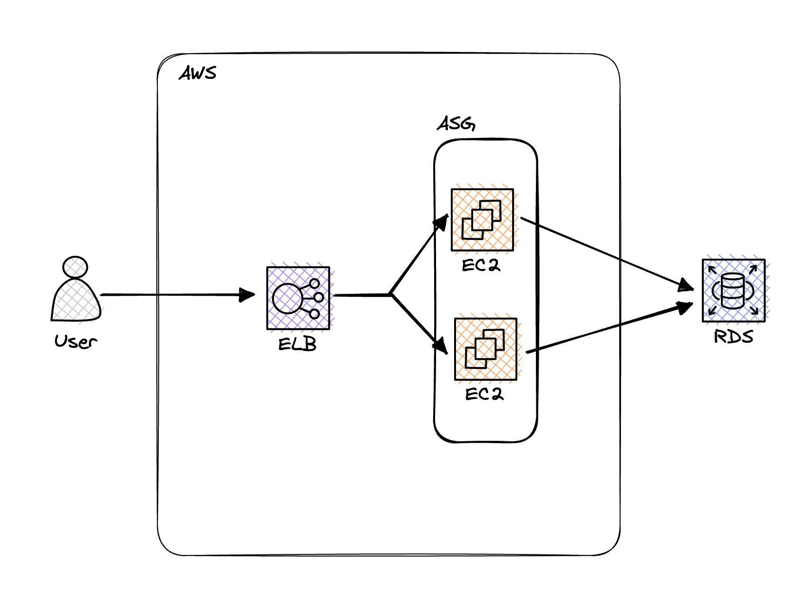
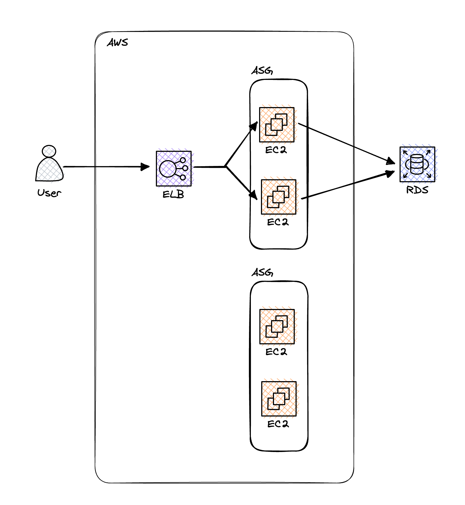
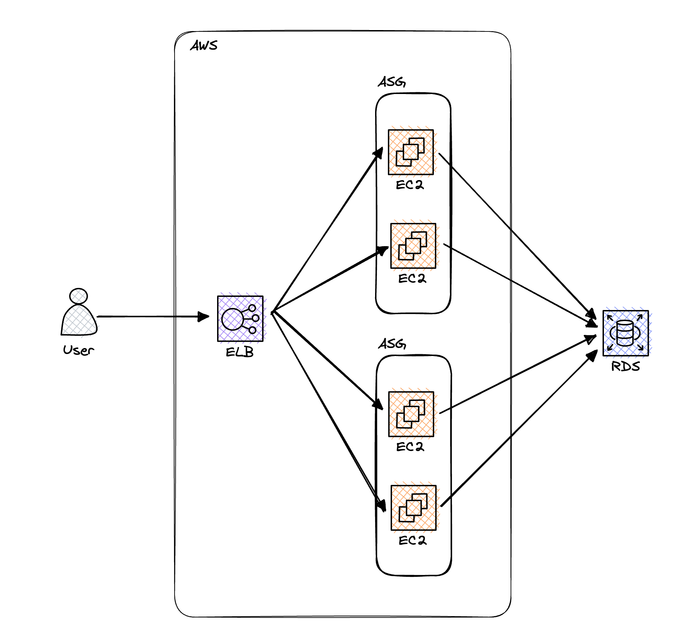
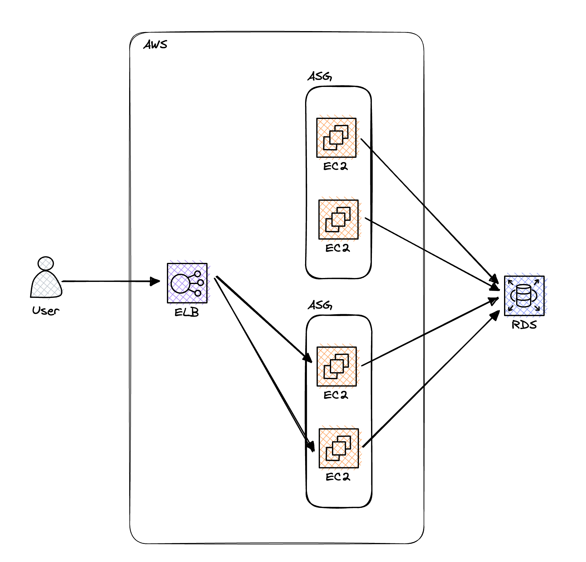
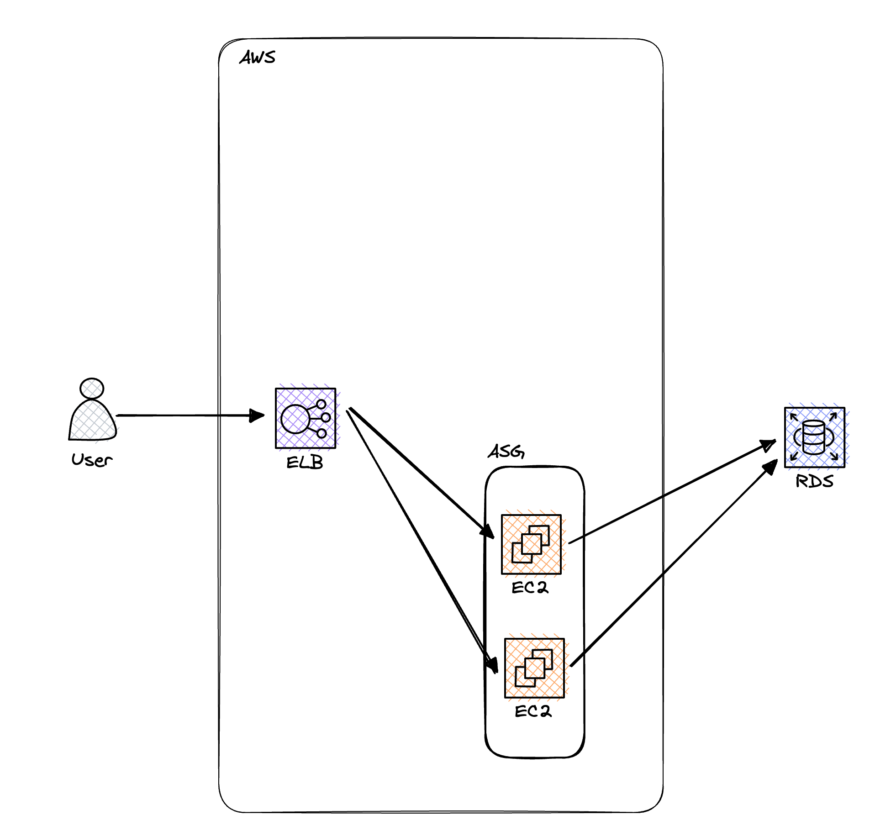

# 테라폼의 팁과 요령

## 반복문

### 반복문 종류

테라폼은 각각 조금씩 다른 상황에 사용하도록 고안된 몇 가지 반복문 구성을 제공합니다.

- count 매개 변수 : 리소스 반복
- for_each 표현식 : 리소스 내에서 리소스 및 인라인 블록을 반복
- for 표현식 : 리스트와 맵을 반복
- for 문자열 지시어 : 문자열 내에서 리스트와 맵을 반복

### count 매개변수를 이용한 반복

다음과 같은 IAM 사용자를 테라폼에 선언했다고 가정해봅시다.

``` 
provider "aws" {
  region = "us-west-1"
}

resource "aws_iam_user" "example" {
  name = "neo"
}
```

만약 같은 사용자 3명을 만들고 싶다면 일반적인 프로그래밍 언어에서는 다음과 같이 작성할 것입니다.

``` 
for (int i = 0, i < 3; i++) {
	resource "aws_iam_user" "example" {
	  name = "neo"
	}
}
```

하지만 테라폼에는 for 반복문 또는 언어에 내장된 기존의 절차 논리가 없기 때문에 이러한 방식은 동작하지 않습니다.

이런 상황을 해결하기 위해 테라폼 리소스에는 count라는 메타 매개변수가 있습니다.

count는 테라폼의 반복 구조로써, count에 생성하고자 하는 리소스의 사본 수만 정의하면 됩니다.

다음은 count 사용 예시입니다.

``` 
resource "aws_iam_user" "example" {
	count = 3
  	name = "neo"
}
```

하지만 지금 코드는 사용자 이름이 유일하지 않아 에러가 발생합니다.

이를 해결하기 위해서는 다음과 같이 count의 현재 인덱스를 지정할 수 있습니다.

``` 
resource "aws_iam_user" "example" {
	count = 3
  	name = "neo.${count.index}"
}
```

terraform plan을 실행시켜보면 3명의 사용자를 생성하려는 것을 알 수 있습니다.

``` 
# aws_iam_user.example[0] will be created
  + resource "aws_iam_user" "example" {
      + arn           = (known after apply)
      + force_destroy = false
      + id            = (known after apply)
      + name          = "neo.0"
      + path          = "/"
      + tags_all      = (known after apply)
      + unique_id     = (known after apply)
    }

  # aws_iam_user.example[1] will be created
  + resource "aws_iam_user" "example" {
      + arn           = (known after apply)
      + force_destroy = false
      + id            = (known after apply)
      + name          = "neo.1"
      + path          = "/"
      + tags_all      = (known after apply)
      + unique_id     = (known after apply)
    }

  # aws_iam_user.example[2] will be created
  + resource "aws_iam_user" "example" {
      + arn           = (known after apply)
      + force_destroy = false
      + id            = (known after apply)
      + name          = "neo.2"
      + path          = "/"
      + tags_all      = (known after apply)
      + unique_id     = (known after apply)
    }
```

### 입력변수와 count 인덱스를 활용하기

위와 같이 단순히 인덱스를 사용하는 방식은 특별한 의미를 부여하기는 힘듭니다.

다음과 같이 입력 변수에 IAM 사용자 이름을 정의하고 인덱스를 활용하면 의미있는 사용자 이름을 지정할 수 있습니다.

``` 
variable "user_names" {
  description = "Create IAM users with these names"
  type = list(string)
  default = [ "neo", "trinity", "morpheus" ]
} 
```

입력변수의 값을 순회하면서 사용자 이름을 정의하기 위해 count와 length 함수를 함께 이용해봅시다.

먼저, 테라폼의 배열 조회 구문과 length 함수에 대해 알아봅시다.

- 배열 조회(array lookup) 구문
    - 테라폼에서 배열의 배열 요소를 찾는 구문은 다른 대부분 프로그래밍 언어에서 사용하는 언어와 유사합니다.
    - ARRAY[<INDEX>]
        - 예 ) var.user_names[1]
- length 함수
    - 주어진 ARRAY의 항목 수를 반환하는 함수입니다.
        - 문자열 및 맵을 대상으로도 동작합니다.
    - length(<ARRAY>)
        - 예) length(var.user_names)

다음과 같이 배열 조회 구문과 length 함수, 입력 변수를 활용하여 각기 다른 IAM 사용자 이름을 지정할 수 있습니다.

``` 
resource "aws_iam_user" "example" {
	count = length(var.user_names)
	name = var.user_names[count.index]
}
```

### 리소스에 count를 사용한 후의 상태

리소스에 count를 사용한 후에는 하나의 리소스가 아니라 리소스의 배열이 됩니다.

aws_iam_user.example은 이제 배열이 되었으므로 다음과 같은 형식으로 접근해야 합니다.

``` 
<PROVIDER>_<TYPE>.<NAME>[INDEX].ATTRIBUTE
```

예를 들어 IAM 사용자 중 하나의 ARN을 출력 변수로 제공하려면 다음과 같이 작성해야 합니다.

``` 
output "neo_arns" {
  value = aws_iam_user.example[0].arn
  description = "The ARN for user Neo"
}
```

만약 전체 정보를 얻고 싶다면 `*` 을 사용할 수 있습니다.

``` 
output "all_arns" {
  value = aws_iam_user.example[*].arn
  description = "The ARN for all users"
}
```

### count의 문제점

`1. count를 사용하여 전체 리소스를 반복할 수는 있지만 리소스 내에서 인라인 블록을 반복할 수는 없습니다.`

인라인 블록은 다음 형식의 리소스 내에서 설정한 인수를 의미합니다.

``` 
resource "xxx" "yyy" {
	<NAME> {
		[CONFIG...]
	}
}
```

- `NAME`  : tag와 같은 인라인 블록의 이름을 의미합니다.
- `CONFIG`  : key또는 value 같이 해당 인라인 블록에 특정한 하나 이상의 인수로 구성됩니다.

`2. 변경시 인덱스를 기준으로 처리하기 때문에 원치않는 리소스가 삭제될 수 있습니다.`

다음과 같은 사용자 목록이 있다고 가정해봅시다.

``` 
variable "user_names" {
  description = "Create IAM users with these names"
  type = list(string)
  default = [ "neo", "trinity", "morpheus" ]
}
```

IAM 사용자를 만든 상태에서 중간의 trinity라는 사용자를 제거한다고 가정해봅시다.

``` 
variable "user_names" {
  description = "Create IAM users with these names"
  type = list(string)
  default = [ "neo", "trinity", "morpheus" ]
}
```

기대하는 동작은 neo와 morpheus 라는 사용자만 남게 되는 것일 겁니다.

하지만 실제 동작은 trinity 사용자의 이름이 morpheus로 변경되고 morpheus 사용자가 삭제되게 됩니다.

이러한 증상이 발생하는 이유는 다음과 같이 인덱스로 처리되어 1번 인덱스는 이름이 수정되었다고 판단하고 2번 인덱스는 존재하지 않게되니 삭제된다고 판단하게 됩니다.

``` 
// 기존
0 -> neo
1 -> trinity
2 -> morpheus
// 변경후
0 -> neo
1 -> morpheus
2 -> X(삭제)
```

### for_each 표현식을 사용한 반복문 처리

count가 가진 한계를 해결하기 위해 for_each 표현식이 등장했습니다.

for_each 표현식을 사용하면 리스트, 집합, 맵을 사용하여 전체 리소스의 여러 복사본 또는 리소스 내 인라인 블록의 여러 복사본을 생성할 수 있습니다.

먼저 for_each를 사용하여 리소스의 여러 복사본을 만드는 구문은 다음과 같습니다.

``` 
resource "<PROVIDER>_<TYPE>" "<NAME>" {
	for_each = <COLLECTION>

	[CONFIG...]
}
```

- `PROVIDER` :  aws 같은 공급자 이름
- `TYPE` :  instance와 같이 해당 공급자에서 생성할 리소스 유형
- `NAME` : my_instance와 같이 테라폼 코드 전체에서 리소스를 참조하기 위한 식별자
- `COLLECTION` : 루프를 처리할 집합 또는 맵(리소스에 for_each를 사용할 때 리스트는 지원되지 않습니다.)
- `CONFIG` : 해당 리소스와 관련된 하나 이상의 인수 (each.key, each.value를 사용하여 키와 값에 접근 가능)

다음은 for_each를 사용하여 3명의 사용자를 생성하는 방법입니다. 

``` 
resource "aws_iam_user" "example" {
  for_each = toset(var.user_names)
  name = each.value
}
```

위의 예제를 보면 for_each에서는 리스트를 사용할 수 없기 때문에 set을 사용하고 있습니다.

for_each가 집합을 반복하면 each.value로 값을 접근할 수 있게 됩니다.

### for_each 사용 이후

for_each를 사용한 후에는 하나의 리소스나 리소스 배열이 되는 것이 아닌 `리소스 맵`이 됩니다.

이를 확인하기 위해 출력 변수를 추가해봅시다.

``` 
output "all_users" {
	value = aws_iam_user.example
}
```

terraform apply를 실행하면 다음과 같이 출력됩니다.

``` 
all_users = {
  "morpheus" = {
    "arn" = "arn:aws:iam::162304046157:user/morpheus"
    "force_destroy" = false
    "id" = "morpheus"
    "name" = "morpheus"
    "path" = "/"
    "permissions_boundary" = tostring(null)
    "tags" = tomap(null) /* of string */
    "tags_all" = tomap({})
    "unique_id" = "AIDASLSQTGRGZYWNVWBPX"
  }
  "neo" = {
    "arn" = "arn:aws:iam::162304046157:user/neo"
    "force_destroy" = false
    "id" = "neo"
    "name" = "neo"
    "path" = "/"
    "permissions_boundary" = tostring(null)
    "tags" = tomap(null) /* of string */
    "tags_all" = tomap({})
    "unique_id" = "AIDASLSQTGRG56GDCFVK3"
  }
  "trinity" = {
    "arn" = "arn:aws:iam::162304046157:user/trinity"
    "force_destroy" = false
    "id" = "trinity"
    "name" = "trinity"
    "path" = "/"
    "permissions_boundary" = tostring(null)
    "tags" = tomap(null) /* of string */
    "tags_all" = tomap({})
    "unique_id" = "AIDASLSQTGRGU2HQUBENV"
  }
}
```

위와 같이 리소스의 데이터를 전체 출력하게 됩니다.

arn 정보만 출력하고 싶은 경우 다음과 같이 내장 함수 values를 이용해 추출할 수 있습니다.

``` 
output "all_arns" {
	value = values(aws_iam_user.example)[*].arn
}
```

### 리소스를 배열로 처리하는 것보다 맵으로 처리하는 장점

for_each를 사용해 리소스를 맵으로 처리하면 컬렉션 중간의 항목도 안전하게 제거할 수 있어 좋습니다.

인덱스 기준이 아닌 key 값을 기준으로 리소스를 제거하기 때문에 count때 발생했던 문제가 발생하지 않습니다.

따라서, 리소스의 여러 복사본을 만들때는 count 대신 for_each를 사용하는 것이 바람직합니다.

### for_each를 사용하여 여러 개의 인라인 블록 만들기

for_each의 또 다른 장점은 리소스 내에서 여러 개의 인라인 블록을 만들 수 있다는 것입니다.

예를 들어, for_each를 사용하면 모듈의 인라인 블록을 동적으로 생성할 수 있습니다.

먼저 사용자가 사용자 정의 태그를 지정할 수 있게 다음 변수를 추가합시다.

``` 
variable "custom_tags" {
  description = "Custom tag in ASG"
	type = map(string)
	default = {}
}
```

다음으로 프로덕션 환경의 [main.tf](http://main.tf) 파일에 사용자 태그를 설정합니다.

``` 
module "webserver_cluster" {
  source = "../../modules/service/webserver-cluster"

  cluster_name = "webservers-prod"
  db_remote_state_bucket = "terraform-up-and-learning-yckim"
  db_remote_state_key = "prod/data-stores/mysql/terraform.tfstate"

  instance_type = "m4.large"
  min_size = 2
  max_size = 10

  custom_tags = {
	Owner = "team-foo"
	DeployedBy = "terraform"
  }
}
```

위의 코드에는 몇 가지 유용한 태그가 설정되어 있습니다.

- `Owner 태그` : ASG를 소유한 팀을 명시
- `DeployedBy 태그` : 이 인프라가 테라폼을 사용하여 배포되었음을 명시

```
💡 태그를 사용할 때는 일반적으로 팀에 태그 지정 표준을 제시하고 이 표준을 코드로 적용하게 하는 테라폼 모듈을 만드는 것이 바람직합니다.

```

이제 기존의 aws_autoscaling_group 리소스에 태그를 지정해봅시다.

for_each를 사용해 인라인 블록을 동적으로 생성하는 구문은 다음과 같습니다.

```
dynamic "<VAR_NAME>" {
	for_each = <COLLECTION>

	content {
		[CONFIG...]
	}
}
```

- `VAR_NAME` : 반복한 값을 저장할 변수에 사용할 이름입니다.
- `COLLECTION` : 반복되는 리스트 또는 맵입니다.
- `content` : 각 반복에서 생성되는 항목입니다.
    - content 블록내에서 <VAR_NAME>.key 및 <VAR_NAME>.value를 사용해 COLLECTION에 있는 현재 항목의 키와 값에 각각 액세스할 수 있습니다.

<aside>
💡 for_each를 리스트와 함께 사용하는 경우 key는 인덱스가 되고 value는 해당 인덱스 목록에 있는 항목이 됩니다.

</aside>

다음은 for_each를 사용하여 tag 블록을 동적으로 생성하는 예시입니다.

```
resource "aws_autoscaling_group" "example" {
	launch_configuration = aws_launch_configuration.example.name
	vpc_zone_identifier = data.aws_subnet_ids.default.ids
	target_group_arns = [aws_lb_taget_group.asg.arn]
	health_check_type = "ELB"

	min_size = var.min_size
	max_size = var.max_size

	tag {
		key = "Name"
		value = var.cluster_name
		propagate_at_launch = true
	}

	dynamic "tag" {
	  for_each = var.custom_tags

	  content {
		key = tag.key
		value = tag.value
		propagate_at_launch = true
	  }
	}
}
```

terraform plan을 실행시켜보면 custom_tag로 지정한 값이 정상적으로 들어간 것을 볼 수 있습니다.

### for 표현식을 이용한 반복문

단일 값 생성을 하기 위해 반복이 필요한 경우 for 표현식을 사용할 수 있습니다.

먼저 다음과 같은 테라폼 코드가 존재한다고 가정해봅시다.

``` 
variable "names" {
  description = "A list of names"
  type = list(string)
  default = [ "neo", "trinity", "morpheus" ]
}
```

만약 모든 이름의 대문자로 바꾸고 싶은 상황일 경우 어떻게 해야할까요?

테라폼에서는 for 표현식을 통해 해결할 수 있습니다.

for 표현식은 다음과 같은 형태입니다.

``` 
[for <ITEM> in <LIST> : <OUTPUT>]
```

- `LIST` : 반복할 리스트
- `ITEM` : LIST의 각 항목에 할당할 로컬 변수 이름
- `OUTPUT` : ITEM을 어떤식으로든 변환하는 표현식

예를 들어 var.names의 이름 목록을 대문자로 변환하는 테라폼 코드는 다음과 같습니다.

``` 
variable "names" {
  description = "A list of names"
  type = list(string)
  default = [ "neo", "trinity", "morpheus" ]
}

output "upper_names" {
	value = [for name in var.names : upper(name)]
}
```

다음과 같이 결과를 필터링할 수도 있습니다.

``` 
output "short_upper_names" {
	value = [for name in var.names : upper(name) if length(name) < 5]
}
```

위의 코드를 실행시키면 다음과 같은 값이 반환됩니다.

``` 
short_upper_names = [
"NEO",
]
```

### for로 맵을 반복하기

다음과 같이 맵을 반복할수도 있습니다.

``` 
[for <KEY>, <VALUE> in <MAP> : <OUTPUT>]
```

- `MAP` : 반복 대상이 되는 맵
- `KEY` : 맵의 키
- `VALUE` : 맵의 값
- `OUTPUT` : KEY와 VALUE를 변환하는 표현식

예를 들면 다음과 같습니다.

``` 
variable "hero_thousand_faces" {
  description = "map"
  type = map(string)
  default = {
	neo = "hero"
	trinity = "love interest"
	morpheus = "mentor"
  }
}

output "bios" {
	value = [for name, role in var.var.hero_thousand_faces : "${name} is the ${role}"]
}
```

위의 코드를 실행시키면 다음과 같은 결과가 나타납니다.

``` 
bios = [
	"morpheus is the mentor",
	"neo is the hero",
	"trinity is the love interest",
]
```

### for 표현식을 사용하여 리스트와 맵을 변환하기

for 표현식을 리스트가 아닌 맵을 출력하는 데 사용할 수도 있습니다.

``` 
# 리스트를 반복하고 맵을 출력
[for <ITEM> in <LIST> : <OUTPUT_KEY> => <OUTPUT_VALUE>]

# 맵을 반복하고 리스트를 출력
{for <KEY>, <VALUE> in <MAP> : <OUTPUT_KEY> => <OUTPUT_VALUE>}
```

다음은 맵을 변환하여 모든 키와 값을 대문자로 만드는 예시입니다.

``` 
variable "hero_thousand_faces" {
  description = "map"
  type = map(string)
  default = {
	neo = "hero"
	trinity = "love interest"
	morpheus = "mentor"
  }
}

output "upper_roles" {
	value = {for name, role in var.var.hero_thousand_faces : upper(name) => upper(role)}
}
```

위의 코드를 실행한 결과는 다음과 같습니다.

``` 
upper_roles = {
	"MORPHEUS" = "MENTOR"
	"NEO" = "HERO"
	"TRINITY" = "LOVE INTEREST"
}
```

### 문자열 지시자를 사용하는 반복문

다음과 같이 문자열 보간(`${}`) 사용하면 문자열 내에서 테라폼 코드를 참조할 수 있습니다.

``` 
"Hello, ${var.name}"
```

문자열 지시자를 사용하면 문자열 보간과 유사한 구문으로 문자열 내에서 반복문이나 제어문을 사용할 수 있습니다.

다음은 문자열 지시자의 형식입니다.

``` 
%{for <ITEM> in <COLLECTION> }<BODY>%{ endfor }
```

- `COLLECTION` : 반복할 리스트 또는 맵
- `ITEM` : COLLECTION의 각 항목에 할당할 로컬 변수의 이름
- `BODY` : ITEM을 참조할 수 있는 각각의 반복을 렌더링하는 대상

다음은 사용 예시입니다.

``` 
variable "names" {
  description = "A list of names"
  type = list(string)
  default = [ "neo", "trinity", "morpheus" ]
}

output "for_directive" {
  value = <<EOF
  %{ for name in var.names }
	${name}
  %{ endfor }
  EOF
}
```

위의 코드를 실행시키면 다음과 같은 결과를 볼 수 있습니다.

``` 
for_directive =
	neo
	
	trinity

	morpheus
```

결과를 확인해보면 줄바꿈이 되는 것을 볼 수 있는데 이를 없애고 싶다면 다음과 같이 물결표를 사용할 수 있습니다.

``` 
output "for_directive" {
  value = <<EOF
  %{~ for name in var.names }
	${name}
  %{~ endfor }
  EOF
}
```

물결표를 추가하면 다음과 같이 출력됩니다.

``` 
for_directive_strip_maker = 
neo
trinity
morpheus
```

## 조건문
### 테라폼의 조건문

테라폼은 다음과 같은 조건문을 제공합니다.

- count 매개변수
    - 조건부 리소스에서 사용
- for_each와 for 표현식
    - 리소스 내의 조건부 리소스 및 인라인 블록에서 사용
- If 문자열 지시자
    - 문자열 내의 조건문에 사용

### count 매개변수를 사용한 조건문

count 매개변수를 사용하면 반복문을 사용할 수 있었습니다.

이를 조금 응용하면 동일한 매커니즘으로 조건문을 사용할 수 있습니다.

### count 매개변수를 사용한 if문

모듈을 사용할때 특정 상황에서만 생성하고 싶을 수 있습니다.

이러한 방법을 분기처리라고 합니다.

분기처리를 사용하기 위해서 다음과 같은 불리언 입력 변수를 만들어봅시다.

```kotlin
variable "enable_autoscaling" {
  description = "If set to true, enable auto scaling"
  type = bool
}
```

### count 매개변수의 특성 활용하기

테라폼의 count 매개 변수를 활용하면 다른 프로그래밍의 if문 처럼 활용할 수 있습니다.

count 매개변수의 특성은 다음과 같습니다.

- 리소스에 count를 1로 설정하면 해당 리소스의 사본 하나를 얻습니다.
    
    count를 0으로 설정하면 해당 리소스가 만들어지지 않습니다.
    
- 테라폼은 <CONDITION> ? <TRUE_VAL> : <FALSE_VAL> 형식의 조건 표현식을 지원합니다.

이를 활용하면 다음과 같이 분기처리하는 모듈을 만들 수 있습니다.

```kotlin
resource "aws_autoscaling_schedule" "scale_out_during_business_hours" {
	count = var.enable_autoscaling ? 1 : 0

	scheduled_action_name = "${var.cluster_name}-scale-out-during-business-hours"
	min_size = 2
	max_size = 10
	desired_capacity = 10
	recurrence = "0 9 * * *"

	autoscaling_group_name = module.webserver_cluster.asg_name
}

resource "aws_autoscaling_schedule" "scale_in_at_night" {
	count = var.enable_autoscaling ? 1 : 0

	scheduled_action_name = "${var.cluster_name}-scale_in_at_night"
	min_size = 2
	max_size = 10
	desired_capacity = 2
	recurrence = "0 17 * * *"

	autoscaling_group_name = module.webserver_cluster.asg_name
}
```

위의 코드에서 var.enable_autoscaling이 true인 경우 각각의 aws_autoscaling_schedule 리소스에 대한 count 매개 변수가 1로 설정되므로 리소스가 각각 하나씩 생성됩니다.

var.enable_autoscaling이 false이면 각각의 aws_autoscaling_schedule 리소스에 대한 count 매개 변수가 0으로 설정되므로 어떤 리소스도 생성되지 않습니다.

다음과 같이 각각 환경별로 enable_autoscaling 여부를 설정하여 환경별로 오토스케일링 여부를 설정할 수 있습니다.

```kotlin
module "webserver_cluster" {
  source = "../../modules/service/webserver-cluster"

  cluster_name = "webservers-prod"
  db_remote_state_bucket = "terraform-up-and-learning-yckim"
  db_remote_state_key = "prod/data-stores/mysql/terraform.tfstate"

  instance_type = "m4.large"
  min_size = 2
  max_size = 10
  enable_autoscaling = false // false로 설정
}
```

```kotlin
module "webserver_cluster" {
  source = "../../modules/service/webserver-cluster"

  cluster_name = "webservers-prod"
  db_remote_state_bucket = "terraform-up-and-learning-yckim"
  db_remote_state_key = "prod/data-stores/mysql/terraform.tfstate"

  instance_type = "m4.large"
  min_size = 2
  max_size = 10
  enable_autoscaling = true // false로 설정
}
```

### 더 복잡한 예시인 경우

명시적인 불리언 값을 모듈에 전달하는 방식은 원하는대로 잘 동작합니다.

하지만 불리언 값이 문자열 비교 등의 더 복잡한 비교라면 어떻게 해야할까요?

만약, webserver-cluster 모듈의 일부로 클라우드 워치(Cloud watch) 경보를 생성한다고 가정해봅시다.

특정 지표가 사전 정의된 임곗값을 초과하는 경우 이메일, 문자 메시지 등 다양한 메커니즘을 통해 알리도록 클라우드 워치 경보를 구성할 수 있습니다.

다음은 aws_cloudwatch_metric_alarm 리소스를 사용하여 클러스트의 평균 사용률이 5분 동안 90% 이상인 경우 경보를 만드는 방법입니다.

```kotlin
resource "aws_cloudwatch_metric_alarm" "high_cpu_utilization" {
  alarm_name = "${var.cluster_name}-high-cpu-utilization"
  namespace = "AWS/EC2"
  metric_name = "CPUUtilization"

  dimensions = {
	AutoScalingGroupName = aws_autoscaling_group.example.name
  }

  comparison_operator = "GreaterThanThreshould"
  evaluation_periods = 1
  period = 300
  statistic = "Average"
  threshould = 90
  unit = "Percent"
}
```

CPU 크레디트가 부족할 때 발생하는 또 다른 알람을 추가 합시다.

```kotlin
resource "aws_cloudwatch_metric_alarm" "low_cpu_credit_balance" {
  alarm_name = "${var.cluster_name}-low-cpu-credit-balance"
  namespace = "AWS/EC2"
  metric_name = "CPUCreditBalance"

  dimensions = {
	AutoScalingGroupName = aws_autoscaling_group.example.name
  }

  comparison_operator = "LessThanThreshould"
  evaluation_periods = 1
  period = 300
  statistic = "Minimum"
  threshould = 10
  unit = "Count"
}
```

CPU 크레디트는 t2.micro, t2.medium과 같은 tXXX 인스턴스에만 적용됩니다.

m4.large와 같은 더 큰 인스턴스 유형은 CPU 크레디트를 사용하지 않고 CPUCreditBalance 메트릭을 보고하지 않습니다.

그러므로 해당 인스턴스에 대해 이러한 알람을 생성하면 알람은 항상 INSUFFICIENT_DATA 상태로 고정됩니다.

var.instance_type이 문자 ‘t’로 시작하는 경우에만 알람을 생성하는 방법이 있을까요?

var.is_t2_instance라는 새 불리언 입력 변수를 추가할 수 있지만 var.instance_type과 중복되므로 하나의 변수를 업데이트할 때 다른 하나를 업데이트하는 것을 잊어버리기 쉽습니다.

따라서 조건문을 사용하는 것이 더 바람직한 방법입니다.

```kotlin
resource "aws_cloudwatch_metric_alarm" "low_cpu_credit_balance" {
  count = format("$.1s", var.instance_type) == "t" ? 1 : 0 // 추가 코드

  alarm_name = "${var.cluster_name}-low-cpu-credit-balance"
  namespace = "AWS/EC2"
  metric_name = "CPUCreditBalance"

  dimensions = {
	AutoScalingGroupName = aws_autoscaling_group.example.name
  }

  comparison_operator = "LessThanThreshould"
  evaluation_periods = 1
  period = 300
  statistic = "Minimum"
  threshould = 10
  unit = "Count"
}
```

추가된 코드는 format 함수를 사용하여 var.instance_type에서 첫번째 문자만 추출합니다.

t2.micro와 같이 해당 문자가 t면 count를 1로 설정하고 그렇지 않으면 count를 0으로 설정합니다.

이렇게 하면 실제로 CPUCreditBalance 메트릭이 있는 인스턴스 유형에 대해서만 알람을 생성합니다.

### count 매개 변수를 사용하는 if-else 문

지금까지 count 매개변수를 활용하여 if문과 같은 동작을 하는 법을 알아봤습니다.

이번에는 if-else 문에 대해 알아보겠습니다.

이전에 EC2에 대한 읽기 전용 액세스 권한을 가진 여러 IAM 사용자를 생성했습니다.

IAM 사용자 중 하나인 neo에게 클라우드 워치에 대한 액세스 권한을 부여하려고 합니다.

이때, 테라폼 구성을 하는 사람이 neo에게 읽기 권한만 부여할 것인지 아니면 읽기와 쓰기 권한을 모두 부여할 것인지 결정하게 한다고 가정하겠습니다.

일단 사용자에게 정책을 구성하기 전에 다음과 같은 IAM 정책을 생성합니다.

`클라우드 워치에 대한 읽기 전용 액세스를 허용하는 IAM 정책`

```kotlin
data "aws_iam_policy_document" "cloudwatch_read_only" {
	statement {
		effect = "Allow"
		actions = [
			"cloudwatch:Describe*",
			"cloudwatch:Get*",
			"cloudwatch:List*"
		]
		resources = ["*"]
	}
}
```

`클라우드 워치에 대한 읽기 및 쓰기 액세스를 허용하는 IAM 정책`

```kotlin
resource "aws_iam_policy" "cloudwatch_full_access" {
  name = "cloudwatch-full-access"
  policy = data.aws_iam_policy_document.cloudwatch_full_access.json
}

data "aws_iam_policy_document" "cloudwatch_full_access" {
	statement {
		effect = "Allow"
		actions = ["cloudwatch:*"]
		resources = ["*"]
	}
}
```

이제 give_neo_cloudwatch_full_access라는 입력 변수의 값에 기반해 neo라는 IAM 계정에 연결해봅시다.

```kotlin
variable "give_neo_cloudwatch_full_access" {
  description = "If true, neo gets full access to Cloud Watch"
  type = bool
}
```

테라폼에서 if - else 문을 count로 표현하기 위해서는 다음과 같이 사용할 수 있습니다.

```kotlin
resource "aws_iam_user_policy_attachment" "neo_cloudwatch_full_access" {
	count = var.give_neo_cloudwatch_full_access ? 1 : 0

	user = aws_iam_user.example[0].name
	policy_arn = aws_iam_policy.cloudwatch_full_access.arn
}

resource "aws_iam_user_policy_attachment" "neo_cloudwatch_read_only" {
	count = var.give_neo_cloudwatch_full_access ? 0 : 1

	user = aws_iam_user.example[0].name
	policy_arn = aws_iam_policy.cloudwatch_read_only.arn
}
```

위의 코드는 give_neo_cloudwatch_full_access의 값에 따라 쉽게 권한을 적용할 수 있습니다.

이러한 접근 방식은 테라폼 코드가 실제로 실행되는 if 또는 else 절을 알 필요 없는 경우에 효과적입니다.

그러나 if 또는 else 절에 나오는 리소스의 출력 속성에 액세스해야하는 경우 어떻게 해야할까요?

예를 들어 모듈에서 서로 다른 2개의 사용자 데이터 스크립트를 제공하고 사용자가 어느 스크립트를 실행할지 선택하게 하고 싶다고 가정해봅시다.

먼저 모듈은 다음과 같이 스크립트를 가져온다고 가정해봅시다.

```kotlin
data "template_file" "user_data" {
  template = file("${file.module}/user-data.sh")

  vars = {
	server_port = var.server_port
	db_address = data.terraform_remote_state.db.outputs.address
	db_port = data.terraform_remote_state.db.outputs.port
  }
}
```

스크립트는 다음과 같이 작성되어 있습니다.

```kotlin
#!/bin/bash

cat > index.html << EOF
<h1>Hello, World</h1>
<p>DB address: ${db_address}</p>
<p>DB port : ${db_port}</p>
EOF

nohup busybox httpd -f -p ${server_port} &
```

이제 웹 서버 클러스터 중 일부가 [user-data-new.sh](http://user-data-new.sh) 라는 좀 더 짧은 스크립트를 사용한다고 가정해봅시다.

```kotlin
#!/bin/bash

echo "Hello, World, v2" > index.html
nohup busybox httpd -f -p ${server_port} &
```

이 스크립트를 사용하려면 새로운 template_file 데이터 소스가 필요합니다.

```kotlin
data "template_file" "user_data_new" {
	template = file("${path.module}/user-data-new.sh")

	vars = {
		server_port = var.server_port
	}
}
```

하지만 webserver-cluster 모듈 사용자로 하여금 어떻게 사용자 데이터 스크립트 중 하나를 선택할 수 있도록 할까요?

모듈 사용자가 사용자 데이터 스크립트를 선택하게 하는 첫 번째 단꼐로 modules/services/webserver-cluster/variables.tf에 새로운 불리언 입력 변수를 추가합니다.

```kotlin
variable "enable_new_user_data" {
  description = "If set to true, use the new User Data Script"
  type = bool
}
```

모듈 사용자가 사용자 데이터 스크립트를 선택하게 하는 두 번째 단계로 실제 테라폼 코드로 이 작업을 수행하려면 먼저, if-else 구문을 사용해 template_file 데이터 소스 파일이 하나만 만들어지도록 해야 합니다.

```kotlin
data "template_file" "user_data" {
  count = var.enable_new_user_data ? 0 : 1
  template = file("${file.module}/user-data.sh")

  vars = {
	server_port = var.server_port
	db_address = data.terraform_remote_state.db.outputs.address
	db_port = data.terraform_remote_state.db.outputs.port
  }
}

data "template_file" "user_data_new" {
  count = var.enable_new_user_data ? 1 : 0

	template = file("${path.module}/user-data-new.sh")

	vars = {
		server_port = var.server_port
	}
}
```

이제 aws_launch_configuration 리소스의 user_data 매개 변수를 실제로 존재하는 template_file에 설정하기만 하면 됩니다.

이를 위해 다른 조건식을 사용할수도 있습니다.

```kotlin
resource "aws_launch_configuration" "example" {
	image_id = "ami-0c55b159cbfafe1f0"
	instance_type = var.instance_type
	security_groups = [aws_security_group.instance.id]

	user_data = (
		length(data.template_file.user_data[*]) > 0
		? data.template_file.user_data[0].rendered
		: data.template_file.user_data_new[0].rendered
	)
  
  lifecycle {
	create_before_destroy = true
  }
}
```

위의 코드에 불리언 조건을 먼저 살펴봅십니다.

```kotlin
length(data.template_file.user_data[*]) > 0
```

두 template_file 데이터 소스는 모두 count 매개 변수를 사용하는 배열이므로 배열 구문을 사용해야 합니다.

그러나 이러한 배열 중 하나의 길이는 1이고 다른 배열의 길이는 0이므로 해당 배열이 비어있을 수 있기 때문에 data.template_file_user_data[0]와 같은 특정 인덱스에 액세스할 수 없습니다.

해결 방법은 배열이 비어 있더라도 항상 배열을 반환하는 스플릿 표현식을 사용하고 그 배열의 길이를 확인하는 것입니다.

해당 배열의 길이를 사용하여 다음 표현식 중 하나를 선택합니다.

```kotlin
		? data.template_file.user_data[0].rendered
		: data.template_file.user_data_new[0].rendered
```

테라폼은 조건부 결과에 대한 지연평가를 수행하므로 조건이 참인 경우에만 참으로 평가하고 조건이 거짓인 경우 거짓으로 평가합니다.

따라서 비어있지 않은 배열을 가진 인덱스만 실제로 평가되므로 user_data 및 user_data_new에서 인덱스 0을 조회하는 것이 안전합니다.

이제 live/stage/services/webserver-cluster/main.tf에서 enable_new_user_data 매개변수를 true로 설정하여 스테이징 환경에서 새 사용자 데이터 스크립트를 작성해볼 수 있습니다.

```kotlin
module "webserver_cluster" {
  source = "../../modules/service/webserver-cluster"

  cluster_name = "webservers-prod"
  db_remote_state_bucket = "terraform-up-and-learning-yckim"
  db_remote_state_key = "prod/data-stores/mysql/terraform.tfstate"

  instance_type = "m4.large"
  min_size = 2
  max_size = 10
  enable_autoscaling = true
  enable_new_user_data = true

  custom_tags = {
	Owner = "team-foo"
	DeployedBy = "terraform"
  }
}
```

count와 내장 함수를 이용하여 if-else 구문처럼 동작시킬 수 있고 복잡성을 숨겨서 사용자들이 깔끔하고 단순한 API로 작업할 수 있게 해줍니다.

### for_each와 for 표현식을 사용한 조건문

count 매개변수를 사용하여 리소스에 조건 논리를 수행하는 방법은 이해했으니 이제 for_each 표현식으로 유사한 전략을 사용하여 조건 논리를 수행할 수 있습니다.

for_each 표현식을 빈 컬렉션으로 전달하면 0개의 리소스 또는 0개의 인라인 블록을 생성합니다.

비어 있지 않은 컬렉션을 전달하면 하나 이상의 리소스 또는 인라인 블록을 만듭니다.

그렇다면 컬렉션이 비어있는지 여부를 조건부로 어떻게 결정할 수 있을까요?

이를 조건부로 설정하기 위해서는 for_each 표현식과 for 표현식을 결합하는 것입니다.

예를 들어 다음 모듈이 태그를 어떻게 설정하는지 떠올려 봅시다.

```kotlin
dynamic "tag" {
	for_each = var.custom_tags

	content {
		key = tag.key
		value = tag.value
		propagate_at_launch = true
	}
}
```

var.custom_tags가 비어있으면 for_each 표현식에는 반복할 항목이 없기 때문에 태그가 설정되지 않습니다.

여기서 for_each 표현식을 for 표현식과 결합하면 더 발전시킬 수 있습니다.

```kotlin
dynamic "tag" {
	for_each = {
		for key, value in var.custom_tags:
		key => upper(value)
		if key != "Name"
	}

	content {
		key = tag.key
		value = tag.value
		propagate_at_launch = true
	}
}
```

중첩된 for 표현식은 일관성을 위해 var.custom_tags를 반복하며, 각 값을 대문자로 변환하고 모듈이 이미 자체 Name 태그를 설정했으므로 for 표현식의 조건을 사용하여 key 집합을 Name으로 필터링합니다.

for 표현식에서 값을 필터링하여 임의 조건부 논리를 구현할 수 있습니다.

리소스의 복사본을 여러 개 만들때는 count보다 for_each를 사용하는 것이 더 낫지만

조건 논리의 경우 비어있지 않은 컬렉션에 for_each 설정을 하는 것보다 count를 0또는 1로 설정하는 것이 간단합니다.

즉, 리소스를 조건부로 생성할때는 count를 사용할 수 있지만 그 외 모든 유형의 반복문 및 조건문에는 for_each를 사용합니다.

### if 문자열 지시자가 있는 조건문

문자열 지시자를 통해서도 조건문을 만들 수 있습니다.

다음과 같은 형식을 가집니다.

```kotlin
%{if <CONDITION> }<TRUEVAL>%{ endif }
```

CONDITION은 불리언으로 평가되는 표현식이고 TRUEVAL은 CONDITION이 true로 평가되면 렌더링할 표현식입니다.

다음과 같이 else 절을 선택적으로 포함할 수 있습니다.

```kotlin
%{ if <CONDITION> }<TRUEVAL>%{ else }<FALSEVAL>%{ endif }
```

FALSEVAL은 CONDITION이 false로 평가되면 렌더링할 표현식입니다.

예를 들면 다음과 같습니다.

```kotlin
variable "name" {
	description = "A name to render"
	type = string
}

output "if_else_directive" {
	value = "Hello, %{if var.name != "" }${var.name}%{ else }(unnamed)%{ endif }"
}
```
## 무중단 배포
모듈을 통해 웹 서버 클러스터를 배포하는데 사용할 수 있는 깔끔한 API를 만들었으니 이제 클러스터를 업데이트하면 됩니다.

실제 운영 환경을 안정적으로 배포하기 위해서는 다양한 배포 방법을 사용할 수 있습니다.

대표적으로 블루-그린, 롤링, 불가변적 배포 방법 등이 있습니다.

### 블루-그린을 통한 무중단 배포

이번에는 블루-그린 배포를 다뤄보겠습니다.

먼저 AMI를 module/service/webserver-cluster/variables.tf에서 입력변수로 노출합니다.

```kotlin
variable "ami" {
  description = "The AMI to run in the cluster"
  default = "ami-0c55b159cbfafe1f0"
  type = string
}
```

그리고 HTTP 서버에서 헬스체크 용도로 사용하는 메세지를 제어하기 위한 입력변수를 추가해봅시다.

```kotlin
variable "server_text" {
  description = "The text the web server should return"
  default = "Hello, world"
  type = string
}
```

그리고 다음과 같이 배포에 사용될 스크립트 파일을 불러오는 구문을 작성합시다.

```kotlin
data "template_file" "user_data" {
	template = file("${path.module}/user-data.sh")

	vars = {
		server_port = var.server_port
		db_address = data.terraform_remote_state.db.outputs.address
		db_port = data.terraform_remote_state.db.outputs.port
		server_text = var.server_text
	}
}
```

불러오는 스크립트 파일의 내용을 다음과 같이 작성합니다.

```bash
cat > index.html << EOF
<h1>${server_text}</h1>
<p>DB address: ${db_address}</p>
<p>DB port : ${db_port}</p>
EOF

nohup busybox httpd -f -p ${server_port} &
```

이제 [main.tf](http://main.tf) 파일에 다음과 같이 인스턴스 설정을 추가합니다.

```bash
resource "aws_launch_configuration" "example" {
	image_id = var.ami
	instance_type = var.instance_type
	security_groups = [aws_security_group.instance.id]

	user_data = data.template_file.user_data.rendered

	lifecycle {
	  create_before_destroy = true
	}
  
}
```

이제 스테이지 환경에서 다음과 같이 모듈을 사용하도록 변경합니다.

```bash
module "webserver_cluster" {
  source = "../../modules/service/webserver-cluster"

	ami = "ami-0c55b159cbfafe1f0"
	server_text = "New server text"
	
  cluster_name = "webservers-stage"
  db_remote_state_bucket = "terraform-up-and-learning-yckim"
  db_remote_state_key = "prod/data-stores/mysql/terraform.tfstate"

  instance_type = "t2.micro"
  min_size = 2
  max_size = 2
  enable_autoscaling = false
}
```

위와 같이 작성후 plan 명령을 실행하면 두가지 내용을 변경하려고 합니다.

첫번째로, 이전 시작 구성을 업데이트된 user_data가 있는 새로운 구성으로 교체하는 것이고

둘째는, 새 시작 구성을 참조하도록 ASG를 수정하는 것입니다.

문제는 ASG가 새로운 EC2 인스턴스를 시작하기전에 새로운 시작 구성을 참조하는 것만으로는 효과가 없다는 것입니다.

이를 해결하기 위해서는 destroy 명령을 통해 삭제후 apply 명령을 통해 다시 실행시켜야 합니다.

그러나 이 경우에 기존 자원을 삭제하면서 실행시키기 때문에 다운타임이 발생합니다.

### create_before_destroy

이를 해결하기 위해 create_before_destroy 설정을 활용하여 무중단 배포를 진행할 수 있습니다.

수명 주기 설정을 활용하여 무중단 배포를 수행하는 방법은 다음과 같습니다.

1. 시작 구성 이름에 직접 의존하도록 ASG의 name 매개변수를 구성합니다.
    
    시작 구성을 변경할 때 마다 즉, AMI 또는 사용자 데이터를 업데이트할 때마다 이름이 변경되고 ASG 이름이 변경되어 테라폼이 ASG를 강제로 교체합니다.
    
2. ASG의 create_before_destroy 매개 변수를 true로 설정하면 테라폼이 교체를 시도할 때마다 원본을 삭제하기에 앞서 교체 ASG를 생성합니다.
3. ASG의 min_elb_capacity 매개 변수를 클러스터의 min_size로 설정합니다. 그러면 테라폼은 원래의 ASG를 파괴하기 전에 최소한 새 ASG의 서버들이 ALB에서 상태 확인을 통과하기 기다립니다.

업데이트된 aws_autoscaling_group 리소스는 다음과 같습니다.

```bash
resource "aws_autoscaling_group" "example" {
	name = "${var.cluster_name}-${aws_launch_configuration.example.name}"

	launch_configuration = aws_launch_configuration.example.name
	vpc_zone_identifier = ata.aws_subnet_ids.default.ids
	target_group_arns = [aws_lb_target_group.asg.arn]
	health_check_type = "ELB"

	min_size = var.min_size
	max_size = var.max_size

	min_elb_capacity = var.min_size

	life_cycle {
		create_before_destroy = true
	}

	tag {
		key = "Name"
		value = var.cluster_name
		propagate_at_launch = true
	}

	dynamic "tag" {
	  for_each = {
		for key, value in var.var.custom_tags:
		key => upper(value)
		if key != "Name"
	  }

	  content {
		key = tag.key
		value = tag.value
		propagate_at_launch = true
	  }
	}
}
```

terraform plan으로 확인해보면 aws_autoscaling_group 리소스가 forces replacement로 표시되어 있습니다.

이는 테라폼이 ASG를 새 AMI 또는 사용자 데이터를 실행하는 새 ASG로 교체한다는 의미입니다.

### apply 명령 실행 이후 흐름

1. apply 전에는 다음과 같이 실행되고 있습니다.
    
    
    
2. 버전 2가 포함된 AMI로 전환시 다음과 같이 새로운 ASG를 배포하게 됩니다.
    
    
    
3. 그 후 새 ASG 서버가 부팅되고 데이터베이스 연결되어 ALB에 등록된 후 버전1과 버전2가 동시에 실행됩니다.
    
    
    
4. 그 다음 ALB에서 ASG 버전1을 제거합니다.
    
    
    
5. 그 후 ASG 버전 1을 삭제합니다.
    
    
    

이런식으로 무중단 배포가 성공적으로 이루어진 것을 볼 수 있습니다.

### 배포중에 문제가 발생할 경우

만약, 배포 중에 문제가 발생하면 테라폼은 자동으로 롤백됩니다.

예를 들어, 버전 2 앱에 버그가 있고 부팅에 실패한 경우 새 ASG 인스턴스는 ALB에 등록되지 않습니다.

배포 실패로 판단하는 시간은 wait_for_capacity_timeout의 값으로 판단하며, 기본값은 10분입니다.

## 테라폼 주의사항

### 리소스 출력을 count 또는 for_each에서 참조할 수 없음

여러 EC2 인스턴스를 배포하려고 할때, 어떤 이유로 ASG를 사용하고 싶지 않다고 가정해봅시다.

이때 다음과 같은 코드를 작성하게 됩니다.

```bash
resouce "aws_instance" "example_1" {
	count = 3
	ami = "ami-0c55b159cbfafe1f0"
	instance_type = "t2.micro"
}
```

count가 하드 코딩된 값으로 설정되어 있으므로 이 코드는 문제없이 동작합니다.

그리고 apply를 실행하면 3개의 EC2 인스턴스를 생성합니다.

그럼 현재의 AWS 리전에서 가용 영역당 하나의 EC2 인스턴스를 배포하려면 어떻게 해야할까요?

이를 해결하기 위해서는 aws_availability_zones 데이터 소스를 사용하여 AZ 리스트를 가져오도록 코드를 업데이트하고 count 매개 변수 및 배열 조회를 사용하려 각 AZ를 반복하고 EC2 인스턴스를 작성할 수 있습니다.

```bash
resource "aws_instance" "example_2" {
	count = length(data.aws_availability_zones.all.names)
	availability_zone = data.aws_availability_zones.all.names[count.index]
	ami = "ami-0c55b159cbfafe1f0"
	instance_type = "t2.micro"
}

data "aws_availability_zones" "all" {}
```

count가 문제 없이 데이터 소스를 참조할 수 있기 때문에 이 코드는 이번에도 잘 동작합니다.

하지만 생성해야 하는 인스턴스의 수가 일부 리소스의 출력에 따라 달라진다면 어떻게 해야할까요?

다음과 같이 랜덤 숫자를 반환하는 resource를 하나 추가해봅시다.

```bash
resource "random_integer" "num_instances" {
	min = 1
	max = 3
}
```

이 코드는 1과 3사이의 정수를 생성합니다.

이제 생성한 리소스를 활용하여 instance를 생성해봅시다.

```bash
resource "aws_instance" "example_3" {
	count = random_integer.num_instances.result
	ami = "ami-0c55b159cbfafe1f0"
	instacne_type = "t2.micro"
}
```

실행하면 다음과 같은 에러가 발생합니다.

```bash
Error: Invalid count argument
```

테라폼은 리소스를 생성하거나 수정하기 전에 plan 단계에서 count와 for_each를 계산할 수 있어야 합니다.

이는 count와 for_each가 하드 코딩된 값, 변수 데이터 소스 및 리소스의 리스트 등은 참조할 수 있지만 계산된 리소스 출력은 참조할 수 없다는 뜻입니다.

### 무중단 배포의 주의사항

ASG와 함께 create_before_destroy를 사용하는 것은 무중단 배포를 위한 좋은 방법이지만 오토스케일링 정책에서는 작동하지 않습니다.

정확히는 각 배포 후 ASG 크기를 min_size로 다시 설정하므로 오토스케일링 정책을 사용하여 실행 서버 수를 늘리는 경우 문제가 발생할 수 있습니다.

예를 들어 모듈에 9시에 클러스터 서버수를 2개에서 10개로 늘리는 리소스가 포함되어 있다고 가정해봅시다.

이때 11시에 배포를 진행하게 되면 배포는 2대의 서버만 구동시킨 상대로 다음날까지 유지되게 됩니다.

이를 해결하기 위해 다음과 같은 방법을 사용할 수 있습니다.

- aws_autoscaling_schedule의 recurrence 매개변수를 매분 실행하도록 변경
- AWS API를 활용하여 ASG에서 실행 중인 서버 수를 파악하는 스크립트를 작성하고 external 데이터 소스를 사용하여 이 스크립트가 반환하는 값으로 설정

### 유효한 plan의 실패

plan 명령을 실행하면 완벽하게 유효해 보이는 plan을 나타내지만 apply를 실행하면 오류가 발생할 때도 있습니다.

예를 들어 중복된 IAM 사용자를 만들 경우 plan 명령으로는 성공하지만 실제로는 충돌로 인해 실패하게 됩니다.

이런 문제가 발생하는 이유는 plan 명령이 테라폼 상태 파일만 확인하므로 테라폼 이외의 방법으로 리소스를 생성하면 문제가 발생할 수 있습니다.

이 같은 문제를 해결할 두가지 교훈이 있습니다.

- 테라폼을 사용하기 시작했다면 테라폼만 사용해야 합니다.
- 기존 인프라가 있는 경우 import 명령을 사용합니다.

### 리팩터링의 까다로움

리팩터링은 외부 동작을 변경하지 않고 기존 코드 내부의 세부 정보를 재구성하는 작업을 합니다.

리팩터링의 목표는 코드의 가독성, 유지 보수성 및 일반적인 보안을 개선하며 정기적으로 수행해야 하는 작업입니다.

하지만 테라폼 같은 코드형 인프라의 경우 코드의 외부 동작을 정의해야 하는 요소에 주의해야 합니다.

예를 들어, 일반적인 리팩터링 방법중 하나로 변수나 함수의 이름을 바꾸어서 보다 명확한 이름을 지정하는 것입니다.

많은 IDE는 리팩터링을 기본적으로 지원하며 전체 코드 베이스에서 변수 또는 함수의 이름을 자동으로 바꿀 수 있습니다.

하지만 테라폼에서는 시스템이 중단될 수 있기 때문에 매우 주의해서 수행해야 합니다.

서비스 이름이 바뀌어서 시스템 중단이 발생할수도 있기 때문입니다.

이런 상황을 방지하기 위해 다음과 같은 사항을 꼭 기억해야 합니다.

- 항상 plan 명령을 사용하기
- 파기하기 전에 생성하기
- 식별자 변경을 위한 상태 변경
- 일부 매개변수는 변경할 수 없음

### 최종 일관성

AWS와 같은 일부 클라우드 공급자의 API는 비동기적이며, 결국 일관성을 관리합니다.

비동기는 요청된 작업이 완료되기를 기다리지 않고 API가 즉시 응답을 보낼 수 있음을 의미합니다.

결과적으로 최종 일관성이란 변경 사항이 전체 시스템에 전파되는데 시간이 걸리므로 API 호출에 응답하는 데이터 저장소 복제본에 따라 일정 기간 동안 일관성 없는 응답을 받을 수 있다는 것을 의미합니다.

예를 들어 EC2 인스턴스 생성을 요청하는 API를 AWS에 호출한다고 가정해보겠습니다.

API는 EC2 인스턴스 생성이 완료될 때까지 기다리지 않고 201을 거의 즉시 반환합니다.

해당 EC2 인스턴스에 즉시 연결을 시도할 경우 AWS가 여전히 프로비저닝 중이거나 인스턴스가 아직 부팅되지 않았기 때문에 실패할 가능성이 큽니다.

또한 해당 EC2 인스턴스에 대한 정보를 가져오기 위해 다른 API를 호출한 경우 404 같은 예외가 발생할 수 있습니다.

이러한 특징때문에 자원을 추가할때 종종 버그가 발생할 수 있기 때문에 주의해야 합니다.