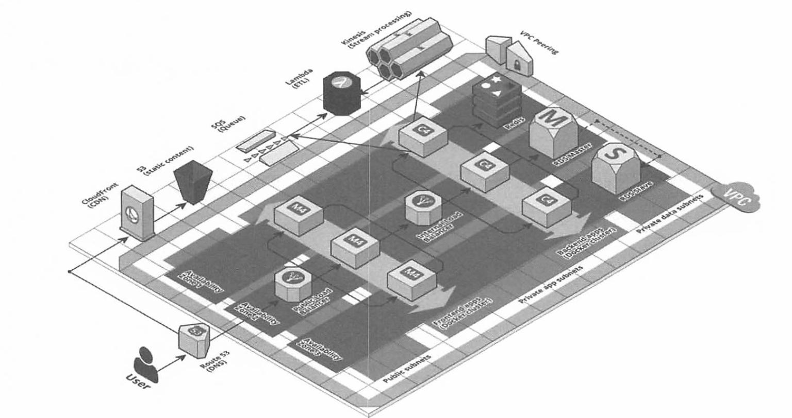
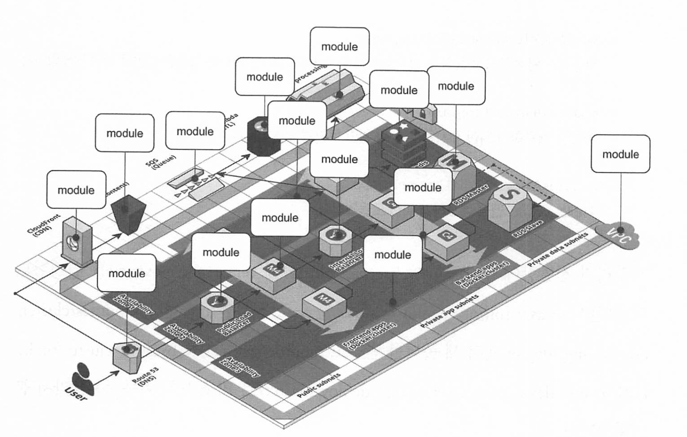

# 프로덕션 수준의 테라폼 코드

## 프로덕션 수준 인프라 구축에는 오랜 시간이 걸린다
### 프로덕션 수준의 인프라 구축은 어렵다

프로덕션 수준의 인프라 구축은 시간도 많이 걸리고 스트레스도 심한일입니다.

여기서 의미하는 프로덕션 수준의 인프라란 서버, 데이터 저장소, 로드 밸런서, 보안 기능, 모니터링 및 경고 도구, 파이프라인 구축 및 비즈니스 운영에 필요한 기타 모든 기술을 의미합니다.

회사에서는 엔지니어가 다음과 같은 상황을 해결할 것으로 기대합니다.

- 트래픽 과부하로 인프라가 중단되는 상황
- 장애가 발생하여 데이터가 손실되는 상황
- 해커의 침입으로 데이터에 문제가 생겨 비즈니스가 중단되는 일

프로덕션 수준의 인프라를 만드는 프로젝트에 소요되는 시간은 대략 다음과 같습니다.

| 인프라 유형 | 예 | 예상 소요 시간 |
| --- | --- | --- |
| 관리형 서비스 | 아마존 RDS | 1 ~ 2주 |
| 스스로 관리하는 분산 시스템 (상태 비저장) | Node.js 앱이 실행되는 클러스터 | 2 ~ 4주 |
| 스스로 관리하는 분산 시스템 (상태 저장) | 엘라스틱서치 | 2 ~ 4개월 |
| 전체 아키텍처 | 애플리케이션, 데이터, 로드 밸런서, 모니터링 등 | 6 ~ 36개월 |

프로덕션 수준의 인프라를 구축해본 경험이 없다면 이 수치에 놀랄 수 있습니다.

하지만 대규모 클라우드 마이그레이션을 거쳤거나 처음부터 새로운 인프라를 구축한 경험이 있는 사람이라면 누구나 이러한 수치조차 낙관적임을 알고 있습니다.

프로덕션 인프라를 구축하는 데 깊은 전문성을 갖춘 인력이 팀에 없거나 팀이 여러 방향으로 끌려다녀 집중할 시간을 갖지 못한다면 시간은 훨신 더 오래 걸릴 수 있습니다.

### 소프트웨어 프로젝트에 걸리는 시간은 아주 부정확하다

프로젝트는 실제로 걸리는 시간보다 훨씬 오래걸릴 수 있습니다.

5분 정도 걸릴 것이라 생각 작업들도 하루가 소요되기도 합니다.

데브옵스 작업에 오랜 시간이 걸리는 데는 3가지 주요 이유가 있습니다.

1. 데브옵스 산업이 여전히 초기 단계이기 때문입니다.
    - 클라우드 컴퓨팅, 코드형 인프라, 데브옵스 등의 용어는 2000년대 중반후에서 후반쯤에 나타났습니다.
    - 이로 인해 모든 도구와 기술은 새롭고 빠르게 변화하고 있습니다.
2. 데브옵스가 `야크털깎기` 에 취약합니다.
    - 야크 털 깎기는 원래 하고 싶었던 작업을 진행하기 전에 해야하는 작업들을 의미합니다.
    - 예를들어 다음과 같은 상황이 존재할 수 있습니다.
        - 앱에서 버그를 만드는 오타를 수정해서 배포 → 수정 중 TLS  인증서 문제 발생 → 오래된 리눅스 버전 문제 → 운영체제 버전 업데이트 후 재배포
3. 1번과 2번 이유로 인해 우발적인 복잡성을 가지게 됩니다.
    - 우발적인 복잡성이란 특정 도구와 프로세스에 의해 발생하는 문제를 의미합니다.

이러한 이유로 프로덕션 인프라를 준비하기 위해 수행해야하는 작업의 체크 리스트가 너무 많게 됩니다.

그리고 문제는 대다수 개발자가 체크 리스트에 있는 대부분의 항목을 알지못할 확률이 높아 시간이 많이 걸릴 수 밖에 없어집니다.

## 프로덕션 수준 인프라 체크 리스트
| 작업 | 설명 | 사용 가능한 도구 |
| --- | --- | --- |
| 설치 (Install) | 소프트웨어 바이너리나 필요한 종속성을 설치 | bash, 셰프, 앤서블, 퍼핏 |
| 설정 (Configure) | 포트 설정, TLS 인증서, 서비스 디스커버리, 팔로워, 복제 등의 소프트웨어 설정 | bash, 셰프, 앤서블, 퍼핏 |
| 프로비전 (Provision) | 서버, 로드 밸런서, 네트워크, 방화벽, IAM 권한 설정 등의 인프라 제공 | 테라폼, 클라우드 포메이션 |
| 고가용성 (High Availability) | 요청량에 따른 스케일 업/아웃 수평적 확장, 수직적 확장 | 오토 스케일링, 복제, 샤딩, 캐싱, 분할 정복 |
| 성능 (Performance) | CPU, 메모리, 디스크, 네트워크, GPU 용량 최적화, 쿼리 튜닝, 벤치 마킹, 테스트, 프로파일링 | 다이나트레이스, 밸그린드, 비주얼 VM, 제이미터 |
| 네트워킹 (Networking) | 정적 혹은 동적 IP 설정, 포트, 서비스 디스커버리, 방화벽, DNS, SSH 접속, VPN 연결 | VPC, 방화벽, 라우터, DNS registars, OpenVPN |
| 보안 (Security) | TLS를 통한 통신 중 데이터 암호화, 디스크 암호화, 인증, 인가, 보안 관리, 서버 하드닝 | ACM, Let’s Encrypt, KMS, 코그니토, 볼트, CIS |
| 성능지표 (Metrics) | 가용성, 비즈니스, 애플리케이션, 서버, 이벤트, 추적, 알림에 대한 메트릭 | 클라우드 워치, DataDog, New Relic, Honeycomb |
| 로그 (Logs) | 로그 순환 중앙으로 로그 데이터 수집 | 클라우드 워치 Logs, ELK, 수모 로직, 페이퍼 트레일 |
| 백업 및 복구 (Backup and Restore) | DB, 캐시, 기타 데이터를 일정에 따라 백업, 리전, 계정 별 복제 | RDS, ElastiCache, 복제 |
| 비용 최적화 (Cost Optimization) | 적절한 인스턴스 유형 선택, 스팟 혹은 예약 인스턴스 사용, 오토스케일링, 사용하지 않는 리소스 정리 | 오토 스케일링, 스팟 인스턴스, 예약 인스턴스 |
| 문서화 (Documentation) | 코드, 아키텍처, 모든 내용을 문서화
장애 대응 내용 정리 | README, wikis, 슬랙 |
| 테스트 (Tests) | 인프라 코드를 테스트 자동화, 항상 테스트 후에 배포 | 테라테스트, 인스펙, 서버스펙, 키친 테라폼 |

## 프로덕션 수준 인프라 모듈

### 재사용 가능한 모듈을 구축하는 사례 살펴보기

이번에 살펴볼 주제는 다음과 같습니다.

- 소형모듈
- 합성 가능한 모듈
- 테스트 가능한 모듈
- 릴리스 가능한 모듈
- 테라폼 모듈 외의 것들

### 소형 모듈

테라폼 및 코드형 인프라를 처음 사용하는 개발자는 개발, 스테이징, 프로덕션 등 모든 환경에 대한 인프라를 단일 파일 또는 단일 모듈로 정의합니다.

이는 중복된 코드가 많이 발생하고 관리가 어려워지는 요소이므로 소형모듈로 관리하는 것이 좋습니다.

### 대형 모듈의 단점

- 속도가 느림
    - 모든 인프라가 하나의 테라폼 모듈에 정의되어 있으면, 명령을 실행하는데 시간이 오래 걸립니다.
    - 모듈이 너무 커지면 terraform plan 명령을 실행하는데만 5 ~ 6분 걸립니다.
- 안전하지 않음
    - 모든 인프라가 하나의 큰 모듈로 관리되는 경우 어떤 것을 변경하려면 모든 액세스 권한이 필요합니다.
    - 따라서 거의 모든 사용자가 관리자 권한을 가지게 되며, 최소 권한 원칙에 위배됩니다.
- 위험성이 높음
    - 모든 달걀이 한 바구니에 있다면 실수로 전부 깨뜨릴 수도 있습니다.
    - 스테이징 환경에서 프론트엔드 앱을 약간 변경했을 뿐인데 오타나 잘못된 명령으로 인해 프로덕션 데이터베이스를 삭제할 수 있습니다.
- 이해하기 어려움
    - 한 곳에 코드가 많을수록 한 사람이 모든 것을 이해하기가 더 어려워집니다.
- 리뷰하기 어려움
    - 코드가 많을 수록 리뷰하는 것이 어려워집니다.
- 테스트하기 어려움
    - 많은 양의 코드를 한번에 테스트하는 것은 거의 불가능합니다.

### 한가지 하는 일을 하는 모듈을 작성하자

클린코드에서는 다음과 같은 내용이 있습니다.

<aside>
💡 함수의 첫 번째 규칙은 작아야 한다는 것입니다.
함수의 두 번째 규칙은 그보다 더 작아야 한다는 것입니다.
- 로버트 마틴

</aside>

프로그래밍에서도 하나의 코드가 너무 길면 읽기 힘들어지고 유지보수하기 어려워집니다.

이를 위해 하나의 역할을 하도록 함수를 분리하여 가독성과 재사용성을 높이는 것이 좋습니다.

테라폼도 이와 같은 전략을 사용하는 것이 좋습니다.

다음과 같은 아키텍처가 존재한다고 가정해봅시다.



위의 코드가 하나의 테라폼 모듈로 정의 되었다면 문제가 발생할 위험이 높은 코드로 작성된 것입니다.

위의 아키텍처는 다음과 같이 소형 모듈로 만들어 관리하는 것이 좋습니다.



### webserver-cluster 모듈 분리하기

지금까지 구축한 webserver-cluster 모듈도 커지기 시작하고 있습니다.

다소 관련이 없는 다음 3가지 작업을 하나의 모듈로 처리하고 있습니다.

- 오토 스케일링 그룹
- 애플리케이션 로드 밸런서
- Hello, World 애플리케이션

이에 따라 코드를 소형 모듈 3개로 리팩터링 해봅시다.

- modules/cluster-asg-rolling-deploy
    - 무중단 롤링 배포를 수행할 수 있으며, ASG를 배포하기 위한 재사용 가능한 일반 독립형 모듈입니다.
- modules/networking/alb
    - ALB를 배포하기 위한 재사용 가능한 일반 독립형 모듈입니다.
- modules/services/hello-world-app
    - Hello, World 앱을 배포하기 위한 모듈입니다.

### 합성 가능한 모듈

이제 각각 한가지 작업을 수행하는 소형 모듈(asg, alb)이 있습니다.

이제 모듈들을 함께 작동시켜봅시다.

### 합성 함수 만들기

모듈들을 함게 작동시키는 방법중 하나는 함수 합성을 통해 한 함수의 출력을 다른 함수의 입력으로 전달하는 것입니다.

합성 함수를 만들면 부작용을 최소화할 수 있습니다.

외부에서 상태를 읽는 대신 입력 매개 변수를 통해 전달하고, 외부에 상태를 쓰는 대신 출력 매개 변수를 통해 계산 결과를 반환합니다.

부작용을 최소화하는 것은 함수형 프로그래밍의 핵심 원칙 중 하나입니다.

부작용을 최소화하면 추론하고 테스트하고 재사용하기 쉽기 때문입니다.

인프라 코드로 작업할때 부작용을 피할 수는 없지만 테라폼 모듈에서 동일한 기본 원칙을 따를 수 있습니다.

modules/cluster/asg-rolling-deploy/variables.tf를 열고 새로운 입력 변수 4개를 추가해야 합니다.

```bash
variable "subnet_ids" {
  description = "The subnet IDs to deploy to"
  type        = list(string)
}

variable "target_group_arns" {
  description = "The ARNs of ELB target groups in which to register Instances"
  type        = list(string)
  default     = []
}

variable "health_check_type" {
  description = "The type of health check to perform. Must be one of: EC2, ELB."
  type        = string
  default     = "EC2"
}

variable "user_data" {
  description = "The User Data script to run in each Instance at boot"
  type        = string
  default     = null
}
```

위의 입력 변수는 다음과 같은 역할을 합니다.

- `subnet_id` : asg-rolling-deploy 모듈을 배포할 서브넷으로 지정합니다.
- `target_group_arns와 health_check_type` : ASG를 로드 밸런서와 통합하는 방식을 구성합니다.
- `user_data` : 사용자 데이터 스크립트를 전달하기 위해 사용합니다.

입력 변수를 추가했으니 하드코딩한 참조를 대체합시다.

```bash
resource "aws_autoscaling_group" "example" {
  # Explicitly depend on the launch configuration's name so each time 
  # it's replaced, this ASG is also replaced
  name = "${var.cluster_name}-${aws_launch_configuration.example.name}"

  launch_configuration = aws_launch_configuration.example.name

  vpc_zone_identifier  = var.subnet_ids

  # Configure integrations with a load balancer
  target_group_arns    = var.target_group_arns
  health_check_type    = var.health_check_type

  min_size = var.min_size
  max_size = var.max_size

  # Wait for at least this many instances to pass health checks before
  # considering the ASG deployment complete
  min_elb_capacity = var.min_size

  # When replacing this ASG, create the replacement first, and only delete the
  # original after
  lifecycle {
    create_before_destroy = true
  }

  tag {
    key                 = "Name"
    value               = var.cluster_name
    propagate_at_launch = true
  }

  dynamic "tag" {
    for_each = {
      for key, value in var.custom_tags:
      key => upper(value)
      if key != "Name"
    }

    content {
      key                 = tag.key
      value               = tag.value
      propagate_at_launch = true
    }
  }

}
resource "aws_launch_configuration" "example" {
  image_id        = var.ami
  instance_type   = var.instance_type
  security_groups = [aws_security_group.instance.id]
  user_data       = var.user_data

  # Required when using a launch configuration with an auto scaling group.
  # https://www.terraform.io/docs/providers/aws/r/launch_configuration.html
  lifecycle {
    create_before_destroy = true
  }
}
```

그리고 출력시 사용하기 위해 다음 출력 변수를 추가합시다.

```bash
output "asg_name" {
  value       = aws_autoscaling_group.example.name
  description = "The name of the Auto Scaling Group"
}

output "instance_security_group_id" {
  value       = aws_security_group.instance.id
  description = "The ID of the EC2 Instance Security Group"
}
```

위와 같이 데이터를 출력하면 모듈을 사용하는 사람이 이러한 출력을 사용하여 보안 그룹에 사용자 정의 규칙을 추가하는 등 새로운 동작을 추가할 수 있기 때문에 재사용성을 높일 수 있습니다. 

비슷한 이유로 여러 출력을 modules/networking/alb/outputs.tf 에 추가합시다.

```bash
output "alb_dns_name" {
  value       = aws_lb.example.dns_name
  description = "The domain name of the load balancer"
}

output "alb_http_listener_arn" {
  value       = aws_lb_listener.http.arn
  description = "The ARN of the HTTP listener"
}

output "alb_security_group_id" {
  value       = aws_security_group.alb.id
  description = "The ALB Security Group ID"
}
```

이제 asg-rolling-deploy 및 alb 모듈을 사용하여 webserver-cluster 모듈을 앱을 배포할 수 있는 hello-world-app 모듈로 변환해봅시다.

이를 수행하기 위해 module/services/webserver-cluster의 이름을 module/services/hello-world-app으로 변경합니다.

그리고 module/services/hello-world-app/main.tf에는 다음 리소스만 남겨 둡니다.

- template_file
- aws_lb_target_group
- aws_lb_listener_rule
- terraform_remote_state
- aws_vpc
- aws_subnet_ids

modules/services/hello-world-app/variables.tf에 다음 변수를 추가합시다.

```bash
variable "environment" {
  description = "The name of the environment we're deploying to"
  type        = string
  default     = "stage"
}
```

이제 asg-rolling-deploy 모듈을 hello-world-app 모듈에 추가하여 ASG를 배포합시다.

```bash
module "asg" {
  source = "../../cluster/asg-rolling-deploy"

  cluster_name  = "hello-world-${var.environment}"
  ami           = var.ami
  user_data     = data.template_file.user_data.rendered
  instance_type = var.instance_type

  min_size           = var.min_size
  max_size           = var.max_size
  enable_autoscaling = var.enable_autoscaling

  subnet_ids        = data.aws_subnet_ids.default.ids
  target_group_arns = [aws_lb_target_group.asg.arn]
  health_check_type = "ELB"
  
  custom_tags = var.custom_tags
}
```

그리고 이전에 생성한 alb 모듈을 추가하여 ALB를 배포합니다.

```bash
module "alb" {
  source = "../../networking/alb"

  alb_name   = "hello-world-${var.environment}"
  subnet_ids = data.aws_subnet_ids.default.ids
}
```

다음으로 이 앱에 대한 ALB 대상 그룹 및 리스너 규칙을 구성해야 합니다.

name에서 enviroment를 사용하도록 aws_lb_target_group 리소스를 업데이트 합니다.

```bash
resource "aws_lb_target_group" "asg" {
  name     = "hello-world-${var.environment}"
  port     = var.server_port
  protocol = "HTTP"
  vpc_id   = data.aws_vpc.default.id

  health_check {
    path                = "/"
    protocol            = "HTTP"
    matcher             = "200"
    interval            = 15
    timeout             = 3
    healthy_threshold   = 2
    unhealthy_threshold = 2
  }
}
```

이제 aws_lb_listener_rule 리소스의 listener_arn 매개 변수가 ALB 모듈의 alb_http_listener_arn 출력을 가리키도록 업데이트 합니다.

```bash
resource "aws_lb_listener_rule" "asg" {
  listener_arn = module.alb.alb_http_listener_arn
  priority     = 100

  condition {
    path_pattern {
      values = ["*"]
    }
  }

  action {
    type             = "forward"
    target_group_arn = aws_lb_target_group.asg.arn
  }
}
```

마지막으로 asg-rolling-deploy 및 alb 모듈의 중요한 출력을 hello-world-app 모듈의 출력으로 전달합니다.

```bash
output "alb_dns_name" {
  value       = module.alb.alb_dns_name
  description = "The domain name of the load balancer"
}

output "asg_name" {
  value       = module.asg.asg_name
  description = "The name of the Auto Scaling Group"
}

output "instance_security_group_id" {
  value       = module.asg.instance_security_group_id
  description = "The ID of the EC2 Instance Security Group"
}
```

### 테라폼의 모듈 세분화 패턴

이를 통해 테라폼 모듈을 세분화하는데 성공했습니다.

테라폼에서 흔히 볼 수 있는 모듈 세분화 패턴은 최소한 다음 두가지 유형으로 모듈을 세분화하는 것입니다.

- 일반모듈
    - 다양한 사례에서 사용할 수 있는 asg-rolling-deploy, alb 같은 모듈이 이에 해당합니다.
- 사용 사례별 모듈
    - 일반 모듈을 여러개 결합하여 특정 사례에 사용하는 용도입니다.

물론, 실제 사용시에는 더 나은 합성과 재사용을 위해 모듈을 더욱 세분화해야 할 수도 있습니다.

### 테스트 가능한 모듈

이제 작성한 모듈이 실제로 작동하는지 확인해봅시다.

여태까지 작성한 모듈은 직접 배포하기 위한 루트 모듈이 아닙니다.

모듈을 배포하려면 원하는 인수를 지정하고 provider를 설정하고 backend를 구성하는 등의 테라폼 코드를 작성해야 합니다.

이를 수행하는 가장 좋은 방법은 예제 폴더를 만드는 것입니다.

다음과 같이 example/asg/main.tf를 작성합시다.

```bash
provider "aws" {
  region = "us-east-2"
}

module "asg" {
  source = "../../modules/cluster/asg-rolling-deploy"

  cluster_name = var.cluster_name
  ami = "ami-0c55b159cbfafe1f0"
  instance_type = "t2.micro"

  min_size = 1
  max_size = 1
  enable_autoscaling = false

  subnet_ids = data.aws_subnet_ids.default.ids
}

data "aws_vpc" "default" {
	default = true
}

data "aws_subnet_ids" "default" {
  vpc_id = data.aws_vpc.default.id
}
```

위의 코드는 asg-rolling-deploy 모듈을 사용하여 크기가 1인 ASG를 배포합니다.

`terraform init` `terraform apply` 를 실행함으로써 오류 없이 실행되고 ASG가 동작하는지 확인합니다.

추가로 README.md를 통해 어떤 의도인지 적어두면 다음과 같은 이점을 얻을 수 있습니다.

- 수동 테스트
    - asg-rolling-deploy 모듈에서 작업하는 동안 해당 테라폼 파일을 통해 코드가 예상대로 동작하는지 확인할 수 있습니다.
- 자동화된 테스트 장치
    - 해당 파일을 통해 자동화된 테스트를 작성할 수 있습니다.
- 실행 가능한 문서
    - 이 예제를 통해 다른 구성원이 모듈의 동작 방식을 이해하고 해당 모듈의 필요성을 알 수 있습니다.

### 새 모듈을 개발할 때 주의해야할 점

새 모듈을 개발할때 항상 예제 코드를 작성하는 것이 모범사례입니다.

구현 부터 시작하면 구현 세부 사항에 깊이 빠져 방황하기 쉽고 다시 본론으로 돌아와 API를 만들다 보면 직관적이지 않고 사용하기 어려운 모듈을 만들 가능성이 큽니다.

반면에 예제 코드로 시작하면 이상적인 사용자 경험을 자유롭게 생각해보고 모듈에 대한 클린 API를 생각해낸 다음 구현으로 넘어갈 수 있습니다.

### 테라폼 버전 고정하기

정기적으로 모듈을 테스트할 때 유용하게 사용할 수 있는 방법으로 required_version 인수를 사용할 수 있습니다.

해당 인수를 통해 특정 모듈에 대해 어떤 테라폼 버전을 사용할 것인지 명시할 수 있습니다.

```bash
terraform {
	required_version = ">= 0.12, < 0.13"
}
```

프로덕션 수준의 코드의 경우 버전을 더욱 엄격하게 고정하는 것이 좋습니다.

추가로, 테라폼 이외에도 모든 공급자 버전도 다음과 같이 고정하는 것을 권장합니다.

```bash
provider "aws" {
	region = "us-east-2"
	version = "~> 2.0"
}
```

위의 코드는 AWS 공급자 코드를 모든 2.x 버전에 고정합니다.

### 릴리즈 가능한 모듈

모듈을 작성하고 테스트한 후 다음 단계는 모듈을 릴리즈 하는 것입니다.

릴리즈하는 방법은 깃 태그를 이용해 다음과 같이 진행할 수 있습니다.

```bash
terraform {
  required_version = ">= 0.12, < 0.13"
}

provider "aws" {
  region = "us-east-2"

  # Allow any 2.x version of the AWS provider
  version = "~> 2.0"
}

module "hello_world_app" {

	// 예시로 사용자의 github 주소로 사용해야함
  source = "git@github.com:foo/modules.git//services/hello-world-app?ref=v0.0.5"

  server_text = var.server_text

  environment            = var.environment
  db_remote_state_bucket = var.db_remote_state_bucket
  db_remote_state_key    = var.db_remote_state_key

  instance_type      = "t2.micro"
  min_size           = 2
  max_size           = 2
  enable_autoscaling = false
}
```

다음으로 live/stage/services/hello-worldapp/outputs.tf 에서 ALB DNS 이름을 출력으로 전달합니다.

```bash
output "alb_dns_name" {
  value       = module.hello_world_app.alb_dns_name
  description = "The domain name of the load balancer"
}
```

이제 모듈이 특정 버전으로 모듈을 릴리즈하고 배포할 수 있습니다.

### 테라폼 레지스트를 이용하여 릴리즈하기

퍼블릭 테라폼 레지스트리는 AWS, 구글 클라우드, 애저 및 기타 여러 공급자를 위한 재사용 가능하며, 커뮤니티에 의해 관리되는 오픈 소스 모듈 수백가지가 포함되어 있습니다.

퍼블릭 테라폼 레지스트리에 모듈을 게시하려면 몇 가지 요구 사항이 있습니다.

- 모듈이 공개 깃허브 레포지터리에 있어야 합니다.
- 리포지터리 이름은 terraform-<PROVIDER>-<NAME>과 같은 형태로 부여해야 합니다.
- 모듈은 레포지터리의 루트에 테라폼 코드를 정의하고, README.md를 제공하고 main.tf, [variables.tf](http://variables.tf) 및 [outputs.tf](http://outputs.tf) 규칙을 파일이름으로 사용하는 것을 포함하는 지정된 파일 구조를 따라야 합니다.
- 리포지터리는 릴리즈를 위해 시맨틱 버전과 함께 깃 태그를 사용해야 합니다.

모듈이 이러한 요구 사항을 충족하는 경우 깃허브 계정으로 테라폼 레지스트리에 로그인하고 웹 UI를 사용해 모듈을 게시하여 전 세계에 공유할 수 있습니다.

### 테라폼 레지스트리에서 모듈을 사용하기 위한 특수 구문

깃 URL로 모듈을 사용하기 위해서는 ref 매개변수를 사용해야 합니다.

테라폼 레지스트리를 사용할 경우 다음 구문처럼 별도의 version 인수를 통해 버전을 지정할 수 있습니다.

```bash
module "<NAME>" {
	source = "<OWNER>/<REPO>/<PROVIDER>"
	version = "<VERSION>"
}
```

- `NAME` : 테라폼 코드에서 모듈에 사용할 식별자
- `OWNER` : 깃허브 레포지터리의 소유자
- `REPO` : 깃허브 레포지터리 이름
- `PROVIDER` : 배포하려는 공급자
- `VERSION` : 사용할 모듈의 버전

다음은 사용 예시입니다.

```bash
module "vault" {
	source = "hashicorp/vault/aws"
	version = "0.12.2"
} 
```

### 테라폼 모듈을 넘어서

전체 프로덕션 수준의 인프라를 구축하려면 테라폼 뿐만 아니라 도커, 패커, 셰프, 퍼핏, 배시 스크립트 등 다른 도구도 사용해야 합니다.

이 코드들은 테라폼 코드와 함께 module 폴더에 존재할 수 있습니다.

그리고 이러한 코드들은 테라폼이 가진 한계를 채워주는 역할을 합니다.

이러한 테라폼의 한계를 해결하기 위해 다음과 같은 방법들도 존재합니다.

- 프로비저너
- null_resource를 사용한 프로비저너
- 외부 데이터 소스

### 프로비저너

테라폼 프로비저는 테라폼을 실행할 때 부트스트랩, 구성 관리 또는 정리 작업을 수행하기 위해 로컬 시스템이나 원격 시스템에서 스크립트를 실행하는데 사용됩니다.

프로비저너에는 다음과 같은 항목들이 있습니다.

- `local-exec` : 로컬 시스템에서 스크립트를 실행
- `remote-exec` : 원격 리소스에서 스크립트를 실행
- `chef` : 원격 리소스에서 셰프 클라이언트를 실행
- `file` : 원격 리소스로 파일로 복사

provisioner 블록을 사용하면 리소스에 프로비저너를 추가할수 있습니다.

다음은 local-exec 프로비저너를 사용해서 로컬 시스템에서 스크립트를 실행하는 방법입니다.

```bash
resource "aws_instance" "example" {
	ami = "ami-0c55b159cbfafe1f0"
	instance_type = "t2.micro"

	provisioner "local-exec" {
		command = "echo \"Hello, World from $(uname -smp)\""
	}
}
```

remote-exec 프로비저너를 실행보는 것은 조금 더 복잡합니다.

EC2 인스턴스와 같은 원격 리소스에서 코드를 실행하려면 테라폼 클라이언트가 다음을 수행할 수 있어야 합니다.

- 네트워크를 통해 EC2 인스턴스와 통신
    - 여러분은 보안 그룹을 이용해 통신을 허용하는 방법을 이미 알고 있습니다.
- EC2 인스턴스에 인증
    - remote-exec 프로비저너는 SSH 및 WinRM 연결을 지원합니다.

먼저 SSH 기본 포트인 포트 22번에 대한 인바운드 연결을 허용하는 보안 그룹을 만들어 보겠습니다.

```bash
resource "aws_security_group" "instance" {
	ingress {
		from_port = 22
		to_port = 22
		protocol = "tcp

		cidr_blocks = ["0.0.0.0/0"]
	}
}
```

SSH 키를 사용하면 컴퓨터에 SSH 키 쌍을 생성하고 공용키를 AWS에 업로드한 후 테라폼 코드가 액세스할 수 있는 안전한 곳에 개인 키를 저장하는 것이 일반적인 프로세스입니다.

그러나 이 코드를 시험해볼 수 있도록 tls_private_key라는 리소스를 사용하여 자동으로 개인키를 생성할 수 있습니다.

```bash
resource "tls_private_key" "example" {
	algorithm = "RSA"
	rsa_bits = 4096
}
```

이 개인 키는 테라폼 상태에 저장되므로 프로덕션 사용 사례에는 적합하지 않지만 이 연습에는 적합합니다.

다음으로 aws_key_pair 리소스를 사용하여 공개 키를 AWS에 업로드합니다.

```bash
resource "aws_key_pair" "generated_key" {
	public_key = tls_private_key.example.public_key_openssh
}
```

마지막으로 EC2 인스턴스의 코드를 작성합니다.

```bash
resource "aws_instance" "example" {
	ami = "ami-0c55b159cbfafe1f0"
	instance_type = "t2.micro"
	vpc_security_group_ids = [aws_security_group.instance.id]
	key_name = aws_key_pair.generated_key.key_name

	provisioner "remote-exec" {
		inline = ["echo \"Hello, World from $(uname -smp\""]
	}

	connection {
		type = "ssh"
		host = self.public_ip
		user = "ubuntu"
		private_key = tls_private_key.example.private_key_pem
	}
}
```

### self 키워드

위의 코드를 보면 self.public_ip라는 구문을 사용하고 있습니다.

기존의 사용했던 aws_instance.example.<ATTRIBUTE>와 같은 방식을 사용하면 자기 자신을 참조할 수 없어 순환 종속성 오류가 발생합니다.

self 표현식은 자기자신을 참조하기 위해 사용하는 표현식으로 프로비저너를 위해 특별히 추가된 방법입니다.

self 표현식은 다음과 같이 사용합니다.

```bash
self.<ATTRIBUTE>
```

### null_resource를 사용한 프로비저너

null_resource를 사용하면 특정 리소스에 연결하지 않고 프로비저너를 실행할 수 있습니다.

아무것도 생성하지 않는다는 점을 제외하면 일반 테라폼 리소스와 같은 기능을 합니다.

null_resource에서 프로비저너를 정의하면 테라폼 수명 주기의 일부로써 스크립트를 수행할 수 있지만 실제 리소스에 연결되지는 않습니다.

```bash
resource "null_resource" "example" {
	provisioner "local-exec" {
		command = "echo \"Hello, World from $(uname -smp)\""
	}
}
```

null_resource에는 키와 값을 맵 형태로 전달하는 triggers라는 편리한 인수도 있습니다.

값이 변경될때마다 null_resource가 다시 만들어지므로 그안에 있는 모든 프로비저너가 다시 실행됩니다.

예를 들어 실행할때마다 null_resource 안에서 프로비저너를 실행하려면 다음과 같이 임의로 생성되는 UUID를 반환하는 uuid() 내장 함수를 사용할 수 있습니다.

```bash
resource "null_resource" "example" {
	triggers = {
		uuid = uuid()
	}

	provisioner "local-exec" {
		command = "echo \"Hello, World from $(uname -smp)\""
	}
}
```

### 외부 데이터 소스

프로비저닝은 일반적으로 테라폼에서 스크립트를 실행하는데 도움이 되지만 항상 적절하지는 않습니다.

때로는 스크립트를 실행하여 외부로 부터 데이터를 가져와서 해당 데이터를 사용하고 싶을 수 있습니다.

이럴때는 external 데이터 소스를 사용하면 됩니다.

외부 데이터 소스를 사용하는 프로토콜은 다음과 같습니다.

- external 데이터 소스의 query 인수를 사용하려 테라폼에서 외부 프로그램으로 데이터를 전달할 수 있습니다.
- 외부 프로그램은 JSON을 stdout에 작성하여 데이터를 테라폼으로 다시 전달할 수 있습니다.

예를 들면 다음과 같습니다.

```bash
data "external" "echo" {
	program = ["bash", "-c", "cat /dev/stdin"]

	query = {
		foo = "bar"
	}
}

output "echo" {
	value = data.external.echo.result
}

output "echo_foo" {
	value = data.external.echo.result.foo
}
```

이 예제에는 external 데이터 소스를 사용하여 stdin에서 수신하는 모든 데이터를 다시 stdout으로 전달하는 배시 스크립트를 실행합니다.

external 데이터 소스를 사용하면 외부 의존성이 커지므로 불안정한 코드가 될 수 있기에 신중하게 사용해야 합니다.