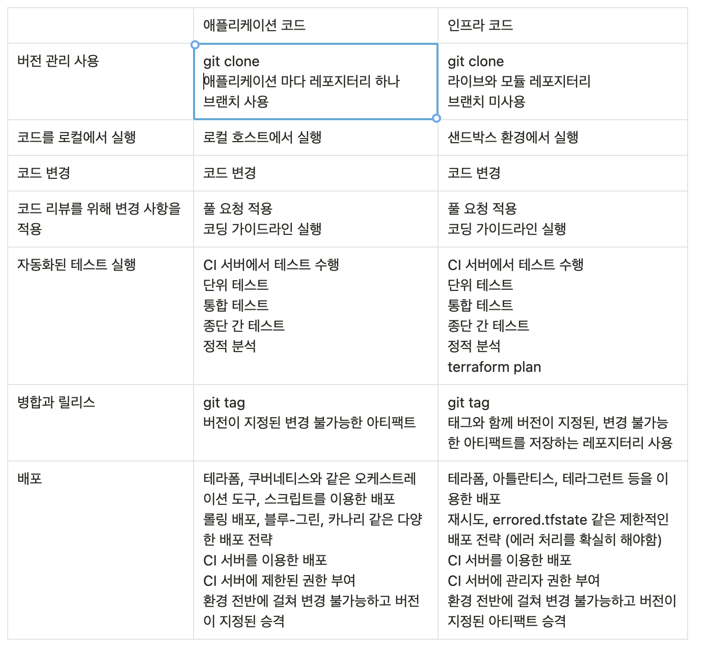

# 테라폼을 팀에서 사용하는 방법

## 팀에 코드형 인프라 도입

### 상사 설득

코드형 인프라를 도입했을 때 자동화, 버그 회피 등 많은 이점을 누릴 수 있지만 다음과 같은 단점이 발생할 수 있습니다.

- 팀 내 기술 격차
    - 코드형 인프라로의 이동은 운영팀이 대부분의 시간을 테라폼 모듈 작성, Go 테스트 코드 작성 등 대량의 코드를 작성하는데 시간을 할애하게 됩니다.
    - 기존에 이러한 내용에 대해 잘 알고 있다면 큰 문제가 없을 수 있지만 익숙하지 않은 경우 팀 내의 큰 기술 격차가 발생하여 생산성이 떨어질 수 있습니다.
- 새로운 도구 도입에 대한 부담감
    - 어떤 개발자들은 새로운 것을 배운다는 사실 자체에 기뻐할 수 있지만 또 다른 개발자들은 자신이 아는 것을 고수하고 새로운 언어와 기술을 배우는데 많은 시간을 할애하는 것이 부담스러울 수 있습니다.
- 기존과는 다른 사고방식 요구
    - 새로운 도구를 도입함으로써 기존의 방식과는 다른 사고방식으로 생각해야할 수 있습니다.
    - 예를 들어, 인프라를 수동으로 관리했을때는 직접 접속하여 명령을 내리는 방식이었다면, 코드형 인프라는 먼저 코드를 편집하고 모든 변경사항을 간접적으로 수행하는 방식으로 변화하게 됩니다.
        - 이로 인해 간단한 작업 같은 경우 오히려 더디다고 느껴질 수 있고 비효율적으로 느껴질 수 있습니다.
- 기회 비용
    - 다른 도구를 도입한다는 것은 그만큼 다른 프로젝트가 보류된다는 것을 의미합니다.
        - 이로 인해 코드형 인프라 도입자체에 부정적으로 변할 수 있습니다.

### 효율적인 설득 방법

설득을 위해서는 위와 같은 문제점을 넘어서는 이점이 있어야 합니다.

따라서, 설득을 위해서는 코드형 인프라를 도입하는 기간동안 팀에 더 많은 가치를 가져다준다는 것을 증명해야 합니다.

이때, 코드형 인프라 도구의 기능을 나열하는 것은 효과적이지 않습니다.

 예를 들어 다음과 같이 설득하는 것은 비효율적입니다.

- 테라폼은 멀티 클라우드에 적용할 수 있습니다.
- 테라폼은 오픈소스 프로젝트입니다.

그래서 이러한 나열대신 이러한 장점들로 얻을 수 있는 점을 이야기해야 합니다.

- 테라폼은 멀티 클라우드에 적용할 수 있기 때문에 다른 클라우드 서비스를 사용할때 모든 도구를 마이그레이션 할 필요가 없습니다.
- 테라폼은 오픈소스이기 때문에 커뮤니티 규모가 크고 이 덕분에 트러블 슈팅 및 새로운 개발자 고용이 쉽습니다.

위와 같이 도입하려는 도구의 장점과 이를 통한 문제 해결을 통해 장점을 어필하는 것이 좋습니다.

### 도입이 되지 않을 수도 있다는 점을 인지하자

팀원들과 이야기 후 현재 상황에 적합하지 않을 수 있습니다.

예를 들어, 다음과 같은 문제들로 인해 코드형 인프라를 도입하지 않는 것이 오히려 나을 수 있습니다.

- 소규모 스타트업이나 몇 개월 내에 버려질 수 있는 프로토 타입을 작성하는 경우
- 개인적인 소규모 사이드 프로젝트를 진행하는 경우

위와 같은 상황에서는 코드형 인프라를 도입하기 위한 기회비용이 더 클 수 있으므로 도입하지 않는 것이 나은 방향일 수 있습니다.

### 현재 문제를 해결할 수 있다면 큰 설득력을 가질 수 있다

만약 도입하고자 하는 기술이 지금 겪고 있는 문제를 해결할 수 있다면 팀원들이 긍정적인 반응을 보일 확률이 높습니다.

예를 들어, 현재 다음과 같은 문제를 겪고 있어 서버 가동 시간을 개선을 하고 싶은 상황이라고 가정해봅시다.

```
💡 지난 몇 달간, 운영 중단이 발생하였고 이러한 운영 중단의 원인이 수동 배포 중 실수로 인해 발생한 문제인 상황입니다. (롤아웃 프로세스 중 중요한 단계를 건너뛰거나 서버를 잘못 구성하는 등..)
```

이런 상황에서 테라폼의 기능이나 이점을 구구절절 이야기 하는 것보다는 `서버가 가동 중단 되는 상황을 절반으로 줄일 아이디어가 있습니다.` 라고 말하면 좀 더 관심을 끌 수 있을 것입니다.

이 때, 테라폼을 이용하여 완전 자동화되고 반복 가능한 인프라를 만드는 것을 제시한다면 큰 설득력을 얻을 수 있을 것입니다.

### 점진적 도입

대부분의 대규모 소프트웨어 프로젝트는 실패할 확률이 높습니다.

그래서 어떤 팀이 코드형 인프라를 채택할 때 엄청난 양의 인프라를 모든 팀에 걸쳐 한 번에 그리고 종종 더 큰 이니셔티브의 일부로 채택하려 할 때 걱정이 됩니다.

대기업의 CEO 또는 CTO가 모든 것을 클라우드로 마이그레이션하고 기존 데이터 센터를 종료하며 6개월 안에 모든 사람이 데브옵스를 수행하도록 지시하는 것을 보면 고개를 저을 수 밖에 없습니다.

이런 계획들을 실패할 확률이 높으며 성공한다하더라도 긴 시간이 필요하게 됩니다.

코드형 인프라를 성공적으로 채택하고 싶거나 다른 유형의 마이그레이션 프로젝트를 성공시키는 유일한 방법은 점진적으로 도입하는 것입니다.

### 잘못된 점진적 도입

점진주의의 핵심은 단순한 작업을 일련의 작은 단계로 나누는 것만이 아니라 이후의 단계를 실행하지 않는다 하더라도 모든 단계가 고유한 가치를 가져다주는 방식으로 작업을 나누는 것입니다.

만약, 여러 단계로 나누어져 있지만 마지막 단계가 완료될 때 까지 실질적인 가치를 제공하지 않는 마이그레이션 프로젝트를 진행한다고 가정해봅시다.

예를 들어, 첫 번째 단계는 프론트엔드를 다시 작성하는 것이지만 새로운 백엔드에 의존하기 때문에 아직 실행되지 않습니다.

두번째 단계로 백엔드를 다시 작성하지만 데이터를 새 데이터 저장소로 마이그레이션하기 전 까지는 작동하지 않기 때문에 백엔드도 실행되지 않습니다.

마지막 단계는 데이터 마이그레이션을 수행하는 것입니다.

이 마지막 단계가 끝나고 나서야 비로소 모든 것을 실행하고 이 모든 작업을 수행함으로써 어떤 가치가 실현되는 것을 깨닫습니다.

만약, 중간에 프로젝트가 취소되거나 보류되거나 부분적으로 크게 변경된다면 많은 투자에도 불구하고 프로젝트에서 어떠한 가치도 얻을 수 없습니다.

사실, 이것은 대규모 마이그레이션 프로젝트에서 너무나도 많이 일어나는 일입니다.

대부분의 소프트웨어 프로젝트와 마찬가지로 이 프로젝트는 시작하기에 크고 예상보다 훨씬 오래 걸립니다.

위와 같이 잘못된 점진주의를 사용하면 엄청난 비용을 지불하고 아무 대가도 얻지 못하는 최악의 결과를 초래할 수 있습니다.

### 올바른 점진주의를 사용하기

점진주의를 제대로 이해하고 사용한다면 프로젝트가 완료되지 않아도 프로젝트가 어떤 단계를 거쳤던 간에 작업을 수행할 수 있게 됩니다.

이를 달성하는 가장 좋은 방법은 한 번에 작고 구체적인 문제 하나를 해결하는 데 집중하는 것입니다.

예를 들어, 클라우드로의 빅뱅 마이그레이션을 수행하는 대신 어려움을 겪고 있는 소규모의 특정 앱 또는 팀을 식별해 이들만 마이그레이션 하도록 시도합니다.

또는, 데브옵스로 빅뱅 이동을 시도하는 대신 배포 중 중단 같은 작고 구체적인 문제 하나를 찾습니다.

그리고 테라폼으로 가장 문제가 많은 부분을 배포 자동화하는 것처럼 해당 특정 문제에 대한 해결책을 마련하도록 시도합니다.

이렇게 작은 문제를 해결해나가면 추진력을 얻을 수 있고 빠르게 해결해나가면서 새로운 도구에 도입에 대한 지원을 받을 수 있게 됩니다.

### 팀에 학습 시간 부여

새로운 기술을 도입할때는 혼자만 도입해서는 안됩니다.

모든 팀원들이 학습하고 이해가 충분한 상태에서 충분한 노력을 기울여야만 성공적으로 기술을 도입할 수 있습니다.

한명이 아무리 훌륭하게 코드를 작성했다 하더라도 팀 전체가 그 코드를 사용하지 않는다면 다음과 같은 문제가 일어날 수 있습니다.

1. 팀의 개발자가 코드형 인프라에 열정적이며, 몇 달 동안 멋진 테라폼 코드를 작성하여 많은 인프라를 배포하는 데 사용합니다.
2. 개발자는 행복하고 생산적이지만 안타깝게도 나머지 팀원들은 테라폼을 배우고 채택할 시간이 없었습니다.
3. 그런 다음 불가피한 중단 상황이 발생합니다.
4. 이제 팀원 중 다른 한명이 중단을 처리해야 하는 상황이 오면 다음과 같이 대처할 수 있을 것입니다.
    1. 항상 하던 방식으로 수동으로 변경하여 작업하기
    2. 테라폼을 사용하여 중단을 수정하기 (익숙하지 않기 때문에 긴 시간이 소요될 가능성이 높음)
5. 수동 결과로 인해 테라폼 코드가 더 이상 실제 배포된 코드와 일치하지 않게 됩니다.
    
    따라서, 팀 내 누군가가 두 번재 옵션을 선택하고 테라폼을 사용하려고 해도 이상한 오류가 발생할 가능성이 있습니다.
    
    그렇게 되면 테라폼에 대한 신뢰를 잃고 다시 한번 첫 번째 옵션으로 돌아가서 더 많은 수동 변경을 수행합니다.
    
6. 결국 모든 사람이 수동으로 다시 작업하는 상황이 벌어지고 기존에 작성된 테라폼 코드는 의미가 없어집니다.

이런 상황을 막기 위해서는 팀원들이 도구를 배우고 충분히 사용 방법을 익히는데 필요한 시간을 모두에게 제공해야 합니다.

### 팀이 코드형 인프라를 더 빨리 채택하도록 도울 수 있는 방법

팀이 코드형 인프라를 더 빨리 채택하도록 도울 수 있는 한가지 방법은 잘 정의된 프로세스를 갖는 것입니다.

소규모 팀에서 코드형 인프라를 배우거나 사용할 때는 개발자의 컴퓨터에서 애드혹 형태로 실행하는 것으로 충분합니다.

그러나 회사가 성장하고 코드형 인프라 사용량이 증가함에 따라 배포가 어떻게 이루어지는지에 대한 보다 체계적이고 반복가능하며, 자동화된 워크플로를 정의해야 합니다.

## 애플리케이션 코드 배포를 위한 워크 플로
애플리케이션 코드 배포를 워크 플로는 다음과 같습니다.

1. 버전 관리 사용
2. 코드를 로컬에서 실행
3. 코드 변경
4. 코드 리뷰를 위해 변경사항 반영
5. 자동화된 테스트 실행
6. 병합과 릴리스
7. 배포

### 버전관리 사용

버전 관리 상태로 관리해야 코드를 신뢰할 수 있는 상태로 사용할 수 있기 때문에 모든 코드는 버전 관리 상태에 있어야 합니다.

버전 관리 대상은 다음과 같은 대상이 존재합니다.

- [README.md](http://README.md) 와 같은 설명 문서
- YAML 과 같은 파일로 작성된 구성 파일
- RSpec으로 작성된 테스트 코드 같은 사양
- JUnit으로 작성된 자동화된 테스트
- 액티브 레코드로 작성된 스키마 마이그레이션 같은 데이터베이스
- 테라폼으로 작성된 인프라 관리를 위한 코드

### 코드를 로컬에서 실행

버전관리를 사용하여 파일을 받아오면 코드를 로컬에서 실행하게 됩니다.

애플리케이션을 로컬에 실행하여 수동 및 자동화된 테스트(작성되어 있다면)를 로컬에서 실행할 수 있을 것 입니다.

<aside>
💡 단, 인프라를 변경하는 코드는 로컬로 실행할 수 없습니다. (특정 클라우드에 종속적이기 때문)

</aside>

### 코드 변경

애플리케이션 코드가 실행되는 것이 확인되면 변경 작업을 수행하면 됩니다.

변경을 수행한 후 자동화된 테스트를 재실행하여 변경사항이 작동하는지 확인하고 계속해서 변경하는 과정이 반복됩니다.

자동화된 테스트를 통해 피드백을 즉시 받기 때문에 신속하게 문제를 파악할 수 있습니다.

<aside>
💡 코드 변경시에 자동화된 테스트를 의존하여 변경 작업을 수행하므로 자동화된 테스트가 중요합니다.

</aside>

### 코드 리뷰를 위해 변경사항 반영

코드 변경을 완료하면 이제는 코드 리뷰를 위해 변경 사항을 반영해야 합니다.

깃허브를 사용한다면 PullRequest를 통해 리뷰를 진행할 수 있습니다.

### 자동화된 테스트 실행

버전 관리 시스템이 푸시하는 모든 커밋에 대해 자동화된 테스트를 실행하도록 파이프라인 구성을 진행해야 합니다.

이를 위해 Jenkins, Circle CI, Travis CI, Github Actions 등을 사용할 수 있습니다.

### 병합과 릴리스

팀 구성원은 코드 변경사항을 리뷰하고 잠재적인 버그를 찾은 후 기존 테스트가 통과했는지 확인하고 추가한 새로운 동작에 대한 테스트를 추가했는지 확인해야 합니다.

모든 것이 문제 없다면 코드 병합을 진행합니다.

병합을 완료하면 병합한 코드를 릴리스해야 합니다.

애플리케이션을 패키징하는 방법은 배포 방법에 따라 달라질 수 있으며, 다음과 같습니다.

- Docker 이미지
- AMI와 같은 가상 머신 이미지
- Jar와 같은 애플리케이션 실행 파일

릴리스시에는 깃 태그를 이용하여 특정 깃 커밋에 대한 릴리스 기록을 남길 수 있습니다.

```bash
git tag -a "v0.0.1" -m "Update commit"
```

### 배포

이제 버전이 지정된 아티팩트가 있으므로 배포할 차례입니다.

애플리케이션 코드는 애플리케이션 유형, 패키징하는 방법, 실행 방법, 아키텍처, 사용 중인 도구 등에 따라 여러 가지 방법으로 배포할 수 있습니다.

다음은 배포시 고려해야할 사항입니다.

- 배포 도구
- 배포 전략
- 배포 서버
- 환경 전반에 걸쳐 아티팩트 승격

### 배포 도구

애플리케이션을 패키지하는 방법과 실행 방법에 따라 애플리케이션을 배포하는데 사용할 수 있는 다양한 도구가 있습니다.

다음은 배포 도구들입니다.

- 테라폼
    - 테라폼을 사용하여 특정 유형의 애플리케이션들을 배포할 수 있으며, 패커와 같은 도구를 함께 사용하면 특정 AMI 버전과 함께 애플리케이션을 배포할 수 있습니다.
- 도커 오케스트레이션 도구
    - 쿠버네티스, 도커 스웜, ECS 등과 같은 도커화된 애플리케이션을 배포하고 관리하기 위해 설계된 오케스트레이션 도구를 활용하여 배포를 관리할 수 있습니다.
- 스크립트
    - 테라폼 및 대부분의 오케스트레이션 도구는 제한된 배포전략만 지원하기 때문에 더 복잡한 배포 요구 사항이 존재한다면 특정 스크립트를 통해 배포를 관리할 수도 있습니다.
    - 스크립트로 작성하는 경우 실패처리가 가장 까다롭기 때문에 주의해서 작성해야 합니다.

### 배포 전략

요구 사항에 따라 애플리케이션 배포에 사용할 수 있는 다양한 전략이 존재합니다.

가장 일반적인 전략은 다음과 같습니다.

- 교체를 통한 롤링 배포
    - 앱의 이전 복사본 중 하나를 제거하고 이를 교체할 새 사본을 배포합니다. 새 사본이 올라올 때까지 기다렸다가 상태 확인을 통과하면 새 복사본에 라이브 트래픽을 전송하기 시작합니다. 그리고 이전 복사본이 모두 교체될 때까지 프로세스를 반복합니다.
    - 애플리케이션의 복사본이 특정 개수 만큼 실행되지 않도록 보장하는데 유용합니다.
    - 각 앱이 고유한 ID를 가진 stateful한 시스템을 다룰때 유용합니다.
    - 배포하는 동안 이전 버전과 새 버전을 동시에 실행한다는 점에 유의해야 합니다.
- 교체 없는 롤링 배포
    - 앱의 새 복사본을 배포하고 새 복사본이 올라올 때까지 기다렸다가 상태 확인이 통과되면 새 복사본에 라이브 트래픽을 보내기 시작한 후 이전 복사본 배포를 취소합니다. 그리고 이전 복사본이 모두 교체될 때 까지 프로세스를 반복합니다.
    - 실행 중인 앱 복사본이 특정 개수 아래로 내려가지 않기 때문에 배포 중 용량이 줄어들지 않는 다는 장점이 있습니다.
    - 배포하는 동안 이전 버전과 새버전을 동시에 실행한다는 점에 유의해야 합니다.
- 블루-그린 배포
    - 앱의 복사본을 배포한 후 모든 복사본이 올라올 때까지 기다립니다. 그리고 상태확인을 통과한 후 모든 라이브 트래픽을 새 복사본으로 이동한 다음 이전 복사본을 배포 취소합니다.
    - 클라우드와 같이 유연하게 자원을 관리할 수 있는 경우에 많이 사용됩니다.
    - 사용자에게 애플리케이션 버전이 하나로만 보이며 애플리케이션을 특정 개수 만큼 보장할 수 있기 때문에 줄어든 상태로 실행되지 않는다는 장점이 존재합니다.
- 카나리 배포
    - 앱의 새 복사본 하나를 배포하고 복사본이 올라올 때 까지 기다렸다가 상태 확인을 통과한 후 라이브 트래팩을 전송하기 시작한 다음 배포를 일시 중지합니다. 배포를 일시 중지 하는 동안 ‘카나리’라고 불리는 앱의 새로운 복사본을 ‘컨트롤’이라고 불리는 이전의 사본 중 하나와 비교합니다.
    - 일반 사용자들은 테스트가 진행되는지 알지 못한채로 새로운 코드가 제대로 작동하는지 테스트해볼 수 있습니다.
    - 점진적으로 새로운 기능을 테스트하며 배포할 수 있다는 장점이 존재합니다.

### 배포 서버

다음과 같은 이유로 개발자 컴퓨터가 아닌 CI 서버에서 배포를 진행하는 것이 좋습니다.

- 완전 자동화
    - 배포 프로세스가 코드로 정의되고 어떤 단계도 수동 오류로 인해 실수로 놓치지 않습니다.
    - 빠르고 반복적으로 배포할 수 있게 됩니다.
- 일관된 환경에서 실행
    - 개발자가 자신의 컴퓨터에서 배포를 실행하면 해당 컴퓨터 구성 방법 차이로 인해 버그가 발생할 수 있습니다.
    - 동일한 CI 서버에서 모든 항목을 배포하면 이러한 문제를 모두 해결할 수 있습니다.
- 보다 나은 권한 관리
    - 모든 개발자에게 배포 권한을 부여하지 않고 CI 서버에만 해당 권한을 부여할 수 있습니다.

### 환경 전반에 걸쳐 아티팩트 승격

불변 인프라 방식을 사용하는 경우 새로운 변경사항을 롤아웃하는 방법은 한 환경에서 다른 환경으로 정확히 동일한 버전의 아티팩트를 승격하는 것입니다.

예를 들어 개발, 스테이징, 프로덕션 환경이 있는 경우 애플리케이션의 v0.0.1을 출시하려면 다음과 같이 수행합니다.

1. 개발 환경에 앱 v0.0.1을 배포합니다.
2. 개발 환경에서 수동 및 자동 테스트를 실행합니다.
3. v0.0.1이 개발 환경에서 잘 작동하는 경우 1단계와 2단계를 반복하여 v0.0.1를 스테이징 환경에 배포합니다. 이를 아티팩트 승격이라고 합니다.
4. 스테이징 환경에서 배포가 잘 이루어졌을 경우 운영환경도 아티팩트 승격을 진행합니다.

모든 곳에서 똑같은 아티팩트를 실행하고 있기 때문에 한 환경에서 작동하면 다른 환경에서도 작동할 가능성이 높습니다.

문제가 발생하면 언제든지 이전 아티팩트 버전을 배포하여 롤백할 수 있습니다.

## 인프라 코드 배포를 위한 워크플로
### 인프라 코드 워크플로

1. 버전 관리 사용
2. 코드를 로컬에서 실행
3. 코드 변경
4. 코드 리뷰를 위해 변경 사항 반영
5. 자동화된 테스트 실행
6. 병합 및 릴리스
7. 배포

표면적으로는 애플리케이션 코드를 배포하는 워크플로와 동일하게 보이지만 내부적으로는 중요한 차이가 있습니다.

### 버전 관리 사용

애플리케이션 코드와 마찬가지로 모든 인프라 코드는 버전 관리 상태에 있어야 합니다.

그러나, 인프라 코드 버전 관리에는 몇 가지 추가 요구 사항이 있습니다.

- 라이브 레포지터리 및 모듈 레포지터리
- 테라폼의 황금 법칙
- 브랜치 문제

### 라이브 레포지터리 및 모듈 레포지터리

테라폼을 사용하면 모듈 레포지터리와 라이브 인프라 레포지터리 최소 2개의 개별 버전 관리 레포지터리가 필요합니다.

### 테라폼의 황금 법칙

테라폼의 황금 법칙은 다음과 같습니다.

<aside>
💡 라이브 레포지터리의 메인 브랜치는 프로덕션에 실제로 배포된 것을 1:1로 표현해야 합니다.

</aside>

위의 문장의 몇몇 문구의 의미는 다음과 같습니다.

- 실제로 배포된 것
    - 라이브 레포지터리의 테라폼 코드가 실제로 배포된 내용인지 확인할 수 있는 유일한 방법은 절대 테라폼을 사용하지 않고 변경하지 않는 것입니다.
    - 테라폼을 통하지 않은 변경은 복잡한 버그로 이어질 뿐만 아니라 코드형 인프라를 사용하여 얻을 수 있는 이점을 무효화합니다.
- 1:1로 표현
    - 필자가 라이브 레포지터리를 탐색한다면 빠른 검색을 통해 어떤 환경에 어떤 리소스가 배포되었는지 확인할 수 있어야 합니다.
    - 즉, 모든 리소스는 라이브 레포지터리에 체크인 된 일부 코드와 1:1로 일치해야 합니다.
    - 작업 공간만 사용하는 경우 코드만 보고 실제로 배포된 것이 어떤 것인지 알 수 없기 때문에 개별 폴더를 통해 정의하는 것이 좋습니다.
- 메인 브랜치
    - 실제로 프로덕션에 배포된 내용을 이해하려면 단일 브랜치만 살펴봐야 합니다.
    - 프로덕션 환경에 영향을 미치는 모든 변경 사항은 대표로 사용되는 메인 브랜치를 통해 관리하는 것이 좋습니다.

### 브랜치 문제

테라폼은 테라폼 백엔드에 내장된 잠금 매커니즘을 사용하여 협업을 할 수 있도록 도와줍니다.

하지만 테라폼 백엔드는 테라폼 상태 잠금 기능은 제공하지만 테라폼 코드 수준의 잠금 기능을 제공하진 않습니다.

특히, 팀원 간에 동일한 환경에 같은 코드를 배포하지만 브랜치가 다른 경우 잠금으로 해결할 수 없는 코드 충돌이 발생합니다.

이런 상황에서 테라폼 백엔드 잠금은 도움이 되지 않습니다.

이를 막기 위해서 항상 단일 브랜치를 사용하여 배포해야 합니다.

### 코드를 로컬에서 실행

테라폼은 애플리케이션 코드와 달리 로컬호스트가 존재하지 않습니다.

즉, 로컬 환경에서는 AWS 인스턴스를 배포할 수 없습니다.

이를 해결하기 위한 유일한 방법은 개발자 전용 AWS 계정과 같은 샌드박스 환경에서 실행하는 방법입니다.

### 코드 변경

이제 테라폼 코드를 실행할 수 있으니 애플리케이션 코드와 마찬가지로 반복적으로 변경 작업을 진행할 수 있습니다.

애플리케이션 코드와 유일한 차이점은 일반적으로 인프라 코드 테스트에 더 오랜 시간이 걸린다는 것입니다.

따라서, 변경 사항에 대한 피드백을 최대한 빨리 받을 수 있도록 테스트 주기를 단축할 수 있는 방법을 충분히 고려해야 합니다.

예를 들어, 테스트 단계를 통해 피드백 루프를 단축시키는 방법 등이 있습니다.

### 코드 리뷰를 위해 변경 사항을 반영

코드가 예상한 대로 작동한 후에는 애플리케이션 코드와 마찬가지로 코드를 리뷰하기 위한 풀 요청을 생성할 수 있습니다.

팀별로 의미 있는 테라폼 코딩 지침은 다를 수 있으나 대부분의 팀에서 유용하게 사용되는 지침은 다음과 같습니다.

- 문서화
- 자동화된 테스트
- 파일 레이아웃
- 스타일 가이드

### 문서화

어떤 의미에서 테라폼 코드는 인프라를 문서화한 것으로 볼 수 있습니다.

어떤 인프라를 구축했는지, 그 인프라가 어떻게 구성되는지 간단한 언어로 정확하게 설명하지만 자체 문서화 코드 같은 것은 없습니다.

잘 작성된 코드는 무엇을 하는지 알려주지만 테라폼을 포함해 제가 알고 있는 어떤 프로그래밍 언어도 왜 그렇게 하는지 알려주지 않습니다.

이것이 코드 자체를 넘어 코드형 인프라를 도입한 모든 소프트웨어에 문서화가 필요한 이유입니다.

다음은 코드 리뷰를 위해 고려할 만한 몇 가지 문서화 유형입니다.

- 서면 문서화
    - 대부분의 테라폼 모듈에는 모듈의 기능, 모듈이 존재하는 이유, 모듈의 사용 방법, 수정 방법을 설명하는 README가 있어야 합니다.
    - 테라폼 코드를 작성하기 전에 README를 작성하는 것을 추천합니다.
- 코드 문서화
    - 코드 자체 내에서 주석을 문서화의 한 형태로 사용할 수 있습니다.
    - 주석은 코드가 어떻게 사용되어야 하는지 또는 왜 이런식으로 설계했는지와 같이 코드로 표현할 수 없는 정보를 제공하는 것이 좋습니다.
    - 모든 입력 및 출력 변수가 해당 변수를 사용하는 방법은 description 매개변수를 이용하는 것을 추천합니다.
- 예제 코드
    - 모든 테라폼 모듈은 해당 모듈을 어떻게 사용해야 하는지를 보여주는 예제 코드를 포함해야 합니다.
    - 올바른 사용 패턴을 강조하고 사용자가 코드를 작성할 필요 없이 모듈을 사용해볼 수 있는 방법이면 모듈에 대한 자동화된 테스트를 추가하는 주요 방법입니다.

### 자동화된 테스트

자동화된 테스트를 통해 신뢰성 있는 테라폼 코드를 유지할 수 있습니다.

신뢰성 있는 테라폼 코드를 유지하기 위해 테스트를 의미있게 작성해야 합니다.

### 파일 레이아웃

팀은 테라폼 코드가 저장되는 위치 및 사용하는 파일 레이아웃에 대한 규칙을 정의해야 합니다.

테라폼의 파일 레이아웃은 테라폼 상태가 저장되는 방식도 결정합니다.

그러므로 스테이징 환경의 변경으로 인해 우연히 프로덕션에 문제가 발생하지 않도록 하기 위해 파일 레이아웃을 이용해 격리 보장 기능을 사용하는 것을 염두에 두어야 합니다.

### 스타일 가이드

모든 팀은 공백, 줄 바꿈, 들여쓰기, 중괄호, 변수 이름 지정 등을 포함하여 코드 스타일에 대한 일련의 규칙을 정해야 합니다.

이러한 규칙을 통해 코드베이스 전체에 일관성이 있어야 하며 이를 위해 포매터 같은 도구의 도움을 받을 수 있습니다.

테라폼에는 일관된 스타일로 코드를 자동으로 재포맷할 수 있는 내장 fmt 명령도 있습니다.

```bash
terrform fmt
```

이 명령을 커밋 훅의 일부로 실행하면 버전 관리에 커밋된 모든 코드가 일관된 스타일인지 자동으로 확인할 수 있습니다.

### 자동화된 테스트 실행

애플리케이션 코드와 마찬가지로 인프라 코드는 모든 커밋후에 CI 서버에 자동으로 자동화된 테스트를 시작하는 커밋 훅을 가지고 있어야 하며 풀 요청에서 해당 테스트의 결과를 표시해야 합니다.

이를 위해 `apply 명령어를 실행하기 전에 항상 plan을 먼저 실행`하는 것이 좋습니다.

테라폼은 apply를 실행할 때 자동으로 plan을 출력하므로 실제로 이 규칙은 항상 작업을 멈추고 출력된 내용을 읽어야 하는 것을 의미합니다.

이 규칙을 장려하는 좋은 방법은 plan을 코드 리뷰 흐름에 통합하는 것입니다.

예를 들어 아틀란티스는 커밋에 terraform plan 명령을 실행하고 풀 요청에 plan 출력을 주석으로 자동 추가하는 오픈 소스 도구입니다.

plan 명령을 사용하면 diff 출력을 파일에 저장할 수도 있습니다.

```bash
terraform plan -out=example.plan
```

그런 다음 저장된 plan 파일에서 apply 명령을 실행하여 여러분이 보았던 변경 사항을 정확히 적용했는지 확인할 수 있습니다.

```bash
terraform apply example.plan
```

테라폼 상태와 마찬가지로 저장된 plan 파일에 시크릿이 포함될 수 있다는 점에 유의해야 합니다.

예를 들어, 테라폼을 사용하여 데이터베이스를 배포하는 경우 plan 파일에 데이터베이스 패스워드가 포함될 수 있습니다.

plan 파일은 암호화되지 않으므로 일정 기간 동안 저장하려면 별도의 자체 암호화를 제공하는 것이 좋습니다.

### 병합과 릴리스

팀 구성원이 코드 변경과 plan 출력을 검토했고 모든 테스트를 통과했다면 변경 사항을 메인 브랜치에 병합하고 코드를 릴리스할 수 있습니다.

애플리케이션 코드와 마찬가지로 깃 태그를 사용하여 버전이 지정된 릴리스를 만들 수 있습니다.

```bash
git tag -a "v0.0.6" -m "Update hello-world-example text"
git push --follow-tags
```

애플리케이션 코드는 도커 이미지나 VM 이미지와 같이 배포할 별도의 아티팩트가 있는 경우가 많지만 테라폼은 기본적으로 깃 레포지터리에서 다운로드한 코드 자체가 태그와 버전이 지정된 불변 아티팩트가 됩니다.

### 배포

테라폼에서 배포를 진행하기 위해서 다음과 같은 사항을 고려해야 합니다.

- 배포 도구
- 배포 전략
- 배포 서버
- 환경 전반에서 아티팩트 승격

### 배포 도구

테라폼 코드를 배포할 때 테라폼 자체가 여러분이 사용하는 주요 도구입니다.

그러나 유용한 다른 몇 가지 도구도 있습니다.

- 아틀란티스
    - 아틀란티스는 Pull Request에 plan 출력을 추가할 수 있을 뿐 아니라 특별한 주석을 추가하여 terraform apply 명령을 시작할 수 있습니다.
    - 테라폼 배포를 편리한 웹 인터페이스를 제공하지만 버전 관리를 지원하지 않기 때문에 대규모 프로젝트의 유지 보수와 디버깅을 더 어렵게 만들 수 있다는 점에 유의해야 합니다.
- 테라폼 엔터프라이즈
    - 테라폼 엔터프라이즈는 변수, 시크릿, 액세스 권한 관리뿐만 아니라 terraform plan 및 terraform apply를 실행하는 데 사용할 수 있는 웹 UI를 제공합니다.
- 테라그런트
    - 테라폼의 일부 공백을 메우는 테라폼용 오픈 소스 래퍼 도구입니다.
    - 테라그런트를 이용하여 최소한의 복사 및 붙여넣기로 여러 환경에 버전이 지정된 테라폼 코드를 배포할 수 있습니다.
- 스크립트
    - 테라폼 배포시 파이썬, 루비, 배시와 같은 범용 프로그래밍으로 스크립트를 작성할 수 있습니다.

### 배포 전략

테라폼 자체는 어떤 배포 전략도 제공하지 않습니다.

롤링 배포 또는 블루-그린 배포에 대한 내장 지원이 없으며, 대부분의 테라폼 변경 사항을 기능 전환할 수 있는 방법이 없습니다.

예를 들어 변경하든 변경하지 않든 관계없이 데이터베이스 변경 기능 전환을 사용할 수 없습니다.

기본적으로 코드에 있는 모든 구성을 실행하는 terraform apply 명령만 수행할 수 있습니다.

물론 이전 장에서 구축한 asg-rolling deploy 모듈에서 무중단 롤링 배포를 구현한 것 같이 코드 자체에서 배포 전략을 구현할 수도 있습니다.

그러나 `테라폼은 선언적 언어이기 때문에 여러분이 통제할 수 있는 배포 전략이 상당히 제한`됩니다.

이러한 한계 때문에 배포가 잘못되었을 때 어떤 일이 일어나는지 고려하는 것이 매우 중요합니다.

애플리케이션 배포의 경우 배포 전략에 따라 많은 유형의 오류가 포착됩니다.

예를 들어, 앱이 상태 점검을 통과하지 못하면 로드 밸런서에서 라이브 트래픽을 전송하지 않으므로 사용자에게 영향을 주지 않습니다.

더욱이 롤링 배포나 블루-그린 배포 전략은 오류가 발생할 경우 자동으로 이전 버전의 앱으로 롤백할 수 있습니다.

반면 테라폼은 오류 발생 시 자동으로 롤백하지 않습니다.

임의의 인프라 코드를 사용하면 안전하지 않거나 안전하지 않을 가능성이 있기 때문입니다.

예를 들어, 앱 배포가 실패한 경우 대부분 이전 버전의 앱으로 롤백하는 것이 안전합니다.

그러나 배포 중이던 테라폼 변경이 실패하고 그 변경이 데이터베이스를 삭제하거나 서버를 종료하는 것이었다면 쉽게 롤백할 수 없을 것입니다.

테라폼을 배포할 때 오류는 충분히 발생할 수 있기 때문에 이를 인지하고 오류를 처리하는 최상의 방법을 제공해야 합니다.

- 재시도
    - 특정 유형의 테라폼 오류는 일시적이며 terraform apply를 실행하면 다시 사라집니다.
    - 테라폼과 함께 사용하는 배포 도구는 이러한 알려진 오류를 감지하고 잠시 후 다시 시도해야 합니다.
    - 테라그런트에는 알려진 오류에 대한 자동 재시도 기능이 내장되어 있습니다.
- 테라폼 상태 오류
    - 때때로 terraform apply를 실행한 후 테라폼이 상태를 저장하지 못할 수도 있습니다.
    - 예를 들어, apply 도중에 인터넷 연결이 끊어지면 apply 명령이 실패할 뿐만 아니라 테라폼은 아마존 S3 같은 원격 백엔드에 업데이트된 상태 파일을 쓸 수 없게 됩니다.
    - 이 경우 errored.tfstate라는 디스크에 상태 파일을 저장합니다.
        - CI 서버에서 빌드 후 작업 공간을 정리할 때 이러한 파일을 삭제하지 않도록 주의해야 합니다.
    - 배포 실패 후에도 여전히 이 파일에 액세스할 수 있는 경우 인터넷 연결이 복원되는 즉시 state push 명령을 사용해 이 파일을 S3 같은 원격 백엔드로 푸시하여 상태 정보가 손실되지 않도록 할 수 있습니다.
- 잠금 해제 오류
    - 테라폼은 가끔씩 자금 해제에 실패하기도 합니다.
    - terraform apply 실행 중간에 CI 서버 충돌이 발생하면 테라폼은 영구적으로 잠금 상태로 유지됩니다.
    - 동일한 모듈에서 apply를 실행하려는 다른 사용자는 상태가 잠겨 있다는 오류 메시지와 잠금 ID를 받습니다.
    - 잘못 남겨진 잠금이라고 확신하는 경우 여러분은 force-unlock 명령을 사용하여 오류 메시지에서 받은 잠금 ID를 전달하여 잠금을 강제로 해제할 수 있습니다.
        
        ```bash
        terraform force-unlock <LOCK_ID>
        ```
        
    

### 배포 서버

애플리케이션 코드와 마찬가지로 모든 인프라 코드 변경은 개발자 컴퓨터가 아닌 CI 서버에서 적용해야 합니다.

예를 들어 젠킨스, 서클 CI, 테라폼 엔터프라이즈, 아틀란티스 또는 다른 안전한 자동화된 플랫폼에서 테라폼 명령을 실행할 수 있습니다.

이렇게 하면 애플리케이션 코드와 동일한 이점을 얻을 수 있습니다.

- 배포 프로세스 자동화
- 항상 일관된 환경에서 배포
- 프로덕션 환경에 액세스할 수 있는 권한을 가진 사용자를 효과적으로 통제

### CI 서버는 보안에 취약하다

CI 서버는 임의의 코드를 실행하도록 설계되었기 때문에 보안이 취약한 경우가 많으므로 CI 서버에 영구적인 관리자 자격 증명을 제공하는 것은 위험할 수 있습니다.

이 위험을 최소화하기 위해 다음과 같은 방법을 적용할 수 있습니다.

- 퍼블릭 IP 없이 프라이빗 서브넷에서 CI서버를 실행한 후 VPN 연결을 통해서만 액세스할 수 있도록 합니다.
    - 추가적인 비용이 발생할 수 있습니다.
    - 외부 시스템의 웹훅이 동작하지 않을 수 있습니다.
- CI 서버를 잠급니다.
    - HTTP를 통해서만 액세스할 수 있도록 하고 모든 사용자에게 인증을 요구합니다.
- CI 서버에 영구적인 관리자 자격 증명을 제공하지 않도록 합니다.
    - 일부 유형의 인프라 코드 변경 사항을 자동으로 배포할 수 있도록 자격 증명을 제공하되 민감한 항목의 경우 관리자가 서버에 1시간 후에 만료되는 임시 자격 증명 등을 제공합니다.

### 환경 전반에 걸쳐 아티팩트 승격

<aside>
💡 프로덕션 환경으로 가기전 항상 사전 프로덕션 환경에서 테라폼 변경 사항을 테스트해야 합니다.

</aside>

테라폼으로 모든 것이 자동화되어 있기 때문에 변경을 시도하는데는 많은 노력이 필요하지 않지만 엄청난 양의 오류가 발생할 수 있습니다.

테라폼은 오류가 발생할 때 변경 사항을 롤백하지 않기 때문에 사전 프로덕션 환경에서 테스트하는 것이 중요합니다.

테라폼 코드를 환경에 걸쳐(dev → stage → prod) 승격하는 프로세스는 terraform plan을 실행하고 수동으로 출력을 리뷰하는 추가 단계가 있다는 점을 제외하면 애플리케이션 아티팩트를 승격하는 프로세스와 유사합니다.

대부분의 애플리케이션 배포는 비슷하고 상대적으로 위험이 낮기 때문에 이 단계는 일반적으로 애플리케이션 배포에 필요하지 않습니다.

그러나 모든 인프라 배포는 완전히 다를 수 있으며 데이터베이스를 삭제하는 것 같은 실수를 하면 손실이 매우 클 수 있으니 plan 출력을 확인하고 리뷰하는 마지막 기회를 갖는 것은 그만한 가치가 있습니다.

예를 들어 테라폼 모듈을 승격하는 단계는 다음과 같이 진행할 수 있습니다.

1. 개발 환경을 v0.0.6으로 업데이트하고 terraform plan을 실행합니다.
2. 누군가에게 plan을 리뷰하고 승인하도록 요청합니다. 예를 들어 슬랙을 통해 자동화된 메시지를 보냅니다.
3. plan이 승인되면 terraform apply를 실행하여 개발 환경에 배포합니다.
4. 개발 환경에서 자동 테스트를 실행합니다.
5. 개발 환경에 잘 작동하면 스테이지로 승격합니다.
6. 스테이지에서 잘 작동하면 프로덕션으로 승격합니다.

### 라이브 레포지터리의 코드 중복 문제 해결하기

이때 라이브 레포지터리에서 환경 간의 모든 코드 중복 문제를 처리하는 것이 중요합니다.

라이브 레포지터리에는 많은 영역이 있고 각 영역 내에는 많은 수의 모듈이 잇으며 대부분 복사 붙여넣은 것들 일 것입니다.

물론 각 모듈에는 모듈 레포지터리의 모듈을 참조하는 main.tf가 있으므로 복사 및 붙여넣기 작업량이 많지 않지만 단일 모듈을 인스턴스화해도 각 환경 간에 복제해야 하는 많은 양의 보일러플레이트 코드가 존재합니다.

- provider 구성
- backend 구성
- 모듈의 모든 입력 변수 설정
- 모듈에서 출력되는 모든 출력 변수

이렇게 하면 각 모듈에서 거의 동일한 코드를 수십 또는 수백줄 까지 추가하여 각 환경에 복사하고 붙여넣게 될 수 있습니다.

### 테라그런트

이 코드를 DRY, 즉 반복하지 않게하고 여러 환경 간에 테라폼 코드를 더 쉽게 승격하기 위해 앞서 언급한 테라그런트라는 도구를 사용할 수 있습니다.

```bash
terragrunt plan
terragrunt apply
terragrunt output
```

테라 그런트는 지정한 명령으로 테라폼을 실행하지만 여러분이 terragrunt.hcl 파일에 지정한 구성에 따라 몇 가지 추가 동작을 실행할 수 있습니다.

기본 개념은 모든 테라폼 코드를 모듈 레포지터리에서 정확히 한 번 정의하고 라이브 레포지터리에는 각 환경에 각 모듈을 구성하고 배포하는 DRY 방법을 제공하는 terragrunt.hcl 파일만 갖는 것입니다.

이렇게하면 훨씬 적은 라이브 레포지터를 갖게 됩니다.

### 테라그런트 사용하기

테라그런트를 사용하기 위해 다음과 같이 app/main.tf provider 구성을 추가합니다.

```bash
provider "aws" {
	region = "us-west-1"
}
```

다음으로 mysql/main.tf, app/main.tf 에 backend 구성을 추가하고 config 블록을 비워둡니다.

```bash
terraform {
	backend "s3" {}
}
```

이러한 변경 사항을 커밋하고 모듈 레포지터리의 새 버전을 릴리스한 후 라이브 레포지터리의 모든 .tf 파일을 삭제합니다.

그리고 이를 terragrunt.hcl 파일로 대체합니다.

다음은 terragrunt.hcl 파일 예시입니다.

```bash
terraform {
	source = "github.com/{사용자 이름}/modules//data-stores/mysql?ref=v0.0.1"
}

inputs = {
	db_name = "example_stage"
	db_username = "admin"
	# TF_VAR_db_password 환경 변수를 사용하여 패스워드 설정
}
```

terragrunt.hcl 파일은 테라폼 자체와 동일한 하시코프 구성언어를 사용합니다.

terragrunt apply를 실행하고 terragrunt.hcl 파일에서 source 매개 변수를 찾으면 테라그런트는 다음을 수행합니다.

1. 임시 폴더의 source에 지정된 URL을 확인합니다.
2. 임시 폴더에서 terraform apply를 실행하면 inputs = {…} 븡록에서 지정한 입력 변수를 전달합니다.

이러한 접근 방식의 이점은 라이브 레포지터리의 코드가 모듈 당 하나의 terragrunt.hcl 파일로 축소된다는 것입니다.

또한 테라그런트는 backend 구성을 DRY하게 유지시켜줄 수 있습니다.

bucket, key, dynamodb_table 등을 모든 모듈에 정의하는 대신 각 환경 당 하나의 terragrunt.hcl 파일에 정의할 수 있습니다.

```bash
remote_state {
	backend = "s3"

	config = {
		bucket = "<YOUR_BUCKET>"
		key = "${path_relative_to_include()}/terraform.tfstate"
		region = "us-west-1"
		encrypt = true
		dbnamodb_table = "<YOUR_TABLE>"
	}
}
```

remote_state 블록에서는 path_relative_to_include()라는 테라 그런트 내장 함수를 사용하는 key 값을 제외하고 항상 동일한 방식으로 backend 구성을 지정합니다.

이 함수는 루트 terragrunt.hcl 파일과 이를 포함하는 모든 자식 모듈 간의 상대 경로를 반환합니다.

예를 들어 루트파일을 mysql/terragrunt.hcl에 포함하려면 include 블록을 추가합니다.

```bash
terraform {
	source = "github.com/{사용자 이름}/modules//data-stores/mysql?ref=v0.0.1"
}

include {
	path = find_in_parent_folders()
}

inputs = {
	db_name = "example_stage"
	db_username = "admin"
	# TF_VAR_db_password 환경 변수를 사용하여 패스워드 설정
}
```

include 블록은 테라그런트 내장 함수 find_in_parent_folders()를 사용하여 루트 terragrunt.hcl을 찾고 remote_state 구성을 포함하여 해당 부모 파일의 모든 설정을 자동으로 상속합니다.

결과적으로 이 mysql 모듈은 루트 파일과 동일한 backend 설정을 모두 사용하고 key 값은 자동으로 mysql/terraform.tfstate로 해석합니다.

### 테라그런트로 배포하기

이렇게 작성한 모듈을 배포하려면 terragrunt apply를 실행합니다.

로그를 확인하면 테라그런트가 terragrunt.hcl 파일을 읽고 지정한 모듈을 다운로드하고 terraform init을 실행하여 backend 구성한 것을 볼 수 있습니다.

만약 S3 버킷과 다이나모 DB 테이블이 아직 존재하지 않는 경우 자동으로 생성하기도 합니다.

이제 다음과 같이 terragrunt.hcl 파일을 추가하면 애플리케이션을 배포할 수 있습니다.

```bash
terraform {
	source = "github.com/{사용자 이름}/modules//services/app?ref=v0.0.1"
}

include {
	path = find_in_parent_folders()
}

inputs = {
	environment = "stage"

	min_size = 2
	max_size = 2
	
	enable_autoscaling = false

	db_remote_state_bucket = "<YOUR_BUCKET>"
	db_remote_state_key = "<YOUR_KEY>"
}
```

### 배포 워크플로 비교

